# 青花植架构

> 产品主张：**Everything is for your plant**。识别、临时问诊和浇水可以先提供一次性价值；当用户愿意长期照顾这株植物时，创建或绑定用户植物，让后续事实、状态、建议、行动与反馈都回到同一株真实植物。完整目标架构保持稳定，首版上线范围另见 [首版运行边界](docs/backend-v2/phases/first-release-scope.md)。

青花植同时维护两套不可混用、但必须相互映射的架构：

- 业务领域架构描述业务事实、业务能力、业务关系与业务流，是产品和领域合同的事实源。
- 后端基础设施架构描述业务能力如何由 CloudBase、应用服务、领域核心、共享基础设施、持久化和外部适配器实现，是后端技术设计的事实源。
- 后端基础设施架构必须实现业务领域架构，但不得增删或改写业务语义；业务领域架构不得包含具体框架、数据库访问或部署细节。
- 中文是业务、架构和文档的首要表达语言。图中的英文只作为程序标识或行业缩写保留，必须由同一节点中的中文名称解释，不得让英文术语承担唯一业务含义。

## 业务领域架构

```mermaid
flowchart TB

  %% ========== 访问主体、身份与权益 ==========
  Visitor[游客<br/>匿名访问主体<br/>不是正式用户] --> VisitorGrant[游客基础能力]
  PlatformIdentity[平台身份绑定<br/>微信 / 抖音 / 小红书 / 手机号] --> Identity[统一用户主体<br/>user_id]
  Identity --> FreeGrant[登录免费能力<br/>含用户植物创建]
  Identity --> RegistrationFact[注册事实<br/>服务端 user_created_at]
  RegistrationFact --> TrialGrant[一次性 24 小时试用<br/>绝对到期 / 不随设备或平台重置]
  Identity -->|拥有| PlantRoot

  Subscription[会员与支付事实] --> MemberGrant[会员权益<br/>9.9 元 / 订阅周期]

  VisitorGrant --> EffectiveEntitlement[生效权益投影<br/>会员 ＞ 试用 ＞ 登录免费 ＞ 游客]
  FreeGrant --> EffectiveEntitlement
  TrialGrant --> EffectiveEntitlement
  MemberGrant --> EffectiveEntitlement

  CapabilityCatalog[能力目录<br/>适用层级 / 是否消耗 AI 点数] --> CapabilityGate[能力决策]
  BusinessPolicyGovernance[关键业务策略治理<br/>类型化草稿 / 审核 / 生效时间 / 回滚] --> BusinessPolicyRelease[已发布业务策略<br/>不可变版本 / SHA-256 / 负责人]
  BusinessPolicyRelease --> CapabilityCatalog
  BusinessPolicyRelease --> TrialGrant
  BusinessPolicyRelease --> MemberGrant
  BusinessPolicyRelease --> GenerativeGate
  Visitor --> CapabilityGate
  Identity --> CapabilityGate
  EffectiveEntitlement --> CapabilityGate

  TrialGrant --> TrialAIBudget[试用 AI 算力池<br/>一次性 200 点 / 24 小时]
  MemberGrant --> MemberAIBudget[会员 AI 算力池<br/>每订阅周期 2,000<br/>无日限额 / 周限额]
  TrialAIBudget --> GenerativeGate[生成式 AI 成本门<br/>原子预占 / 结算 / 释放]
  MemberAIBudget --> GenerativeGate
  ContributionReward[内容贡献奖励额度<br/>新增规范植物 100 / 基础展示内容 50<br/>实际 release 后发放 / 三个月有效] --> GenerativeGate


  %% ========== 游客与独立临时能力 ==========
  CapabilityGate --> PlantEntry[植物业务入口<br/>识别 / 问诊 / 养护]
  PlantEntry --> SubjectGate{当前主体已有 user_id?}
  SubjectGate -->|否 · 游客| EphemeralCase[临时植物会话<br/>游客 / 已登录用户均可使用<br/>有有效期 / 不生成 user_plant_id]
  SubjectGate -->|是 · 已登录| PlantModeGate{本次是否绑定长期植物?}
  PlantModeGate -->|否 · 临时使用| EphemeralCase
  PlantModeGate -->|是 · 长期使用| PlantSelection[选择已有或创建用户植物]
  PlantSelection -->|选择已有| PlantRoot
  PlantSelection -->|创建新株| CreatePlant
  CapabilityGate -->|所有层级 / 不扣 AI 点数| Identify
  CapabilityGate -->|已发布基础题包 / 不扣 AI 点数| TemporaryDiagnosis[独立基础问诊<br/>不写植物事实]
  CapabilityGate -->|游客与免费用户基础能力| TemporaryCare[独立浇水顾问<br/>不写事实 / 计划 / 提醒]
  CapabilityGate -->|登录后允许创建| CreatePlant[创建用户植物用例]
  CreatePlant --> PlantRoot

  EphemeralCase --> Identify
  EphemeralCase --> TemporaryDiagnosis
  EphemeralCase --> TemporaryCare
  TemporaryDiagnosis --> TemporaryDiagnosisResult[临时问诊结果<br/>不写用户植物事实]
  TemporaryCare --> TemporaryAdvice[临时浇水建议<br/>不写用户植物事实]

  EphemeralCase --> PlantPromotion[用户显式保存本次临时体验<br/>不自动创建或绑定植物]
  PlantPromotion --> PromotionSubjectGate{已有 user_id?}
  PromotionSubjectGate -->|否 · 游客先登录| PromotionLogin[登录并取得统一用户主体]
  PromotionSubjectGate -->|是 · 已登录| PromotionTarget{选择长期归属目标}
  PromotionLogin --> PromotionTarget
  PromotionTarget -->|创建新植物| PromotionCreatePlant[复用创建用户植物用例<br/>提升路径]
  PromotionTarget -->|绑定本人已有植物| ExistingPlantTarget[本人已有用户植物<br/>须校验目标归属]
  PromotionCreatePlant --> PlantRoot
  PromotionCreatePlant -->|创建目标后认领| SessionClaim[同一会话一次性归属命令<br/>两类主体分别验权 / 幂等 / 可审计]
  ExistingPlantTarget --> SessionClaim
  SessionClaim -->|只增加来源记录归属，不改变记录语义| PlantRoot
  TemporaryDiagnosisResult --> PlantPromotion
  TemporaryAdvice --> PlantPromotion


  %% ========== 用户植物核心 ==========
  subgraph Core["核心：用户植物 User Plant"]
    PlantRoot[用户植物<br/>user_plant_id<br/>一株真实植物的稳定身份]

    Profile[个体档案<br/>昵称 / 封面 / 种植日期 / 备注]
    Lifecycle[生命周期<br/>活跃 / 归档 / 删除中 / 已删除]
    PlantState[当前状态投影<br/>完整度 / 活跃状态 / 最近活动]
    PlantIdentity[当前植物身份<br/>已确认 / 待确认 / 暂未识别]
    CareContext[养护环境配置<br/>位置 / 盆器 / 介质 / 栽培方式<br/>光照 / 通风与空气环境]

    PlantRoot --> Profile
    PlantRoot --> Lifecycle
    PlantRoot --> PlantState
    PlantRoot --> PlantIdentity
    PlantRoot --> CareContext
  end

  PlantRoot --> PersistentPlantContext[长期植物上下文<br/>身份 / 档案 / 环境 / 事实 / 状态]
  EphemeralCase --> EphemeralPlantContext[临时植物上下文<br/>本次输入与结果 / 有效期内可显式绑定]
  PersistentPlantContext --> RuntimePlantContext[本次运行植物上下文<br/>按能力只读组装 / 不新增植物实体]
  EphemeralPlantContext --> RuntimePlantContext
  RuntimePlantContext --> Identify
  RuntimePlantContext --> TemporaryDiagnosis
  RuntimePlantContext --> TemporaryCare
  RuntimePlantContext --> CareInput
  RuntimePlantContext --> Diagnosis


  %% ========== 植物知识、识别与百科自丰富 ==========
  IdentityCatalog[规范植物身份<br/>分类 / 科学名 / 别名 / taxon_key] --> IdentityProposal
  PublicEncyclopedia[展示型植物百科<br/>简介 / 外观 / 分布 / 约 3 个 Q&A] --> EncyclopediaLookup
  InternalKnowledge[内部维护知识<br/>毒性 / 浇水 / 施肥 / 光照 / 通风<br/>诊断与安全基本面] --> CareInput
  InternalKnowledge --> Diagnosis

  IdentifyEvidence[百度识别结果<br/>仅作为外部候选证据] --> Identify[植物识别能力]
  Identify --> IdentityProposal[身份候选<br/>强匹配 / 弱匹配 / 未识别]
  IdentityProposal -->|用户确认规范候选| PlantIdentity
  IdentityProposal -->|规范身份已确定| EncyclopediaLookup[已发布百科查询]
  IdentityProposal -->|现有身份无法解释| SpeciesCandidatePool[新增植物种类候选池<br/>聚合 / 去重 / 来源证据]
  SpeciesCandidatePool --> IdentityReview[CMS 身份候选审核<br/>关联已有 / 新增身份 / 驳回]
  IdentityReview -->|审核通过新增身份| IdentityCatalog

  EncyclopediaLookup -->|命中| EncyclopediaDisplay[百科展示]
  EncyclopediaLookup -->|缺失且由登录用户触发| KnowledgeGap[展示百科内容缺口]
  KnowledgeGap --> PlatformContentBudget[平台内容预算<br/>不扣触发用户 AI 点数]
  PlatformContentBudget --> QwenEncyclopedia[Qwen 展示百科草稿<br/>固定结构 / 禁止养护与安全字段]
  QwenEncyclopedia --> DisplayValidation[结构 / 长度 / 禁区 / 来源校验]
  DisplayValidation --> CMSDraft[CMS 草稿<br/>可审核 / 可驳回 / 可追溯]
  CMSDraft --> ContributionReview[登录用户贡献审核<br/>记录 user_id / 贡献类型 / 幂等键]
  IdentityReview --> ContributionReview
  ContributionReview -->|新增规范植物实际发布且唯一性核验通过| PlantReward[奖励 100 AI 点数]
  ContributionReview -->|基础展示内容实际发布且唯一性核验通过| ContentReward[奖励 50 AI 点数]
  PlantReward --> ContributionReward
  ContentReward --> ContributionReward


  %% ========== 植物事实 ==========
  PlantRoot --> Facts[植物事实记录<br/>浇水 / 施肥 / 换盆 / 位置变化 / 用户观察]
  CareContext -->|配置变更形成不可变事件| Facts

  Facts --> PlantState
  Lifecycle --> PlantState
  Profile --> PlantState
  CareContext --> PlantState


  %% ========== 天气、视觉、原子环境事实与派生指标 ==========
  CareContext --> Weather[天气能力<br/>位置绑定 / 历史观测 / 预报]
  WeatherObservation[外部天气观测与预报<br/>带提供方 / 时间 / 地点] --> WeatherSnapshot[标准化天气快照<br/>可追溯 / 有新鲜度]
  WeatherSnapshot --> Weather

  PlantRoot --> SoilVisual[盆土表面视觉评估<br/>图片质量 / 湿润度 / 积水迹象]
  Storage --> SoilVisual
  SoilVisual --> SoilEvidence[短时盆土视觉证据<br/>绑定用户植物 / 采集时间 / 有效期]

  CareContext --> EnvironmentAtoms[原子环境事实<br/>光照 / 温度 / 相对湿度 / 空气运动<br/>盆器 / 基质 / 排水 / 盆土表面<br/>来源 / 空间范围 / 时间 / 单位 / 置信度]
  Weather -->|保持 outdoor 来源范围| EnvironmentAtoms
  SoilEvidence --> EnvironmentAtoms
  EnvironmentAtoms --> EnvironmentSnapshot[不可变环境输入快照<br/>观察引用清单 / 配置版本 / SHA-256]
  EnvironmentSnapshot --> EnvironmentDerived[派生环境指标<br/>VPD / 光照暴露 / 空气交换<br/>基质干燥特征 / 环境干燥需求 / 预计干湿周期]

  Facts --> CareInput[养护上下文组装]
  PlantRoot --> CareInput
  EnvironmentSnapshot --> CareInput
  EnvironmentDerived --> CareInput


  %% ========== 养护能力 ==========
  CareInput --> Watering[浇水规划<br/>水量 / 时机 / 盆土安全门]
  CareInput --> Fertilizing[施肥规划]
  CareInput --> Lighting[光照评估与调整建议<br/>暴露估算 / 需求匹配]
  CareInput --> Ventilation[通风评估与调整建议<br/>换气 / 闷湿 / 直吹风险]

  Watering --> Proposal[养护建议 Proposal]
  Fertilizing --> Proposal
  Lighting --> Proposal
  Ventilation --> Proposal

  Watering --> StableCareOutput[统一养护能力合同<br/>稳定外壳 / 明确版本 / 中文语义]
  Fertilizing --> StableCareOutput
  Lighting --> StableCareOutput
  Ventilation --> StableCareOutput

  EphemeralCase --> TemporaryCareInput[临时浇水输入<br/>候选身份 / 盆器介质 / 用户回答<br/>手工盆土状态或受控视觉]
  TemporaryCareInput --> TemporaryEnvironmentAtoms[临时原子环境输入<br/>仅属于本次案例 / 不回写已有植物]
  TemporaryEnvironmentAtoms --> EnvironmentSnapshot
  EnvironmentDerived --> TemporaryCare


  %% ========== 诊断 ==========
  SymptomEntry[症状入口与题包<br/>黄叶 / 萎蔫 / 疑似虫害<br/>收集证据，不等于病因] --> Diagnosis
  SourceClaims[已审核园艺来源主张<br/>原文定位 / 适用范围 / 核验时间] --> HorticulturalCauses[园艺原因分类<br/>非生物性 / 害虫 / 病原相关<br/>混合 / 待判定]
  HorticulturalCauses --> OutcomeCatalog[已发布 Outcome 结论库<br/>适用植物 / 证据条件 / 来源]
  ActionCatalog[已发布 Action 行动库<br/>步骤 / 禁忌 / 复查 / 来源]
  SourceClaims --> OutcomeCatalog
  SourceClaims --> ActionCatalog
  OutcomeCatalog --> OutcomeActionMapping[受审核结论-行动映射<br/>适用条件 / 禁忌 / 版本]
  ActionCatalog --> OutcomeActionMapping
  OutcomeActionMapping --> Diagnosis
  PlantRoot --> Diagnosis[植物诊断<br/>症状 / 题包 / 证据 / 结论]
  Facts --> Diagnosis
  EnvironmentSnapshot --> Diagnosis
  EnvironmentDerived --> Diagnosis
  Diagnosis --> Proposal
  CapabilityGate -->|已发布题包与对应能力| Diagnosis
  GenerativeGate --> DiagnosisAI[AI 视觉诊断 / 生成式解释]
  DiagnosisAI --> Diagnosis


  %% ========== 建议 / 计划 / 实际行为 ==========
  Proposal --> Confirmation[用户确认]

  Confirmation --> PlantWriteGate{已有 user_plant_id<br/>且归属校验通过?}
  PlantWriteGate -->|否 · 维持临时结果| EphemeralResultOnly[仅保留临时建议<br/>不创建计划或事实]
  PlantWriteGate -->|是 · 未来动作| CarePlan[养护计划 / 待办<br/>未来动作]
  CarePlan --> Reminder[提醒任务]
  Reminder --> Notification[平台通知<br/>触达不等于已执行]
  Subscription --> Notification

  PlantWriteGate -->|是 · 确认已实际发生| CareEvent[养护事件<br/>真实行为记录]
  CareEvent --> Facts


  %% ========== 时间线与状态 ==========
  Facts --> Timeline[植物时间线<br/>历史事实与重要结果的展示视图]
  Diagnosis -->|仅归属长期植物的结果| Timeline
  Profile --> Timeline
  CarePlan --> Timeline

  Diagnosis --> PlantState
  CarePlan --> PlantState


  %% ========== 目标架构保留，首版不开放的积分与等级 ==========
  PlantRoot --> RewardableAction[可奖励的有效养护行为<br/>检查与判断 / 不鼓励反复浇水]
  RewardableAction --> CarePoints[积分账户与不可变账本<br/>目标能力 / 首版延后]
  CarePoints --> CareLevel[养护等级<br/>目标能力 / 首版延后]
  CarePoints --> RewardCatalog[积分兑换<br/>目标能力 / 首版延后]
  CareLevel --> LevelReward[等级 AI 奖励额度<br/>目标能力 / 首版延后]
  RewardCatalog --> RedemptionReward[兑换 AI 奖励额度<br/>目标能力 / 首版延后]
  LevelReward --> GenerativeGate
  RedemptionReward --> GenerativeGate


  %% ========== 小青 ==========
  PlantRoot --> AgentContext[小青植物上下文]
  PlantState --> AgentContext
  Facts --> AgentContext
  Timeline --> AgentContext
  Proposal --> AgentContext
  Diagnosis --> AgentContext
  CarePlan --> AgentContext

  AgentContext --> Xiaoqing[小青 Agent]
  Xiaoqing --> AgentUI[流式对话]
  Xiaoqing --> ToolProposal[工具操作建议]
  GenerativeGate --> Xiaoqing

  ToolProposal --> Confirmation


  %% ========== 内容发布 ==========
  CMSDraft --> CMS[CMS 发布系统]
  CMS --> PublishedPublic[已发布展示百科<br/>版本化 / 可回滚]
  InternalEditorial[内部维护与审核] --> CMS
  CMS --> PublishedInternal[已发布植物内部知识<br/>版本化 / 可回滚]
  CMS --> DiagnosisEditorial[诊断知识独立审校<br/>来源 / 原因 / 结论 / 行动 / 映射]
  DiagnosisEditorial --> PublishedDiagnosis[已发布诊断知识包<br/>独立版本 / 可回滚 / 可追溯]

  PublishedPublic --> PublicEncyclopedia
  PublishedInternal --> IdentityCatalog
  PublishedInternal --> InternalKnowledge
  PublishedDiagnosis --> Diagnosis
  PublishedDiagnosis --> SourceClaims
  PublishedDiagnosis --> HorticulturalCauses
  PublishedDiagnosis --> OutcomeCatalog
  PublishedDiagnosis --> ActionCatalog
  PublishedDiagnosis --> OutcomeActionMapping
  PublishedInternal --> Watering
  PublishedInternal --> Fertilizing
  PublishedInternal --> Lighting
  PublishedInternal --> Ventilation


  %% ========== 文件资产 ==========
  Storage[云存储] --> Profile
  Storage --> Diagnosis
```

## 后端基础设施架构

```mermaid
flowchart TB

  %% ========== 外部入口 ==========
  Client[多平台小程序<br/>uni-app<br/>微信 / 抖音 / 小红书] --> CloudBaseAuth[CloudBase Auth v2<br/>匿名主体 / 平台登录主体]
  Client --> Gateway[CloudBase HTTP Gateway<br/>/api/v2]
  CloudBaseAuth --> Gateway
  Gateway --> RoutePolicy[路由访问级别<br/>公开 / 游客 / 登录用户 / 内部服务]

  Agent[CloudBase 小青 Agent] --> AgentAPI[Agent API<br/>用户范围令牌 + 服务签名]

  Scheduler[Scheduler<br/>CloudBase 定时任务 / 受控外部调度] --> JobAPI[Job API<br/>HMAC / 内部签名]

  Provider[支付 / 第三方回调] --> CallbackAPI[Callback API<br/>签名验证 / 幂等处理]


  %% ========== 接入层 ==========
  RoutePolicy --> PrincipalResolver[Principal Resolver<br/>GuestPrincipal / UserPrincipal / ServicePrincipal]
  PrincipalResolver --> IdentityApp
  PrincipalResolver --> KnowledgeApp
  PrincipalResolver --> UserPlantApp
  PrincipalResolver --> CareApp
  PrincipalResolver --> DiagnosisApp
  PrincipalResolver --> SubscriptionApp

  AgentAPI --> UserPlantApp
  AgentAPI --> CareApp
  AgentAPI --> DiagnosisApp

  JobAPI --> CareApp
  JobAPI --> SubscriptionApp

  CallbackAPI --> SubscriptionApp


  %% ========== 应用服务 ==========
  subgraph Application["业务服务层 Application Services"]
    IdentityApp[identity<br/>匿名/正式主体解析<br/>统一身份 / session]
    KnowledgeApp[plant-knowledge<br/>植物身份 / 百科 / 内部知识<br/>识别 / 内容补全]
    UserPlantApp[user-plant<br/>植物入口 / 临时案例 / 显式绑定<br/>用户植物 / 档案 / 生命周期]
    PlantEntryService[user-plant 内部入口与归属用例<br/>先分主体，再选临时或长期<br/>提供作用域与植物归属证明]
    CareApp[care<br/>临时与用户植物养护<br/>事实 / 浇水 / 施肥 / 光照 / 通风 / 计划]
    EnvironmentAssembler[环境证据组装<br/>原子事实 / 输入快照 / 来源与新鲜度]
    DiagnosisApp[diagnosis<br/>临时与用户植物问诊<br/>题包 / 证据 / 结果]
    SubscriptionApp[subscription<br/>试用 / 会员 / 支付 / 通知<br/>能力判定 / AI 点数账本]
  end

  IdentityApp --> PrincipalContract[冻结 Principal 合同]
  PrincipalContract --> SubscriptionApp
  SubscriptionApp --> CapabilitySnapshot[生效能力快照<br/>会员 ＞ 试用 ＞ 免费 ＞ 游客]
  CapabilitySnapshot -.能力判定.-> KnowledgeApp
  CapabilitySnapshot -.能力判定.-> UserPlantApp
  CapabilitySnapshot -.能力判定.-> CareApp
  CapabilitySnapshot -.能力判定.-> DiagnosisApp

  UserPlantApp --> PlantEntryService
  PrincipalContract --> PlantEntryService
  PlantEntryService -.作用域证明；各域按能力组装只读上下文.-> KnowledgeApp
  PlantEntryService -.作用域证明；各域按能力组装只读上下文.-> CareApp
  PlantEntryService -.作用域证明；各域按能力组装只读上下文.-> DiagnosisApp

  CareApp -.AI 预占 / 结算.-> SubscriptionApp
  DiagnosisApp -.AI 预占 / 结算.-> SubscriptionApp
  AgentAPI -.AI 预占 / 结算.-> SubscriptionApp
  KnowledgeApp -.审核通过后发放贡献奖励.-> SubscriptionApp

  CareApp -.用户植物查询.-> UserPlantApp
  DiagnosisApp -.用户植物查询.-> UserPlantApp
  CareApp -.植物知识查询.-> KnowledgeApp
  DiagnosisApp -.植物知识查询.-> KnowledgeApp
  CareApp -.诊断结果引用校验.-> DiagnosisApp
  DiagnosisApp -.只读环境快照查询.-> CareApp


  %% ========== 领域核心 ==========
  subgraph Domain["领域核心 Domain Core<br/>不直接访问网络 / 数据库"]
    IdentityDomain[Identity Domain<br/>游客主体 / 统一用户 / 平台绑定]
    EntitlementDomain[Entitlement Domain<br/>试用 / 会员 / 能力 / AI 点数账本]
    PlantDomain[User Plant Core<br/>植物实例 / 生命周期 / 当前配置]
    EnvironmentDomain[养护环境事实核心<br/>原子事实校验 / 派生指标<br/>不访问网络和数据库]
    CareDomain[Care Domain<br/>事实 / 浇水 / 施肥 / 光照<br/>通风 / 建议 / 计划规则]
    DiagnosisDomain[Diagnosis Domain<br/>诊断规则 / 状态约束 / 结果归约]
    KnowledgeDomain[Plant Knowledge Domain<br/>植物身份与知识模型]
  end

  IdentityApp --> IdentityDomain
  SubscriptionApp --> EntitlementDomain
  UserPlantApp --> PlantDomain
  CareApp --> EnvironmentAssembler
  EnvironmentAssembler --> EnvironmentDomain
  EnvironmentDomain --> CareDomain
  DiagnosisApp --> DiagnosisDomain
  KnowledgeApp --> KnowledgeDomain


  %% ========== 共享基础设施 ==========
  subgraph Shared["共享基础设施 Shared Infrastructure<br/>禁止包含业务规则和事实判断"]
    HTTP[HTTP<br/>路由 / CORS / 请求限制]
    Auth[Auth<br/>Token 与服务签名机械校验<br/>不判断会员和试用业务规则]
    Validation[Validation<br/>AJV DTO 校验]
    Logging[Logging<br/>Pino 脱敏日志]
    DB[DB<br/>Repository / Transaction]
    Security[Security<br/>幂等 / 内部签名 / 防滥用 / 审计]
    Observability[Observability<br/>指标 / Trace / 告警]
    Cache[Cache<br/>版本内容 / 热数据缓存<br/>永不作为事实源]
  end

  %% ========== 配置治理 ==========
  subgraph Configuration["配置治理 Configuration Governance<br/>不新增万能配置云函数"]
    PolicyRegistry[领域业务策略注册表<br/>类型化 release / active 指针<br/>owner 属于各业务域]
    ProviderRegistry[统一 Provider 注册表<br/>能力 / Adapter / 端点档案<br/>超时 / 重试 / 限流 / 成本 / 回退]
    ConfigValidator[配置发布校验<br/>AJV / 语义 / 引用 / SHA-256]
    ConfigSnapshot[请求级配置快照<br/>策略版本 / Provider 版本<br/>一次请求内不可变]
    CredentialStore[受控凭证系统<br/>只通过 credential_ref 引用<br/>密钥不进入配置表]
    LastKnownGood[最近一个已验证版本<br/>有界回退 / 安全能力失败关闭]
  end

  PolicyRegistry --> ConfigValidator
  ProviderRegistry --> ConfigValidator
  ConfigValidator --> ConfigSnapshot
  LastKnownGood --> ConfigSnapshot

  IdentityApp --> Shared
  KnowledgeApp --> Shared
  UserPlantApp --> Shared
  CareApp --> Shared
  DiagnosisApp --> Shared
  SubscriptionApp --> Shared
  IdentityApp --> ConfigSnapshot
  KnowledgeApp --> ConfigSnapshot
  UserPlantApp --> ConfigSnapshot
  CareApp --> ConfigSnapshot
  DiagnosisApp --> ConfigSnapshot
  SubscriptionApp --> ConfigSnapshot


  %% ========== 持久化与所有权 ==========
  subgraph Persistence["持久化与表所有权"]
    IdentityStore[(users / platform identities<br/>principal mapping)]
    KnowledgeStore[(identity / encyclopedia / internal knowledge<br/>release / enrichment jobs)]
    UserPlantStore[(用户植物 / 资产 / 临时案例<br/>主体与有效期 / 显式绑定状态)]
    CareStore[(环境观察 / 输入快照 / 派生指标<br/>事实 / 计划 / 天气 / 临时养护结果)]
    DiagnosisStore[(长期结果归属 user_id + user_plant_id<br/>临时结果归属案例 / 证据 / AI 审计)]
    SubscriptionStore[(试用 / 权益 / 订阅 / 支付<br/>AI 账户 / 预占 / 账本 / 奖励<br/>积分与等级为目标能力，首版延后)]
    ConfigurationStore[(不可变策略 / Provider release<br/>active 指针 / 发布审计)]
    MySQL[(CloudBase MySQL<br/>planting_v2)]

    IdentityStore --> MySQL
    KnowledgeStore --> MySQL
    UserPlantStore --> MySQL
    CareStore --> MySQL
    DiagnosisStore --> MySQL
    SubscriptionStore --> MySQL
    ConfigurationStore --> MySQL
  end

  IdentityApp --> IdentityStore
  KnowledgeApp --> KnowledgeStore
  UserPlantApp --> UserPlantStore
  CareApp --> CareStore
  DiagnosisApp --> DiagnosisStore
  SubscriptionApp --> SubscriptionStore
  PolicyRegistry --> ConfigurationStore
  ProviderRegistry --> ConfigurationStore

  UserPlantApp --> Storage[CloudBase 云存储]
  CareApp --> Storage
  DiagnosisApp --> Storage


  %% ========== 内容补全与发布 ==========
  KnowledgeApp --> Published[已发布版本内容]
  CareApp --> Published
  DiagnosisApp --> Published

  KnowledgeApp --> EncyclopediaQuery[已发布展示百科查询]
  EncyclopediaQuery -->|规范身份缺失百科| EnrichmentJob[幂等补全任务<br/>generation_key / lease]
  EnrichmentJob --> PlatformBudgetGuard[平台内容预算与频率保护<br/>不走用户 AI 点数]
  PlatformBudgetGuard --> EncyclopediaWorker[百科补全 Worker<br/>仍属于 plant-knowledge]
  EncyclopediaWorker --> EncyclopediaQwenAdapter[Qwen 展示内容 Adapter<br/>锁定模型 / prompt / schema]
  EncyclopediaQwenAdapter --> EncyclopediaValidator[AJV / 中文 / 长度 / 禁区校验]
  EncyclopediaValidator --> EncyclopediaDraft[(展示百科不可变草稿)]
  EncyclopediaDraft --> CMS
  CMS --> ContributionApproval[贡献审核结果<br/>user_id / contribution_id / contribution_type]
  ContributionApproval --> KnowledgeApp

  CMS[CloudBase CMS] --> PublishPipeline[发布校验 / 版本记录]
  PublishPipeline --> Published
  CMS --> DiagnosisKnowledgeReview[诊断知识人工审核<br/>来源主张 / 症状与原因<br/>Outcome / Action / 映射]
  DiagnosisKnowledgeReview --> DiagnosisKnowledgePublisher[diagnosis 发布准入<br/>领域单一写者 / 兼容校验]
  DiagnosisApp --> DiagnosisKnowledgePublisher
  DiagnosisKnowledgePublisher --> DiagnosisKnowledgeRelease[不可变诊断知识发布包<br/>来源 / 适用性 / 禁忌校验<br/>兼容版本与 SHA-256]
  DiagnosisKnowledgeRelease --> DiagnosisApp


  %% ========== 外部能力、标准化证据与事实来源 ==========
  KnowledgeApp --> IdentifyAdapter[植物识别 Adapter]
  IdentifyAdapter --> BaiduIdentify[百度植物识别<br/>当前候选来源]
  ProviderRegistry -.受控配置.-> IdentifyAdapter
  CredentialStore -.凭证引用.-> IdentifyAdapter
  IdentifyAdapter --> IdentifySnapshot[识别候选快照<br/>提供方 / 置信度 / 映射结果]
  IdentifySnapshot --> KnowledgeApp
  IdentifySnapshot --> SpeciesCandidateRepo[新增种类候选聚合<br/>去重 / 来源 / 登录贡献人]
  SpeciesCandidateRepo --> CMS

  EncyclopediaQwenAdapter --> Bailian
  ProviderRegistry -.受控配置.-> EncyclopediaQwenAdapter
  CredentialStore -.凭证引用.-> EncyclopediaQwenAdapter

  DiagnosisApp --> DiagnosisVisionAdapter[诊断视觉 Adapter]
  DiagnosisVisionAdapter --> Bailian[云百炼<br/>锁定 Qwen 3.5 Flash + 提示词]
  ProviderRegistry -.受控配置.-> DiagnosisVisionAdapter
  CredentialStore -.凭证引用.-> DiagnosisVisionAdapter
  DiagnosisVisionAdapter --> DiagnosisEvidence[诊断模型证据<br/>模型 / 提示词 / release / schema]
  DiagnosisEvidence --> DiagnosisApp
  DiagnosisApp --> RichResponseExperiment[结构化诊断解释实验<br/>证据约束 / 行动建议 / 不确定性<br/>独立 Prompt 与 Schema 版本]
  RichResponseExperiment -.同一产品动作预占与结算.-> SubscriptionApp
  RichResponseExperiment --> DiagnosisVisionAdapter

  CareApp --> SoilVisionAdapter[盆土视觉 Adapter]
  SoilVisionAdapter --> Bailian
  ProviderRegistry -.受控配置.-> SoilVisionAdapter
  CredentialStore -.凭证引用.-> SoilVisionAdapter
  SoilVisionAdapter --> SoilEvidence[短时盆土证据<br/>user_plant_id / 时间 / 有效期]
  SoilEvidence --> EnvironmentAssembler

  CareApp --> WeatherAdapter[Weather Adapter]
  WeatherAdapter --> QWeather[和风天气<br/>当前观测与预报来源]
  ProviderRegistry -.受控配置.-> WeatherAdapter
  CredentialStore -.凭证引用.-> WeatherAdapter
  WeatherAdapter --> WeatherSnapshot[标准化天气快照<br/>提供方 / 地点 / 时间 / 新鲜度]
  WeatherSnapshot --> EnvironmentAssembler

  SubscriptionApp --> PaymentAdapter[Payment Adapter]
  PaymentAdapter --> WechatPay[微信支付 v3<br/>当前支付来源]
  ProviderRegistry -.受控配置.-> PaymentAdapter
  CredentialStore -.凭证引用.-> PaymentAdapter
  PaymentAdapter --> VerifiedPayment[已验签支付事实]
  VerifiedPayment --> SubscriptionApp

  SubscriptionApp --> NotifyAdapter[Notification Adapter]
  NotifyAdapter --> PlatformNotify[微信 / 抖音等平台通知能力]
  ProviderRegistry -.受控配置.-> NotifyAdapter
  CredentialStore -.凭证引用.-> NotifyAdapter

  PrincipalResolver --> Auth


  %% ========== 工程知识治理 ==========
  subgraph Governance["工程知识治理，不进入用户运行时事实"]
    Contracts[架构 / DTO / Schema / OpenAPI<br/>当前事实源]
    LegacyDisposition[旧代码 / 数据 / 资源处置清单]
    OpenViking[OpenViking<br/>稳定知识与决策导航<br/>不保存用户植物事实]

    Contracts --> LegacyDisposition
    Contracts --> OpenViking
  end


  %% ========== 运行约束 ==========
  Observability --> Monitor[监控 / 告警]
  Security --> Audit[(审计记录)]
```

养护域固定遵循：`原子环境事实 --> 派生环境指标 --> 养护上下文`。室外天气不得冒充室内实测；算法变化不得改写原子事实，只能基于同一不可变输入快照生成新版本派生指标。浇水、施肥、光照、通风和诊断复用这层证据，但各自仍按独立领域规则输出稳定合同。

## 配置治理实施入口

两张架构图只表达关系，不在图中重复当前 169 项业务/治理变量和 12 个首批 Provider 配置档案。实施时必须从以下入口渐进读取：

- [配置与 Provider 总合同](docs/backend-v2/architecture/configuration-and-providers.md)
- [业务关键变量中文目录](docs/backend-v2/architecture/configuration-variable-catalog.md)
- [业务关键变量机器事实源](docs/backend-v2/architecture/configuration-variable-catalog.json)

目录中的 `confirmed` 才能实现，`pending` 的阻断范围必须保持停止，`hard_rule` 不得被 CMS、环境变量或数据库配置覆盖。任何目录外的关键业务常量必须先完成归属、来源、变更和失败边界登记。

配置化不是默认答案：只有变量在真实场景中确有变化可能，且运营、安全、成本、兼容或回滚收益明显高于新增类型、校验、发布、测试和运维复杂度时，才由主代理批准进入目录；否则保持为清晰代码常量或不可配置硬规则。
