# 青花植 v2 分层业务架构（目标态）

> 产品主张：**Everything is for your plant**。本文件按 L0/L1/L2 展开根目录 README 的业务架构，服务于渐进式实施。它描述完整目标态，不代表每个节点都在首版开放；首版边界见 [首版运行边界](../phases/first-release-scope.md)。

## 文档与父子关系组织规则

1. **L0 只保留一张总业务架构图**，作为整份文档的骨架。
2. **L1 使用二级标题（`##`）**，每张图只解释一个 L0 节点或一组强关联的 L0 关系。
3. **L2 使用三级标题（`###`）**，紧跟在所属 L1 下，只解释该 L1 内部被继续折叠的复杂流程。
4. **父子关系与业务流分开表达**：顶部“层级索引图”只表示文档下钻关系；各业务 Mermaid 图只表达业务本身，避免把“展开关系”误读为业务连线。
5. **同一子图只保留一个规范父级**。例如 `Plant Promotion` 在 L0 中是独立节点，但其详细流程与 `Plant Entry / Ephemeral / Persistent` 生命周期强相关，因此 Markdown 中统一放在 `L1-02` 下作为 L2，其他位置只引用，不复制第二份。

### 架构层级索引（仅表示父子/下钻关系）

```mermaid
flowchart TB
  L0["L0｜青花植总业务架构"]
  L101["L1-01｜访问主体、身份与权益"]
  L102["L1-02｜Plant Entry、Ephemeral、Promotion、Persistent"]
  L103["L1-03｜Persistent User Plant / Persistent Plant Context"]
  L104["L1-04｜Runtime Plant Context"]
  L105["L1-05｜Identify / Catalog / CMS 扩种与百科扩充"]
  L106["L1-06｜Care"]
  L107["L1-07｜Diagnosis"]
  L108["L1-08｜小青 Agent"]
  L109["L1-09｜CMS / Published Content Governance"]
  L0 -. "展开" .-> L101
  L0 -. "展开" .-> L102
  L0 -. "展开" .-> L103
  L0 -. "展开" .-> L104
  L0 -. "展开" .-> L105
  L0 -. "展开" .-> L106
  L0 -. "展开" .-> L107
  L0 -. "展开" .-> L108
  L0 -. "展开" .-> L109
  L2_1["L2｜Plant Promotion"]
  L102 -. "下钻" .-> L2_1
  L2_2["L2｜Environment / Cultivation Setup"]
  L103 -. "下钻" .-> L2_2
  L2_3["L2｜Facts / State / Timeline"]
  L103 -. "下钻" .-> L2_3
  L2_4["L2｜外部标识与内部身份映射"]
  L105 -. "下钻" .-> L2_4
  L2_5["L2｜SQL 百科详情与养护边界"]
  L105 -. "下钻" .-> L2_5
  L2_6["L2｜Light｜DNI/DHI → PPFD → DLI"]
  L106 -. "下钻" .-> L2_6
  L2_7["L2｜GrowthActivity｜生长活跃状态"]
  L106 -. "下钻" .-> L2_7
  L2_8["L2｜Watering｜等效干燥进度"]
  L106 -. "下钻" .-> L2_8
  L2_9["L2｜Multi-image Evidence"]
  L107 -. "下钻" .-> L2_9
  L2_10["L2｜Catalog 扩种治理"]
  L109 -. "下钻" .-> L2_10
  L2_11["L2｜Public Encyclopedia"]
  L109 -. "下钻" .-> L2_11
  L2_12["L2｜诊断来源、园艺原因与 Outcome/Action"]
  L107 -. "下钻" .-> L2_12
  L2_13["L2｜诊断知识审核与发布"]
  L109 -. "下钻" .-> L2_13
```

## L0｜青花植总业务架构

只保留核心主体、业务域和关键关系；内部流程由后续 L1/L2 解释。访问主体先分游客和已有 `user_id` 的用户：游客只能使用临时植物上下文，登录用户既可临时使用，也可选择长期用户植物。临时结果只有经过明确创建或绑定才进入长期植物；长期档案、事实、状态、养护、诊断与小青上下文围绕 `user_plant_id` 组织。症状问诊依赖已审核的园艺原因、结论与行动知识；CMS 负责带版本发布，不让生成式草稿直接成为安全事实。

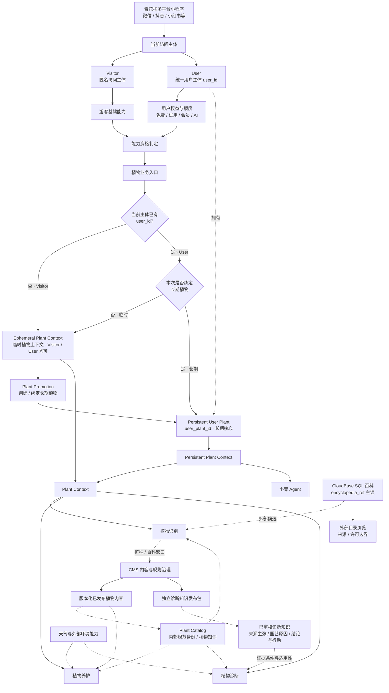

## L1-01｜访问主体、身份与权益

> 父级：L0 → **当前访问主体**

解释 L0 中“Visitor / User → 能力资格判定”的内部关系。身份、权益、AI 额度和奖励账户分层，不把 User Plant 所有权挂到 Entitlement 上。

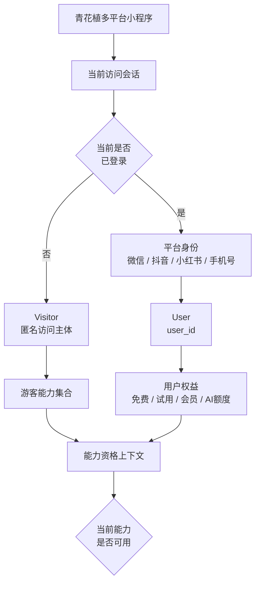

> **边界/说明：** 边界：Visitor 是匿名主体；User 是统一 user_id。Entitlement 只回答“能不能用”，不拥有 User Plant。

## L1-02｜Plant Entry、Ephemeral、Promotion、Persistent

> 父级：L0 → **植物业务入口**

解释 L0 中“植物业务入口 → 先区分访问主体类型 → Ephemeral / Persistent → Promotion → User Plant”。**是否已有 `user_id` 先决定可选范围**：Visitor 没有 `user_id`，首次进入时只能使用 Ephemeral；已有 `user_id` 的 User 则可以选择 Ephemeral，也可以选择 / 创建 Persistent User Plant。

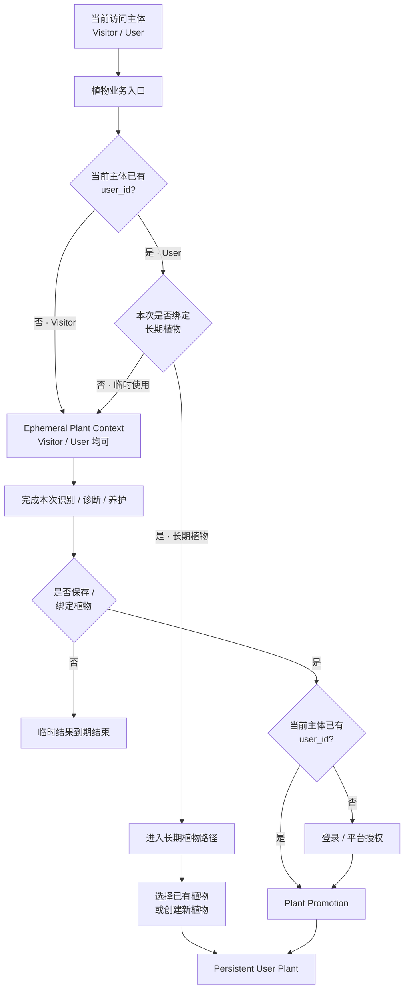

> **边界/说明：** Visitor 在首次进入植物业务时只能走 Ephemeral；已有 `user_id` 的 User 可以在 Ephemeral 与 Persistent 之间选择。Visitor 如果在临时结果后决定保存 / 绑定植物，可以登录取得 `user_id` 后再进入 Plant Promotion。

### L2｜Plant Promotion

> 父级：L1-02｜Plant Entry、Ephemeral、Promotion、Persistent

解释已经完成临时使用，并在需要持久化时具备 `user_id` 的主体，如何通过创建新 User Plant 或绑定已有 User Plant，提升为 Persistent User Plant。这里只表达 Promotion 主流程，不扩大为全量历史迁移。游客登录后的同会话必要结果按已冻结的游客会话认领合同执行；已登录用户主动临时使用后的归属与绑定须先通过[独立 P1 合同补充门](../contracts/authenticated-ephemeral-plant-case.md)，不得套用游客证明。

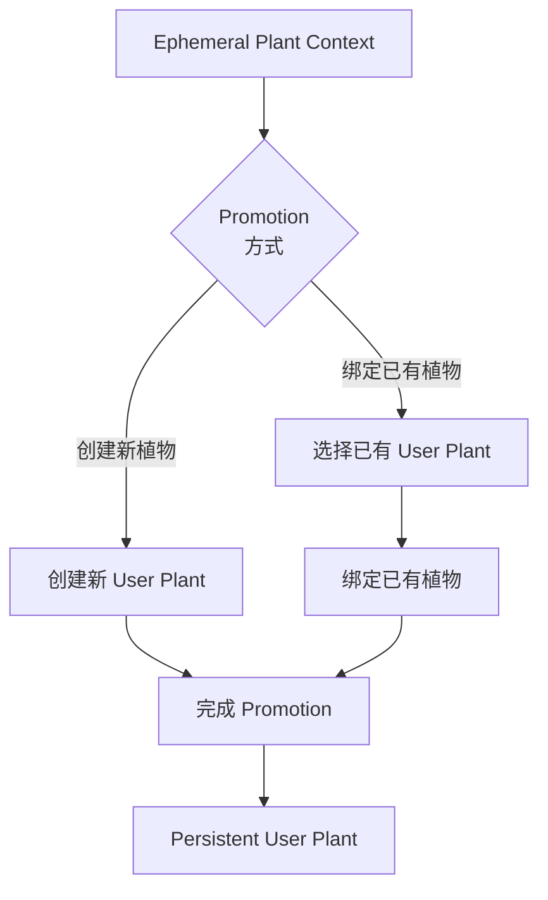

## L1-03｜Persistent User Plant / Persistent Plant Context

> 父级：L0 → **Persistent User Plant**

解释 L0 中长期植物主体及其持久上下文。Profile 只承担展示档案；Atomic Environment（位置 / 光照 / 通风 / 温湿度等）与 Cultivation Setup 是 Persistent Plant Context 的一等输入。

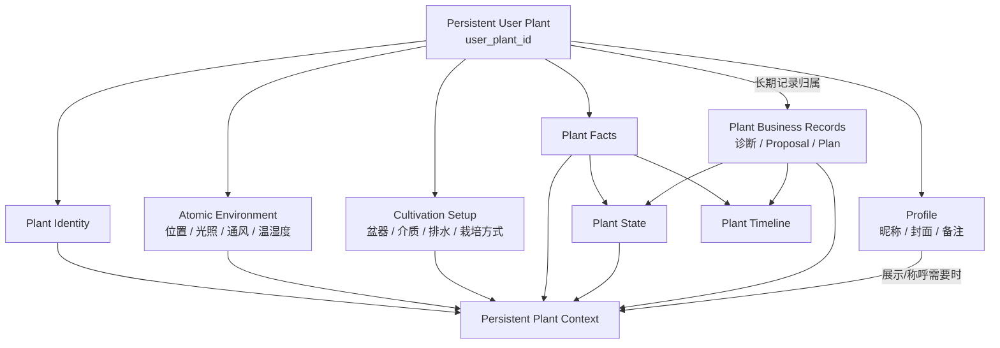

> **边界/说明：** Persistent Plant Context 明确包含 Plant Identity、Atomic Environment、Cultivation Setup、Plant Facts、Plant State 以及按需读取的相关业务记录；Profile 仅在展示 / 称呼需要时进入。

### L2｜Environment / Cultivation Setup

> 父级：L1-03｜Persistent User Plant / Persistent Plant Context

外部微环境与“植物如何被种植”必须分开。

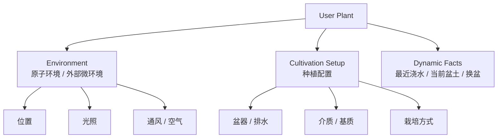

### L2｜Facts / State / Timeline

> 父级：L1-03｜Persistent User Plant / Persistent Plant Context

事实、当前状态和时间线是三种不同语义。

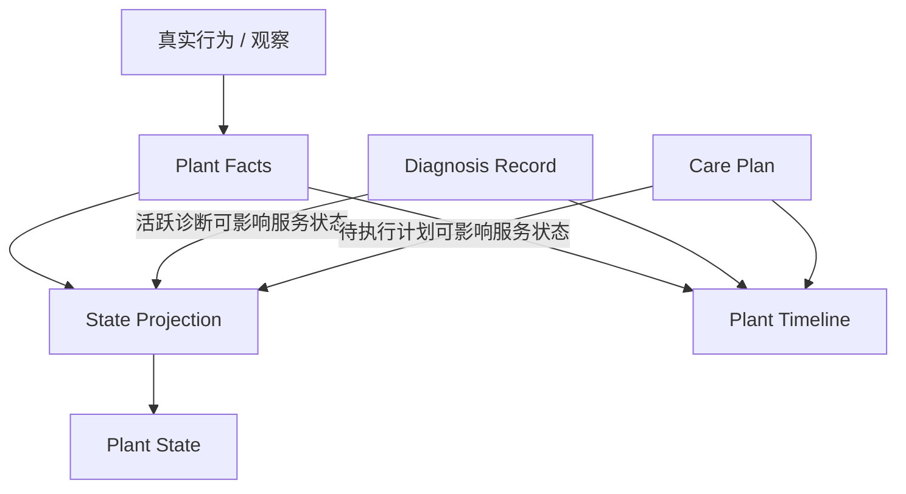

## L1-04｜Runtime Plant Context

> 父级：L0 → **Plant Context**

解释 L0 中 Persistent / Ephemeral 如何汇聚成运行时上下文，并明确 Plant Context 的组成。Atomic Environment 是一等输入，不属于 Care 自己拥有的能力。Runtime Plant Context 是按当前能力组装的视图，不是新的持久化实体。

```mermaid
flowchart TB
  call["发起植物业务调用"]
  scope{"当前植物<br/>作用域"}
  persistent["Persistent Plant Context"]
  pIdentity["Plant Identity"]
  pEnv["Atomic Environment<br/>位置 / 光照 / 通风 / 温湿度"]
  pCult["Cultivation Setup"]
  pFacts["Facts / State"]
  pRecords["Relevant Records"]
  ephemeral["Ephemeral Plant Context"]
  eInput["临时植物输入<br/>Identity / Atomic Environment<br/>Cultivation / Observation"]
  assemble["Context Assembly<br/>按当前能力选择所需数据"]
  runtime["Runtime Plant Context<br/>Identity / Atomic Environment / Cultivation<br/>+ 当前能力所需 Facts / State / Records"]

  call --> scope
  scope -->|Persistent| persistent
  scope -->|Ephemeral| ephemeral
  persistent --> pIdentity
  persistent --> pEnv
  persistent --> pCult
  persistent --> pFacts
  persistent --> pRecords
  ephemeral --> eInput
  pIdentity --> assemble
  pEnv --> assemble
  pCult --> assemble
  pFacts --> assemble
  pRecords --> assemble
  eInput --> assemble
  assemble --> runtime
```

> **边界/说明：** Persistent 路径从 Plant Identity、Atomic Environment、Cultivation Setup、Facts / State、Relevant Records 中按需组装；Ephemeral 路径提供对应的临时输入。Care / Diagnosis 消费的是组装后的 Runtime Plant Context。

## L1-05｜SQL 百科详情 / 内部身份 / 展示百科

> 父级：L0 → **植物识别与目录**

2026-10-03：百科详情运行时主读是 CloudBase SQL `qinghuazhi_v2_test.tropicals_species_encyclopedia_ref`，slug 由学名去符号生成 kebab-case。分类、俗名、百科、生长季分表保存，用 `taxon_id` 软关联。青花植内部目录仍只是已发布 PlantIdentity/Taxon，经 `plant_taxon_tropicals_links` 桥到 Tropicals，不把参考层整库物化成身份。目录搜索目标是已在库内的 `plant_search_*` 投影，搜索全集不等于身份全集。Tropicals 实时 API 只是可选同步或后续能力。当前代码仍是首页 PlantSearchToolbar 客户端直连，SQL 百科只读与对搜索投影的调用尚未实现。百科行可以在许可允许时展示；用户植物确认、CMS 扩种和内容发布仍走各自边界。表关系见 [植物目录数据模型](plant-catalog-data-model.md)。

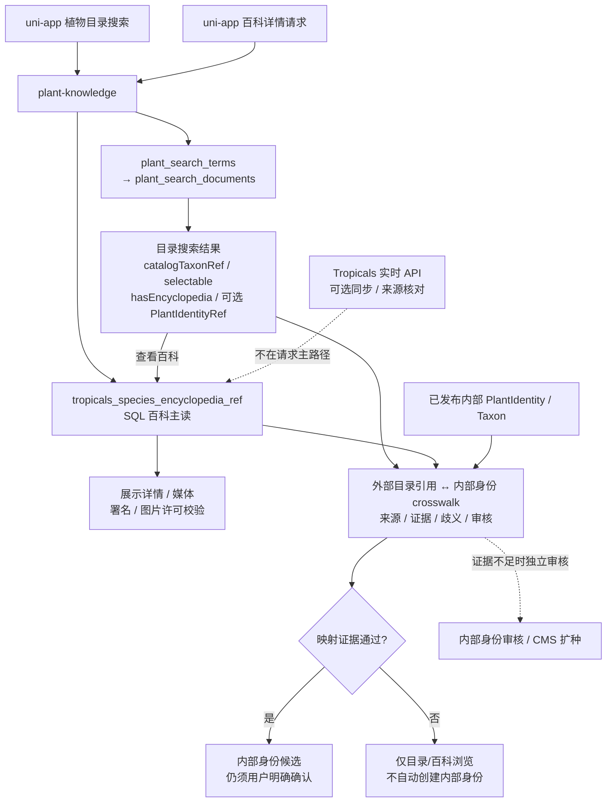

> **边界/说明：** API id/slug、学名派生 slug、离线数据集 taxon_id 与青花植内部身份主键不可混用。映射必须有来源、版本、证据、歧义处理和审核状态；未映射不阻断百科展示，但不能写成已确认的用户植物身份。身份 seed 的 106 条准入只作用于内部 identity release。缺 nameEn、COL、价格不阻断 SQL 主读。

### L2｜外部标识与内部身份映射

> 父级：L1-05｜SQL 百科详情 / 内部身份 / 展示百科

目录 `catalogTaxonRef`、数据集 taxon_id、可选 API id/slug 与学名派生 slug 都先保留在各自命名空间。只有对照内部已发布身份、核验名称与来源证据后，才可提供内部身份候选；落库桥是 `plant_taxon_tropicals_links`，且 `plant_taxa` 的权威来源不包括 Tropicals。无匹配时仍可展示 SQL 百科行或 `plant_search_*` 命中；后续若需纳入内部 Catalog，再由 `ensurePlantIdentity` 与独立身份准入审核。未映射不阻断百科详情。搜索投影已经存在，不另起第三套检索，也不把搜索文档写成身份。

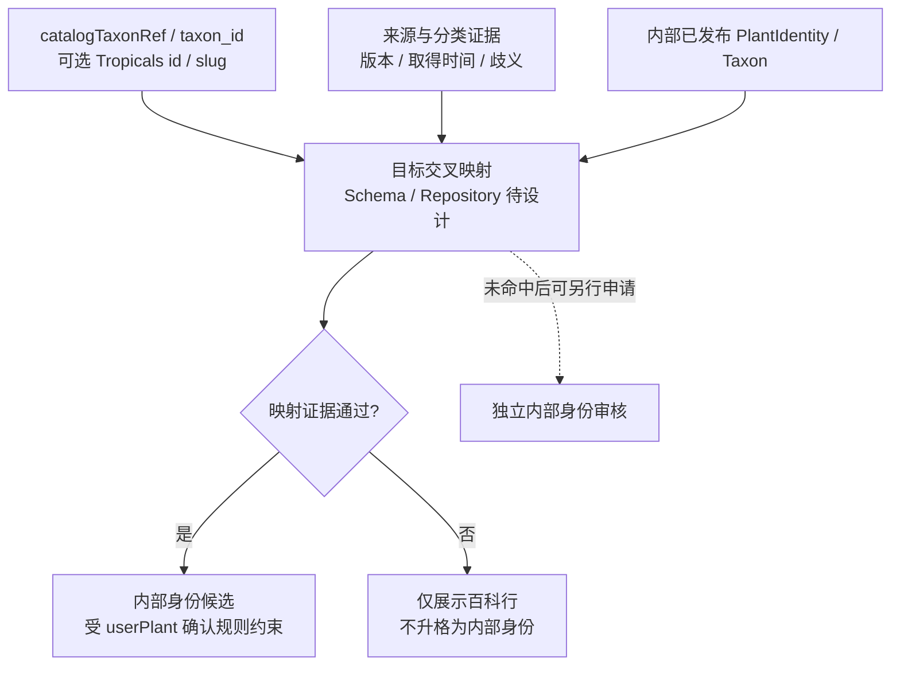

### L2｜SQL 百科详情与媒体边界

> 父级：L1-05｜SQL 百科详情 / 内部身份 / 展示百科

百科详情直接读 `tropicals_species_encyclopedia_ref`，不要求先打 Tropicals 实时 API，也不要求先完成内部身份 crosswalk。展示用表内已有列；图片逐项核对来源许可。**展示投影**中的养护、环境与病虫害文本不得直接进入内部养护、问诊和安全规则；但来源表中的结构化性状可以作为 `Structured Trait Evidence`，经来源保留、归一、冲突检查、审核和不可变 release 后，另行进入 `Internal Care Knowledge / Reference Profile`。展示 DTO 与内部性状证据是两条不同的数据投影，禁止运行时从展示百科反向推导 Care。

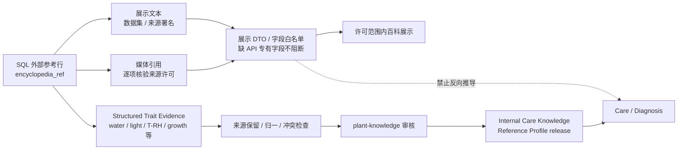

当前实库已有 `water_frequency_tier`、温湿度/光照结构化字段和 `tropicals_growth_season_knowledge`；`tropicals_trait_ref` 当前为空，百科表当前也没有 `substrate_preference`。因此植物级 VPD/光照/生长状态参考可以逐步建立，但“植物级典型栽培基质 Reference”仍缺数据，不得在架构图里伪装成已具备。

## L1-06｜Care

> 父级：L0 → **植物养护**

Care 保持四类稳定能力外壳：浇水、施肥、光照、通风；天气、朝向、温湿度和盆器由共享底座统一解释。共同底座固定为 `Atomic Facts → Snapshot → Deterministic Derivations → Internal Care Knowledge / Reference Profile → Capability Decision`。确定性可计算量先由代码计算；AI 只允许在已验证事实、派生指标与已审核 Authority Pack 上做受约束综合、解释和建议。

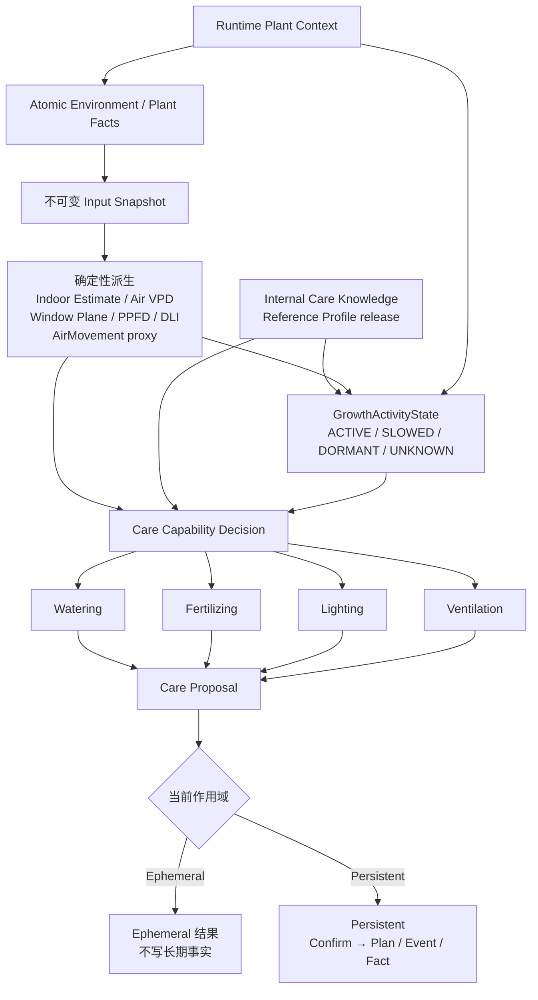

> **边界/说明：** 光照、温湿度、空气运动、盆器、基质等原始输入属于事实/配置；PPFD/DLI、Air VPD、Estimated Indoor Environment、CultivationRetention、GrowthActivityState 和 DryProgress 都是带版本的派生或决策输入。Watering 只消费上游已版本化的光照/环境派生，不直接读取朝向或 `indoorEqHours`。

### L2｜Light｜DNI/DHI → PPFD → DLI

> 父级：L1-06｜Care

光照模型的最终核心指标是 DLI（日光积分），瞬时核心指标是 PPFD。天气辐射先经过太阳几何和窗面几何转换，再经过建筑/室内传播；朝向名称本身不能直接决定有没有直射。

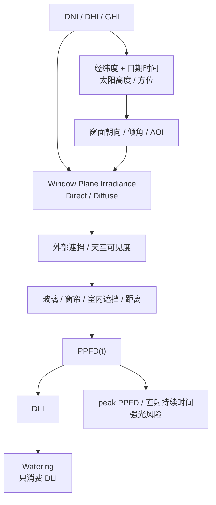

MVP 不把地面反射作为核心计算；Direct / Diffuse 不应过早合并。`indoorEqHours` 退出正式上游。

### L2｜Indoor Environment｜实测优先，估算明示

> 父级：L1-06｜Care

室外天气永远保持 `outdoor` 作用域。存在同时间/空间范围的室内或 plant-zone 实测 T/RH 时优先使用；缺少实测时，才允许由室外逐时温湿度、室内外空气交换、房间太阳热输入与版本化建筑热惯性生成 `Estimated Indoor Environment`。估算结果必须携带来源、算法 release 和置信度，之后才能计算 Air VPD。

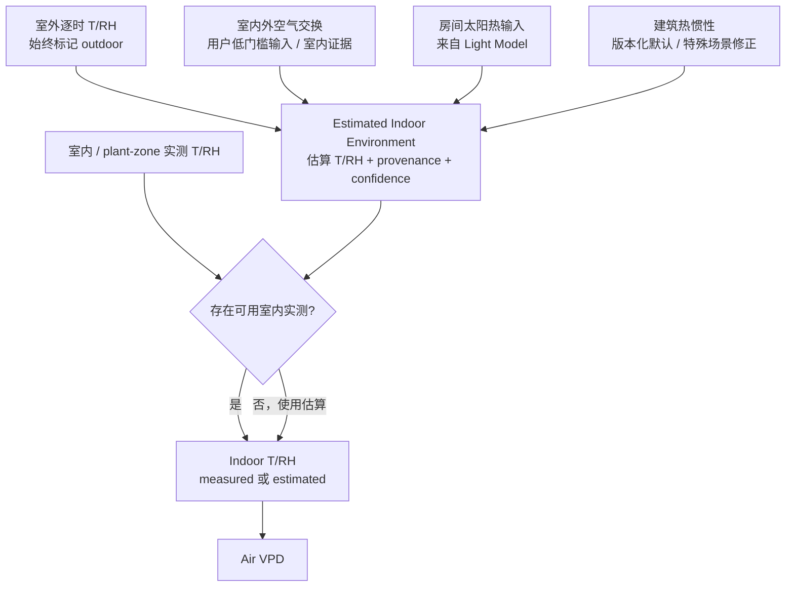

禁止直接把 outdoor T/RH 代入并命名为“室内 VPD”；证据不足时返回 `insufficient_evidence`。

### L2｜GrowthActivity｜生长活跃状态

> 父级：L1-06｜Care

该能力估计植物当前生长活跃状态，而不是输出简单的日历“生长季”布尔值。它是带证据和置信度的植物状态派生，只负责选择条件性养护基线。

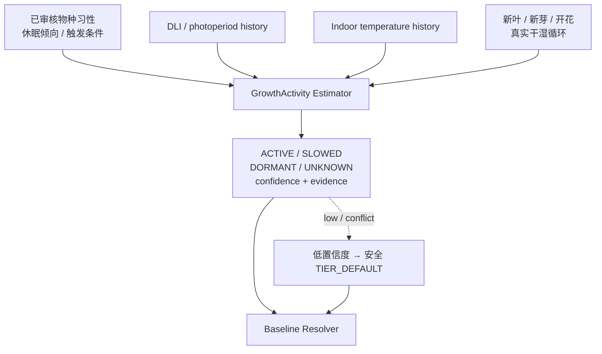

禁止把 GrowthActivity 再作为额外季节乘数，否则 DLI、温度等同一证据会重复计权。

### L2｜Watering｜等效干燥进度

> 父级：L1-06｜Care

浇水从“自然日 × 多个修正系数”改为等效干燥进度。基线决定需要积累多少标准干燥过程；环境决定每天推进多快；栽培系统决定水保存多久；真实历史只校准模型残差；当前盆土证据拥有最终否决权。

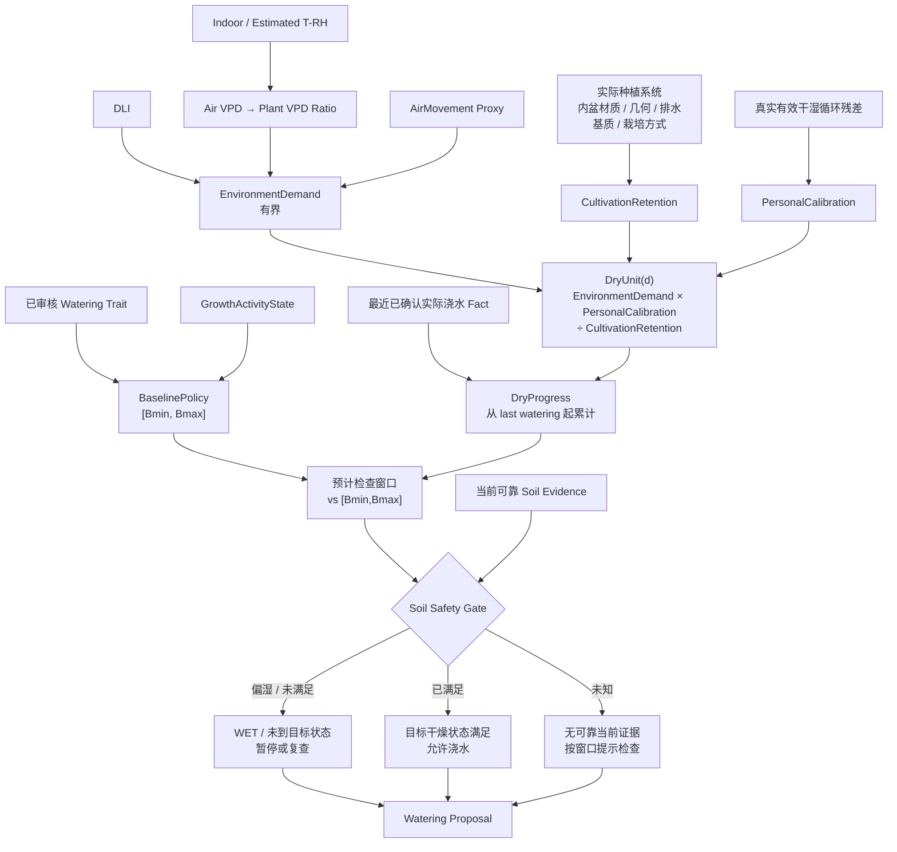

优先级：`当前可靠盆土证据 > 真实干湿循环个体校准 > 环境/栽培预测 > 名义自然日`。Proposal / Plan / Reminder 都不能重置 DryProgress，只有实际发生并确认的浇水 Fact 能重置。具体合同见 [浇水等效干燥进度决策合同](../contracts/watering-decision-model.md)。

## L1-07｜Diagnosis

> 父级：L0 → **植物诊断**

解释 L0 的诊断域：黄叶、萎蔫和疑似虫害是收集证据的症状入口，不直接等于园艺原因。先建立模式内证据账本，再判断证据是否足够；不足时才进入对应题包。固定题包与虫害动态题包边界保持不变。结论和行动必须从已审核的来源主张、园艺原因分类、Outcome 结论库、Action 行动库及受审映射中选取；生成式丰富解释是独立版本的受控候选，不替代证据、来源或用户确认。

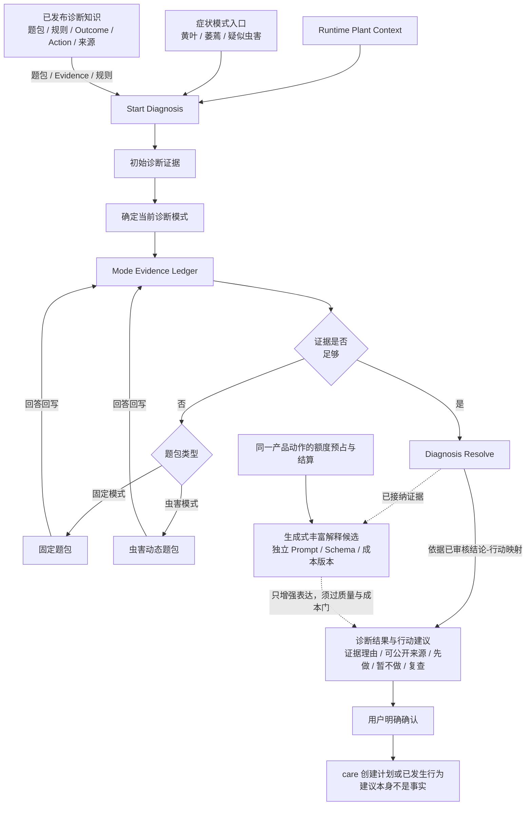

> **边界/说明：** Diagnosis Record 是诊断判断，不是 Plant Fact。视觉证据、用户回答、历史事实都进入同一 Mode Evidence Ledger。

### L2｜诊断来源、园艺原因与 Outcome/Action

> 父级：L1-07｜Diagnosis

症状模式负责收集证据，园艺原因负责解释可能机制；二者不是同一分类轴。每条来源主张须能定位原文、说明适用植物与条件、记录核验时间；结论与行动分别审查，再以明确适用条件、禁忌和版本的映射相连。证据不足时保留待判定，不用生成式内容填补确定性。

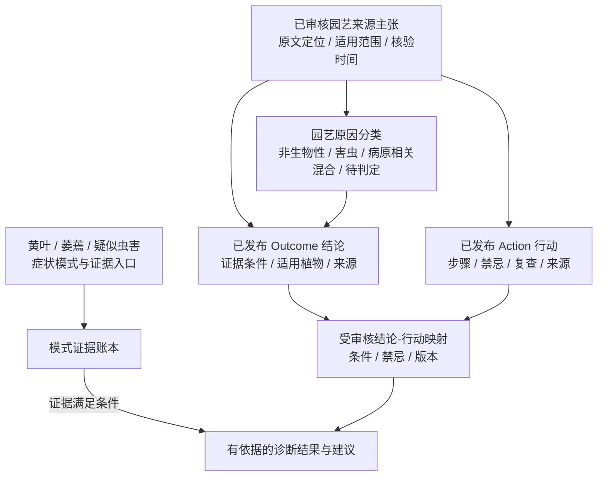

> **边界/说明：** 题包不能直接决定病虫害分类；模型只能提出待审候选，不能直接发布 Outcome、Action 或结论-行动映射。详细合同见 [诊断知识来源合同](../contracts/diagnosis-knowledge-sources.md) 与 [Outcome 字段设计](../contracts/diagnosis-outcome-fields.md)。

### L2｜Multi-image Evidence

> 父级：L1-07｜Diagnosis

多图价值是补齐证据、减少重复追问、核实关键因素，不建立另一套通用病因推理系统。本图是目标能力；首版作为待确认的受控实验候选，未通过质量、成本与额度门前不得开放。

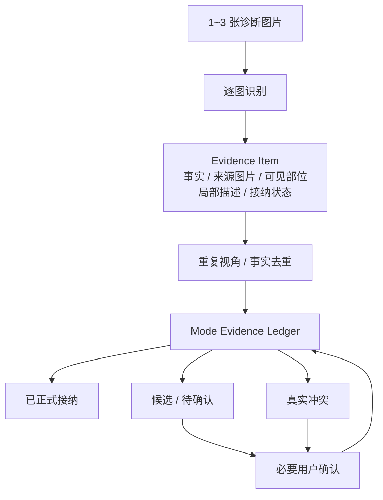

## L1-08｜小青 Agent

> 父级：L0 → **小青 Agent**

小青读取 Persistent Plant Context 和相关记录；只读请求直接回答，写操作先形成 Tool Proposal，再经过用户确认调用正式领域能力。

```mermaid
flowchart TB
  ctx["Persistent Plant Context"]
  records["相关 Timeline / Diagnosis / Plan"]
  agentctx["Agent Context Assembly"]
  xq["小青 Agent"]
  intent{"是否涉及<br/>业务操作"}
  answer["解释 / 问答 / 引导"]
  tool["Tool Proposal"]
  confirm{"用户确认?"}
  domain["调用正式领域能力"]

  ctx --> agentctx
  records --> agentctx
  agentctx --> xq
  xq --> intent
  intent -->|否| answer
  intent -->|是| tool
  tool --> confirm
  confirm -->|是| domain
```

> **边界/说明：** 永久边界：小青不能绕过领域能力直接写 Plant Facts、Plant State 或正式 Diagnosis。

## L1-09｜CMS / Published Content Governance

> 父级：L0 → **CMS 内容与规则治理**

解释 L0 中 CMS 如何接收治理候选并发布版本化内容。植物识别会向 CMS 提交 Catalog 扩种候选和植物百科缺口；诊断内容还需单独治理来源主张、园艺原因、Outcome、Action 与映射。CMS 审核发布后分别回流 Catalog、用户百科、Care 与 Diagnosis；展示百科不得越权成为诊断安全事实。

```mermaid
flowchart TB
  source["治理候选来源<br/>Identify：扩种 / 百科缺口<br/>人工维护 / AI草稿 / 研究资料"]
  draft["CMS Draft"]
  type{"内容类型"}
  identity["规范植物身份 / Catalog 扩种"]
  ency["用户植物百科"]
  knowledge["内部植物知识"]
  care["养护规则"]
  diag["诊断规则 / 题包"]
  diagknowledge["来源主张 / 园艺原因<br/>Outcome / Action / 映射"]
  validation["对应类型校验 / 审核"]
  review{"审核通过?"}
  revision["修订 / 驳回"]
  publish["按内容类型版本化发布"]
  diagRelease["诊断知识独立发布包<br/>由 diagnosis 负责准入"]
  diagnosis["L1-07 诊断读取锁定版本"]

  source --> draft
  draft --> type
  type -->|身份| identity
  type -->|百科| ency
  type -->|内部知识| knowledge
  type -->|养护规则| care
  type -->|诊断规则| diag
  type -->|诊断知识| diagknowledge
  identity --> validation
  ency --> validation
  knowledge --> validation
  care --> validation
  diag --> validation
  diagknowledge --> validation
  validation --> review
  review -->|否| revision
  review -->|是| publish
  revision --> draft
  publish -->|诊断知识| diagRelease
  diagRelease --> diagnosis
```

> **边界/说明：** Qwen 可以生成候选草稿，但不能直接成为规范 Identity、内部养护知识或安全事实的真相源。

### L2｜Catalog 扩种治理

> 父级：L1-09｜CMS / Published Content Governance

解释 CMS 侧如何处理 Identify 产生的 Catalog 扩种候选；这里只负责规范身份治理，不负责百科内容补全。

```mermaid
flowchart TB
  candidate["Catalog 扩种候选"]
  reviewData["身份资料补充<br/>去重 / Alias / taxonomy / 来源"]
  review["CMS 身份审核"]
  gate{"审核结果"}
  existing["关联已有 Identity"]
  new["批准新增 Identity"]
  reject["驳回 / 保留临时候选"]
  publish["发布规范 Identity"]
  catalog["Plant Identity Catalog"]

  candidate --> reviewData
  reviewData --> review
  review --> gate
  gate -->|关联已有| existing
  gate -->|批准新增| new
  gate -->|驳回| reject
  existing --> catalog
  new --> publish
  publish --> catalog
```

### L2｜Public Encyclopedia

> 父级：L1-09｜CMS / Published Content Governance

植物百科补全只针对“已有规范 Identity 但缺用户可见内容”的情况。

```mermaid
flowchart TB
  identity["已有 Catalog Identity"]
  lookup["查询已发布百科"]
  gate{"是否缺失?"}
  display["直接展示"]
  draft["Qwen 结构化草稿"]
  review["CMS 审核 / 发布"]

  identity --> lookup
  lookup --> gate
  gate -->|否| display
  gate -->|是| draft
  draft --> review
```

### L2｜诊断知识审核与发布

> 父级：L1-09｜CMS / Published Content Governance

诊断知识补全可以从已发现的结论或行动缺口开始，但外部资料与模型输出只能形成草稿。审核须分别检查来源可追溯性、症状与原因分类、植物适用性、行动禁忌和结论-行动映射，再形成不可变发布包；发布版本与诊断记录关联，便于回放和纠错。

```mermaid
flowchart TB
  gap["诊断结论 / 行动知识缺口"]
  source["园艺来源定位与主张草稿"]
  classify["症状入口与园艺原因分轴归类"]
  outcomes["Outcome 结论草稿"]
  actions["Action 行动草稿"]
  mapping["结论-行动映射草稿"]
  review["人工审核<br/>来源 / 适用性 / 禁忌 / 冲突"]
  gate{"审核通过?"}
  release["不可变诊断知识发布包<br/>版本 / SHA-256 / 可回滚"]
  diagnosis["Diagnosis 读取已发布版本"]

  gap --> source
  source --> classify
  classify --> outcomes
  classify --> actions
  outcomes --> mapping
  actions --> mapping
  mapping --> review
  review --> gate
  gate -->|否| gap
  gate -->|是| release
  release --> diagnosis
```

## 阅读约定

- `-->`：业务主关系 / 控制流。
- `-.->`：知识、数据或外部能力依赖。
- 菱形节点：条件门，单入口、多条件出口。
- 本文仅表达业务语义和父子关系；技术实现以根目录 README 的后端基础设施图和对应合同映射。
