# 青花植 v2 分层业务架构（目标态）

> 产品主张：**Everything is for your plant**。本文件按 L0/L1/L2 展开根目录 README 的业务架构，服务于渐进式实施。它描述完整目标态，不代表每个节点都在首版开放；首版边界见 [首版运行边界](../phases/first-release-scope.md)。

## 文档与父子关系组织规则

1. **L0 只保留一张总业务架构图**，作为整份文档的骨架。
2. **L1 使用二级标题（`##`）**，每张图只解释一个 L0 节点或一组强关联的 L0 关系。
3. **L2 使用三级标题（`###`）**，紧跟在所属 L1 下，只解释该 L1 内部被继续折叠的复杂流程。
4. **父子关系与业务流分开表达**：顶部“层级索引图”只表示文档下钻关系；各业务 Mermaid 图只表达业务本身，避免把“展开关系”误读为业务连线。
5. **同一子图只保留一个规范父级**。例如 `Plant Promotion` 在 L0 中是独立节点，但其详细流程与 `Plant Entry / Ephemeral / Persistent` 生命周期强相关，因此 Markdown 中统一放在 `L1-02` 下作为 L2，其他位置只引用，不复制第二份。

### 架构层级索引（仅表示父子/下钻关系）

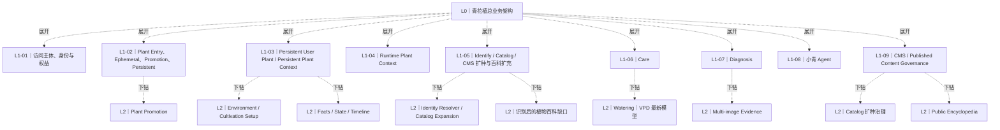
```mermaid
flowchart TB
  L0["L0｜青花植总业务架构"]
  L101["L1-01｜访问主体、身份与权益"]
  L102["L1-02｜Plant Entry、Ephemeral、Promotion、Persistent"]
  L103["L1-03｜Persistent User Plant / Persistent Plant Context"]
  L104["L1-04｜Runtime Plant Context"]
  L105["L1-05｜Identify / Catalog / CMS 扩种与百科扩充"]
  L106["L1-06｜Care"]
  L107["L1-07｜Diagnosis"]
  L108["L1-08｜小青 Agent"]
  L109["L1-09｜CMS / Published Content Governance"]
  L0 -. "展开" .-> L101
  L0 -. "展开" .-> L102
  L0 -. "展开" .-> L103
  L0 -. "展开" .-> L104
  L0 -. "展开" .-> L105
  L0 -. "展开" .-> L106
  L0 -. "展开" .-> L107
  L0 -. "展开" .-> L108
  L0 -. "展开" .-> L109
  L2_1["L2｜Plant Promotion"]
  L102 -. "下钻" .-> L2_1
  L2_2["L2｜Environment / Cultivation Setup"]
  L103 -. "下钻" .-> L2_2
  L2_3["L2｜Facts / State / Timeline"]
  L103 -. "下钻" .-> L2_3
  L2_4["L2｜Identity Resolver / Catalog Expansion"]
  L105 -. "下钻" .-> L2_4
  L2_5["L2｜识别后的植物百科缺口"]
  L105 -. "下钻" .-> L2_5
  L2_6["L2｜Watering｜VPD 最新模型"]
  L106 -. "下钻" .-> L2_6
  L2_7["L2｜Multi-image Evidence"]
  L107 -. "下钻" .-> L2_7
  L2_8["L2｜Catalog 扩种治理"]
  L109 -. "下钻" .-> L2_8
  L2_9["L2｜Public Encyclopedia"]
  L109 -. "下钻" .-> L2_9
```

## L0｜青花植总业务架构

只保留核心主体、业务域和关键关系；内部流程由后续 L1/L2 解释。

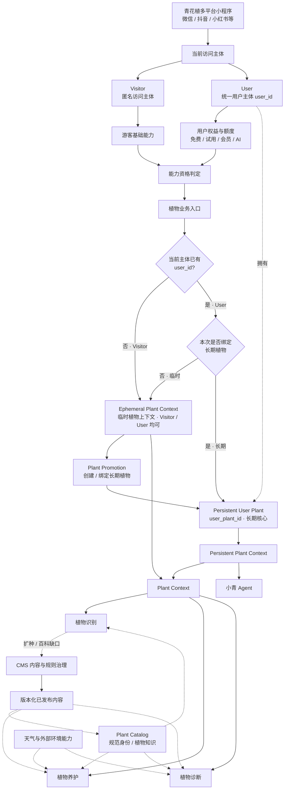
```mermaid
flowchart TB
  client["青花植多平台小程序<br/>微信 / 抖音 / 小红书等"]
  principal["当前访问主体"]
  visitor["Visitor<br/>匿名访问主体"]
  user["User<br/>统一用户主体 user_id"]
  vability["游客基础能力"]
  entitlement["用户权益与额度<br/>免费 / 试用 / 会员 / AI"]
  capability["能力资格判定"]
  entry["植物业务入口"]
  subjectGate{"当前主体已有<br/>user_id?"}
  mode{"本次是否绑定<br/>长期植物"}
  ephemeral["Ephemeral Plant Context<br/>临时植物上下文 · Visitor / User 均可"]
  promotion["Plant Promotion<br/>创建 / 绑定长期植物"]
  userplant["Persistent User Plant<br/>user_plant_id · 长期核心"]
  persistentctx["Persistent Plant Context"]
  runtime["Plant Context"]
  identify["植物识别"]
  care["植物养护"]
  diagnosis["植物诊断"]
  agent["小青 Agent"]
  catalog["Plant Catalog<br/>规范身份 / 植物知识"]
  weather["天气与外部环境能力"]
  cms["CMS 内容与规则治理"]
  published["版本化已发布内容"]

  client --> principal
  principal --> visitor
  principal --> user
  visitor --> vability
  user --> entitlement
  vability --> capability
  entitlement --> capability
  capability --> entry
  entry --> subjectGate
  subjectGate -->|否 · Visitor| ephemeral
  subjectGate -->|是 · User| mode
  mode -->|否 · 临时| ephemeral
  mode -->|是 · 长期| userplant
  ephemeral --> promotion
  promotion --> userplant
  user -. "拥有" .-> userplant
  userplant --> persistentctx
  persistentctx --> runtime
  ephemeral --> runtime
  runtime --> identify
  runtime --> care
  runtime --> diagnosis
  identify -. "扩种 / 百科缺口" .-> cms
  persistentctx --> agent
  catalog -.-> identify
  catalog -.-> care
  catalog -.-> diagnosis
  weather -.-> care
  weather -.-> diagnosis
  cms --> published
  published -.-> catalog
  published -.-> care
  published -.-> diagnosis
```

## L1-01｜访问主体、身份与权益

> 父级：L0 → **当前访问主体**

解释 L0 中“Visitor / User → 能力资格判定”的内部关系。身份、权益、AI 额度和奖励账户分层，不把 User Plant 所有权挂到 Entitlement 上。

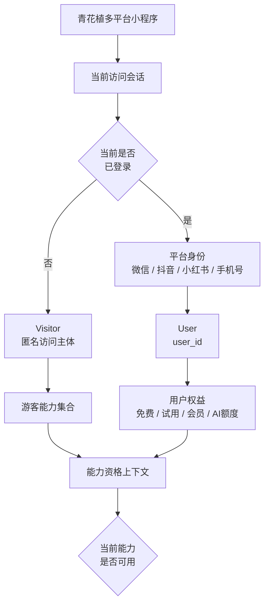
```mermaid
flowchart TB
  client["青花植多平台小程序"]
  access["当前访问会话"]
  login{"当前是否<br/>已登录"}
  visitor["Visitor<br/>匿名访问主体"]
  platform["平台身份<br/>微信 / 抖音 / 小红书 / 手机号"]
  user["User<br/>user_id"]
  vability["游客能力集合"]
  ent["用户权益<br/>免费 / 试用 / 会员 / AI额度"]
  merge["能力资格上下文"]
  gate{"当前能力<br/>是否可用"}

  client --> access
  access --> login
  login -->|否| visitor
  login -->|是| platform
  platform --> user
  visitor --> vability
  user --> ent
  vability --> merge
  ent --> merge
  merge --> gate
```

> **边界/说明：** 边界：Visitor 是匿名主体；User 是统一 user_id。Entitlement 只回答“能不能用”，不拥有 User Plant。

## L1-02｜Plant Entry、Ephemeral、Promotion、Persistent

> 父级：L0 → **植物业务入口**

解释 L0 中“植物业务入口 → 先区分访问主体类型 → Ephemeral / Persistent → Promotion → User Plant”。**是否已有 `user_id` 先决定可选范围**：Visitor 没有 `user_id`，首次进入时只能使用 Ephemeral；已有 `user_id` 的 User 则可以选择 Ephemeral，也可以选择 / 创建 Persistent User Plant。

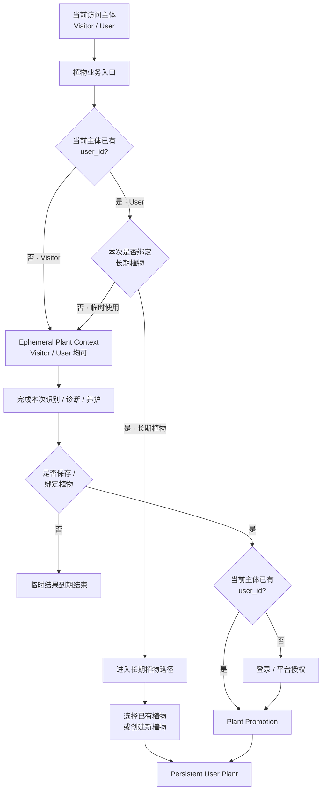
```mermaid
flowchart TB
  actor["当前访问主体<br/>Visitor / User"]
  entry["植物业务入口"]
  subjectGate{"当前主体已有<br/>user_id?"}
  bind{"本次是否绑定<br/>长期植物"}

  persistent["进入长期植物路径"]
  select["选择已有植物<br/>或创建新植物"]
  userplant["Persistent User Plant"]

  ephemeral["Ephemeral Plant Context<br/>Visitor / User 均可"]
  experience["完成本次识别 / 诊断 / 养护"]
  save{"是否保存 /<br/>绑定植物"}
  tempEnd["临时结果到期结束"]
  postUserGate{"当前主体已有<br/>user_id?"}
  postLogin["登录 / 平台授权"]
  promotion["Plant Promotion"]

  actor --> entry
  entry --> subjectGate

  subjectGate -->|否 · Visitor| ephemeral
  subjectGate -->|是 · User| bind
  bind -->|是 · 长期植物| persistent
  persistent --> select
  select --> userplant

  bind -->|否 · 临时使用| ephemeral
  ephemeral --> experience
  experience --> save
  save -->|否| tempEnd
  save -->|是| postUserGate
  postUserGate -->|是| promotion
  postUserGate -->|否| postLogin
  postLogin --> promotion
  promotion --> userplant
```

> **边界/说明：** Visitor 在首次进入植物业务时只能走 Ephemeral；已有 `user_id` 的 User 可以在 Ephemeral 与 Persistent 之间选择。Visitor 如果在临时结果后决定保存 / 绑定植物，可以登录取得 `user_id` 后再进入 Plant Promotion。

### L2｜Plant Promotion

> 父级：L1-02｜Plant Entry、Ephemeral、Promotion、Persistent

解释已经完成临时使用，并在需要持久化时具备 `user_id` 的主体，如何通过创建新 User Plant 或绑定已有 User Plant，提升为 Persistent User Plant。这里只表达 Promotion 主流程，不扩大为全量历史迁移。游客登录后的同会话必要结果按已冻结的游客会话认领合同执行；已登录用户主动临时使用后的归属与绑定须先通过[独立 P1 合同补充门](../contracts/authenticated-ephemeral-plant-case.md)，不得套用游客证明。

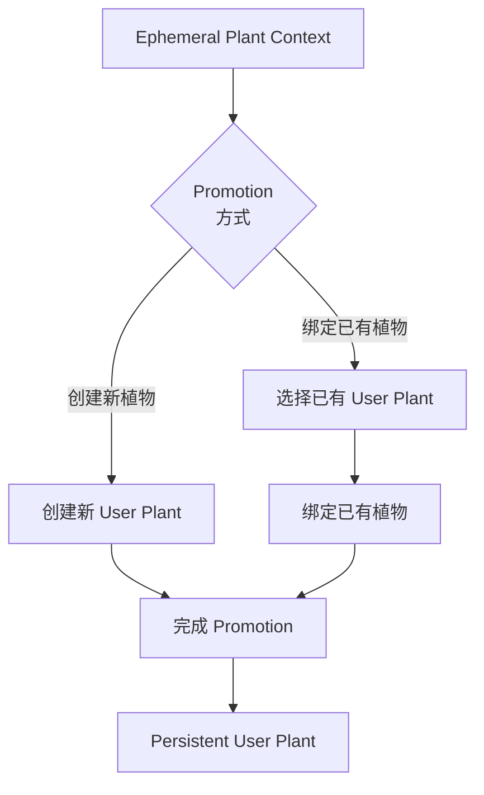
```mermaid
flowchart TB
  temp["Ephemeral Plant Context"]
  target{"Promotion<br/>方式"}
  create["创建新 User Plant"]
  select["选择已有 User Plant"]
  bind["绑定已有植物"]
  done["完成 Promotion"]
  plant["Persistent User Plant"]

  temp --> target
  target -->|创建新植物| create
  target -->|绑定已有植物| select
  select --> bind
  create --> done
  bind --> done
  done --> plant
```

## L1-03｜Persistent User Plant / Persistent Plant Context

> 父级：L0 → **Persistent User Plant**

解释 L0 中长期植物主体及其持久上下文。Profile 只承担展示档案；Atomic Environment（位置 / 光照 / 通风 / 温湿度等）与 Cultivation Setup 是 Persistent Plant Context 的一等输入。

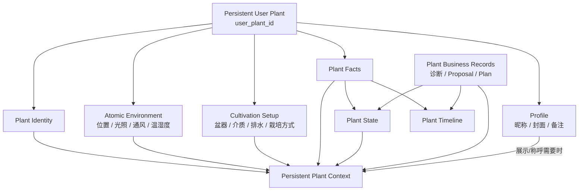
```mermaid
flowchart TB
  plant["Persistent User Plant<br/>user_plant_id"]
  profile["Profile<br/>昵称 / 封面 / 备注"]
  identity["Plant Identity"]
  env["Atomic Environment<br/>位置 / 光照 / 通风 / 温湿度"]
  cult["Cultivation Setup<br/>盆器 / 介质 / 排水 / 栽培方式"]
  facts["Plant Facts"]
  records["Plant Business Records<br/>诊断 / Proposal / Plan"]
  state["Plant State"]
  timeline["Plant Timeline"]
  ctx["Persistent Plant Context"]

  plant --> profile
  plant --> identity
  plant --> env
  plant --> cult
  plant --> facts
  facts --> state
  records --> state
  facts --> timeline
  records --> timeline
  identity --> ctx
  env --> ctx
  cult --> ctx
  facts --> ctx
  state --> ctx
  records --> ctx
  profile -->|展示/称呼需要时| ctx
```

> **边界/说明：** Persistent Plant Context 明确包含 Plant Identity、Atomic Environment、Cultivation Setup、Plant Facts、Plant State 以及按需读取的相关业务记录；Profile 仅在展示 / 称呼需要时进入。

### L2｜Environment / Cultivation Setup

> 父级：L1-03｜Persistent User Plant / Persistent Plant Context

外部微环境与“植物如何被种植”必须分开。

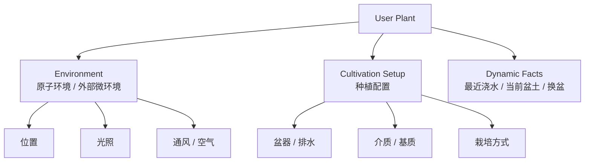
```mermaid
flowchart TB
  plant["User Plant"]
  env["Environment<br/>原子环境 / 外部微环境"]
  cult["Cultivation Setup<br/>种植配置"]
  loc["位置"]
  light["光照"]
  vent["通风 / 空气"]
  pot["盆器 / 排水"]
  medium["介质 / 基质"]
  method["栽培方式"]
  dynamic["Dynamic Facts<br/>最近浇水 / 当前盆土 / 换盆"]

  plant --> env
  plant --> cult
  env --> loc
  env --> light
  env --> vent
  cult --> pot
  cult --> medium
  cult --> method
  plant --> dynamic
```

### L2｜Facts / State / Timeline

> 父级：L1-03｜Persistent User Plant / Persistent Plant Context

事实、当前状态和时间线是三种不同语义。

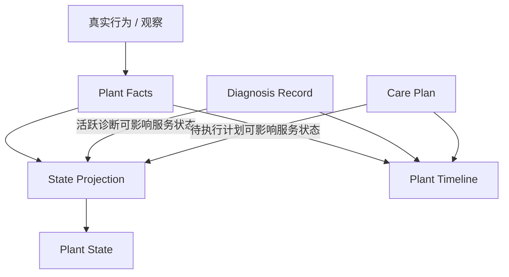
```mermaid
flowchart TB
  event["真实行为 / 观察"]
  facts["Plant Facts"]
  proj["State Projection"]
  state["Plant State"]
  diag["Diagnosis Record"]
  plan["Care Plan"]
  timeline["Plant Timeline"]

  event --> facts
  facts --> proj
  proj --> state
  facts --> timeline
  diag --> timeline
  plan --> timeline
  diag -->|活跃诊断可影响服务状态| proj
  plan -->|待执行计划可影响服务状态| proj
```

## L1-04｜Runtime Plant Context

> 父级：L0 → **Plant Context**

解释 L0 中 Persistent / Ephemeral 如何汇聚成运行时上下文，并明确 Plant Context 的组成。Atomic Environment 是一等输入，不属于 Care 自己拥有的能力。Runtime Plant Context 是按当前能力组装的视图，不是新的持久化实体。

```mermaid
flowchart TB
  call["发起植物业务调用"]
  scope{"当前植物<br/>作用域"}
  persistent["Persistent Plant Context"]
  pIdentity["Plant Identity"]
  pEnv["Atomic Environment<br/>位置 / 光照 / 通风 / 温湿度"]
  pCult["Cultivation Setup"]
  pFacts["Facts / State"]
  pRecords["Relevant Records"]
  ephemeral["Ephemeral Plant Context"]
  eInput["临时植物输入<br/>Identity / Atomic Environment<br/>Cultivation / Observation"]
  assemble["Context Assembly<br/>按当前能力选择所需数据"]
  runtime["Runtime Plant Context<br/>Identity / Atomic Environment / Cultivation<br/>+ 当前能力所需 Facts / State / Records"]

  call --> scope
  scope -->|Persistent| persistent
  scope -->|Ephemeral| ephemeral
  persistent --> pIdentity
  persistent --> pEnv
  persistent --> pCult
  persistent --> pFacts
  persistent --> pRecords
  ephemeral --> eInput
  pIdentity --> assemble
  pEnv --> assemble
  pCult --> assemble
  pFacts --> assemble
  pRecords --> assemble
  eInput --> assemble
  assemble --> runtime
```

> **边界/说明：** Persistent 路径从 Plant Identity、Atomic Environment、Cultivation Setup、Facts / State、Relevant Records 中按需组装；Ephemeral 路径提供对应的临时输入。Care / Diagnosis 消费的是组装后的 Runtime Plant Context。

## L1-05｜Identify / Catalog / CMS 扩种与百科扩充

> 父级：L0 → **植物识别**

解释植物识别与 CMS 的闭环关系：识别先把外部候选归一到青花植 Catalog；未命中规范 Identity 时触发 CMS 的 Catalog 扩种，获得规范 Identity 后再检查用户植物百科，百科缺失时触发 CMS 的百科扩充治理。

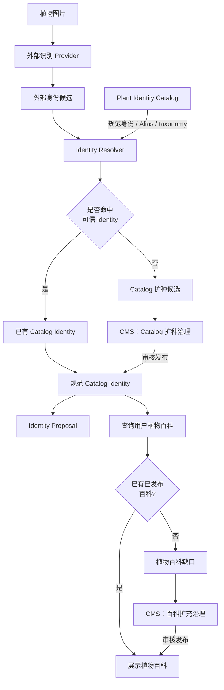
```mermaid
flowchart TB
  image["植物图片"]
  provider["外部识别 Provider"]
  cand["外部身份候选"]
  resolver["Identity Resolver"]
  catalog["Plant Identity Catalog"]
  match{"是否命中<br/>可信 Identity"}
  existing["已有 Catalog Identity"]
  expand["Catalog 扩种候选"]
  cmsExpand["CMS：Catalog 扩种治理"]
  identity["规范 Catalog Identity"]
  proposal["Identity Proposal"]
  encyLookup["查询用户植物百科"]
  encyGate{"已有已发布<br/>百科?"}
  encyDisplay["展示植物百科"]
  encyGap["植物百科缺口"]
  cmsEncy["CMS：百科扩充治理"]

  image --> provider
  provider --> cand
  cand --> resolver
  catalog -->|规范身份 / Alias / taxonomy| resolver
  resolver --> match
  match -->|是| existing
  match -->|否| expand
  existing --> identity
  expand --> cmsExpand
  cmsExpand -->|审核发布| identity
  identity --> proposal
  identity --> encyLookup
  encyLookup --> encyGate
  encyGate -->|是| encyDisplay
  encyGate -->|否| encyGap
  encyGap --> cmsEncy
  cmsEncy -->|审核发布| encyDisplay
```

> **边界/说明：** 扩种与扩百科都由识别流程发现缺口并提交 CMS 治理：扩种解决“Catalog 里没有这个规范植物身份”，扩百科解决“已有规范 Identity，但缺用户可见植物百科”。CMS 审核发布后再回到识别可消费的 Catalog / 百科内容。

### L2｜Identity Resolver / Catalog Expansion

> 父级：L1-05｜Identify / Catalog / CMS 扩种与百科扩充

识别候选先做 Alias / taxonomy 归一和去重；无法关联已有规范 Identity 时，形成 Catalog 扩种候选并交给 CMS 身份治理。

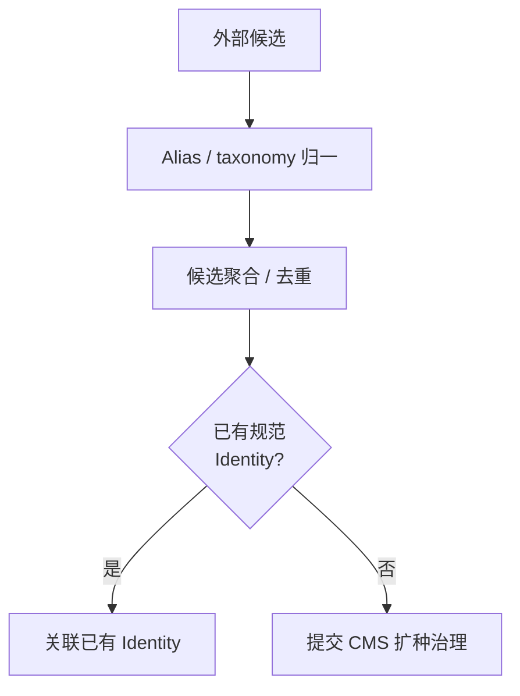
```mermaid
flowchart TB
  candidate["外部候选"]
  alias["Alias / taxonomy 归一"]
  dedup["候选聚合 / 去重"]
  gate{"已有规范<br/>Identity?"}
  use["关联已有 Identity"]
  new["提交 CMS 扩种治理"]

  candidate --> alias
  alias --> dedup
  dedup --> gate
  gate -->|是| use
  gate -->|否| new
```

### L2｜识别后的植物百科缺口

> 父级：L1-05｜Identify / Catalog / CMS 扩种与百科扩充

当规范 Catalog Identity 已经确定后，识别流程检查用户可见植物百科；缺失时把百科缺口交给 CMS 百科治理，审核发布后再用于展示。

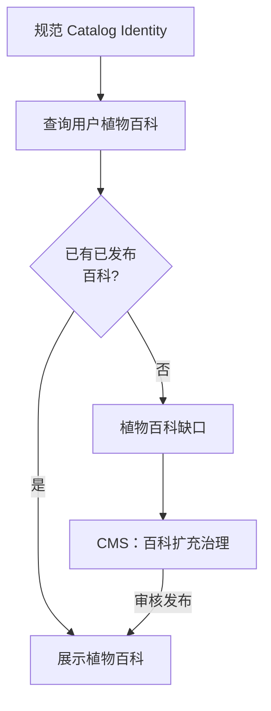
```mermaid
flowchart TB
  identity["规范 Catalog Identity"]
  lookup["查询用户植物百科"]
  gate{"已有已发布<br/>百科?"}
  display["展示植物百科"]
  gap["植物百科缺口"]
  cms["CMS：百科扩充治理"]

  identity --> lookup
  lookup --> gate
  gate -->|是| display
  gate -->|否| gap
  gap --> cms
  cms -->|审核发布| display
```

## L1-06｜Care

> 父级：L0 → **植物养护**

解释 L0 的植物养护域：Care 是基于 Plant Context 派生出的养护决策域。浇水、施肥负责行动规划；光照、通风的原子事实归属于 Environment，Care 仍对外提供评估与调整建议。四类养护能力共同遵守稳定输出合同。Persistent 与 Ephemeral 的结果处理仍保持不同。

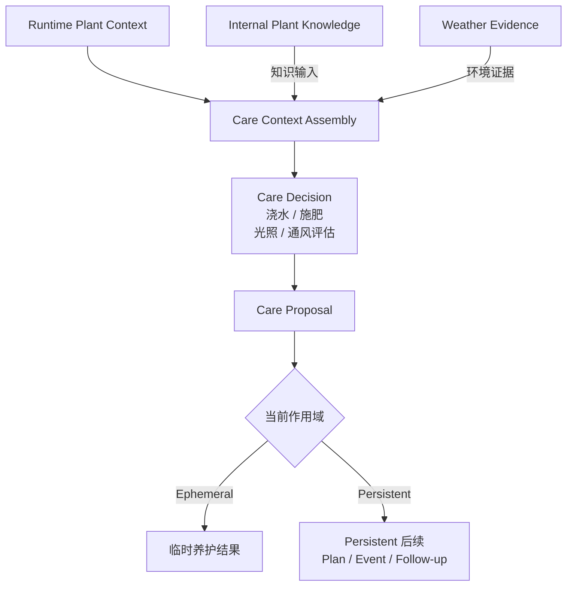
```mermaid
flowchart TB
  ctx["Runtime Plant Context"]
  knowledge["Internal Plant Knowledge"]
  weather["Weather Evidence"]
  input["Care Context Assembly"]
  care["Care Decision<br/>浇水 / 施肥<br/>光照 / 通风评估"]
  proposal["Care Proposal"]
  scope{"当前作用域"}
  temp["临时养护结果"]
  action["Persistent 后续<br/>Plan / Event / Follow-up"]

  ctx --> input
  knowledge -->|知识输入| input
  weather -->|环境证据| input
  input --> care
  care --> proposal
  proposal --> scope
  scope -->|Ephemeral| temp
  scope -->|Persistent| action
```

> **边界/说明：** 光照、通风、温度、湿度的原子事实归属 Atomic Environment；Care 在其上派生浇水、施肥、光照评估与通风评估，四类结果遵守统一合同。浇水的 indoorEqHours、VPD、排水等细节继续下沉到 L2/L3。

### L2｜Watering｜VPD 最新模型

> 父级：L1-06｜Care

按《分支 · 算法稳健性评估》提出的目标模型展开：植物 watering.freq 提供基准周期；光照用 indoorEqHours，室内温度+相对湿度只在一处计算 airVpd，再与 airMovement 合成 environmentalDryingDemand → dryDownFactor；盆器/基质/排水继续参与预计干湿周期。最近浇水、水分荷载、根区/盆土状态作为最终门控：WET 延后/暂停，DRY 尽快检查并浇透，BASELINE 才使用调整后周期。VPD 不与温度/RH重复计权；不使用 lightHealthScore；环境干燥需求只修正周期，不直接改变单次水量；这不是 FAO-PM/ET₀，也不计算真实蒸腾 ml/day。旧 hotDry/highHumidity/coldHumid 等天气桶不再作为这条环境干燥主链。图是目标模型，首版是否开放属于待确认的受控实验安排，不等同于已核验源码实现。

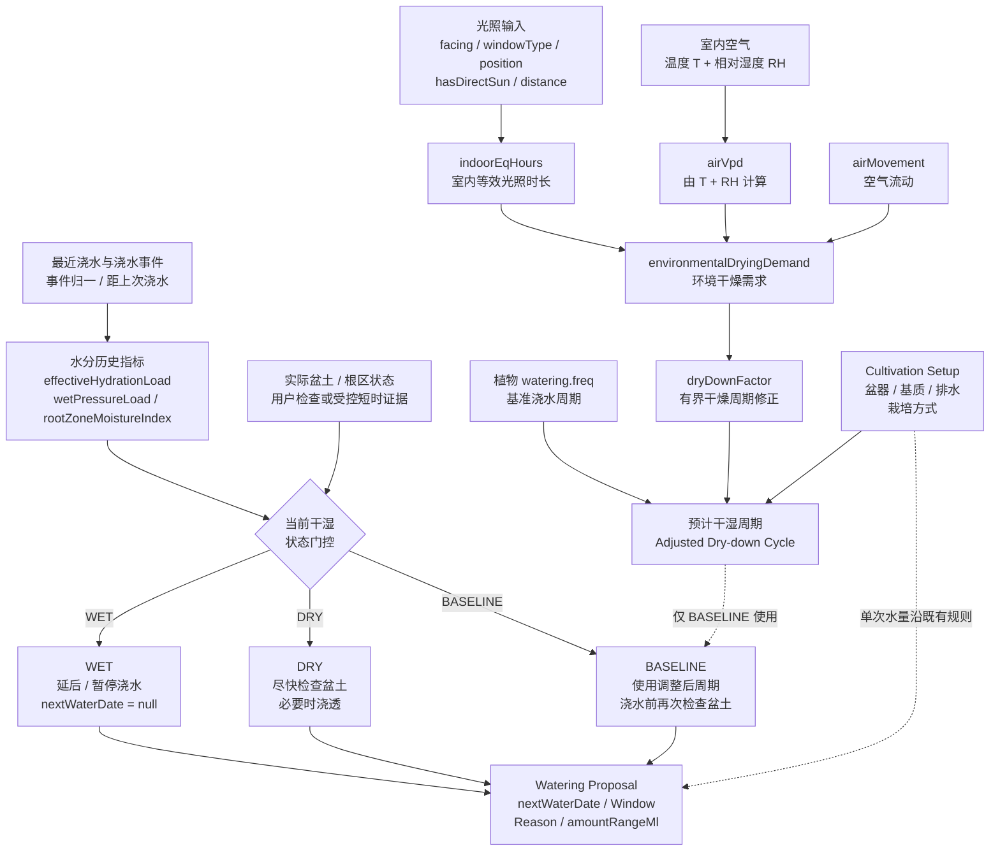
```mermaid
flowchart TB
  baseline["植物 watering.freq<br/>基准浇水周期"]
  lightInput["光照输入<br/>facing / windowType / position<br/>hasDirectSun / distance"]
  indoorEq["indoorEqHours<br/>室内等效光照时长"]
  airInput["室内空气<br/>温度 T + 相对湿度 RH"]
  airVpd["airVpd<br/>由 T + RH 计算"]
  airMove["airMovement<br/>空气流动"]
  envDemand["environmentalDryingDemand<br/>环境干燥需求"]
  dryFactor["dryDownFactor<br/>有界干燥周期修正"]
  cult["Cultivation Setup<br/>盆器 / 基质 / 排水<br/>栽培方式"]
  cycle["预计干湿周期<br/>Adjusted Dry-down Cycle"]
  history["最近浇水与浇水事件<br/>事件归一 / 距上次浇水"]
  loads["水分历史指标<br/>effectiveHydrationLoad<br/>wetPressureLoad / rootZoneMoistureIndex"]
  soil["实际盆土 / 根区状态<br/>用户检查或受控短时证据"]
  gate{"当前干湿<br/>状态门控"}
  wet["WET<br/>延后 / 暂停浇水<br/>nextWaterDate = null"]
  dry["DRY<br/>尽快检查盆土<br/>必要时浇透"]
  base["BASELINE<br/>使用调整后周期<br/>浇水前再次检查盆土"]
  result["Watering Proposal<br/>nextWaterDate / Window<br/>Reason / amountRangeMl"]

  lightInput --> indoorEq
  airInput --> airVpd
  indoorEq --> envDemand
  airVpd --> envDemand
  airMove --> envDemand
  envDemand --> dryFactor
  baseline --> cycle
  dryFactor --> cycle
  cult --> cycle
  history --> loads
  loads --> gate
  soil --> gate
  gate -->|WET| wet
  gate -->|DRY| dry
  gate -->|BASELINE| base
  cycle -. "仅 BASELINE 使用" .-> base
  wet --> result
  dry --> result
  base --> result
  cult -. "单次水量沿既有规则" .-> result
```

## L1-07｜Diagnosis

> 父级：L0 → **植物诊断**

解释 L0 的诊断域：先建立模式内证据账本，再判断证据是否足够；不足时才进入对应题包。固定题包与虫害动态题包边界保持不变。结论之后必须给用户可执行、可复查的建议；生成式丰富解释是独立版本的受控候选，不替代证据与用户确认。

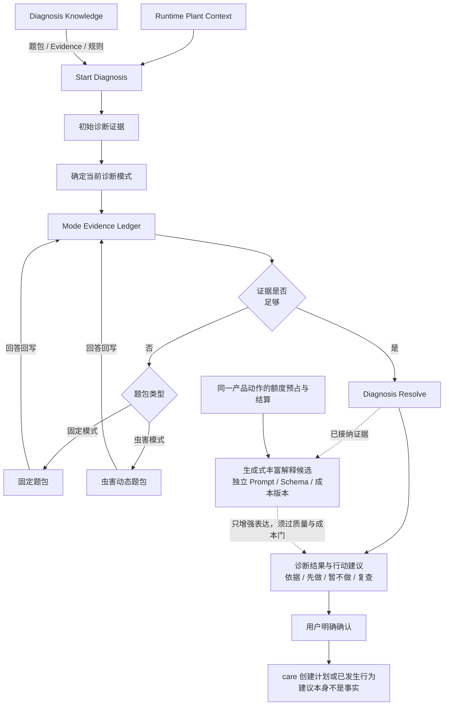
```mermaid
flowchart TB
  ctx["Runtime Plant Context"]
  knowledge["Diagnosis Knowledge"]
  start["Start Diagnosis"]
  initial["初始诊断证据"]
  mode["确定当前诊断模式"]
  ledger["Mode Evidence Ledger"]
  gate{"证据是否<br/>足够"}
  resolve["Diagnosis Resolve"]
  route{"题包类型"}
  fixed["固定题包"]
  pest["虫害动态题包"]
  advice["诊断结果与行动建议<br/>依据 / 先做 / 暂不做 / 复查"]
  confirm["用户明确确认"]
  care["care 创建计划或已发生行为<br/>建议本身不是事实"]
  rich["生成式丰富解释候选<br/>独立 Prompt / Schema / 成本版本"]
  quota["同一产品动作的额度预占与结算"]

  ctx --> start
  knowledge -->|题包 / Evidence / 规则| start
  start --> initial
  initial --> mode
  mode --> ledger
  ledger --> gate
  gate -->|是| resolve
  gate -->|否| route
  route -->|固定模式| fixed
  route -->|虫害模式| pest
  fixed -->|回答回写| ledger
  pest -->|回答回写| ledger
  resolve --> advice
  advice --> confirm
  confirm --> care
  resolve -.已接纳证据.-> rich
  quota --> rich
  rich -.只增强表达，须过质量与成本门.-> advice
```

> **边界/说明：** Diagnosis Record 是诊断判断，不是 Plant Fact。视觉证据、用户回答、历史事实都进入同一 Mode Evidence Ledger。

### L2｜Multi-image Evidence

> 父级：L1-07｜Diagnosis

多图价值是补齐证据、减少重复追问、核实关键因素，不建立另一套通用病因推理系统。本图是目标能力；首版作为待确认的受控实验候选，未通过质量、成本与额度门前不得开放。

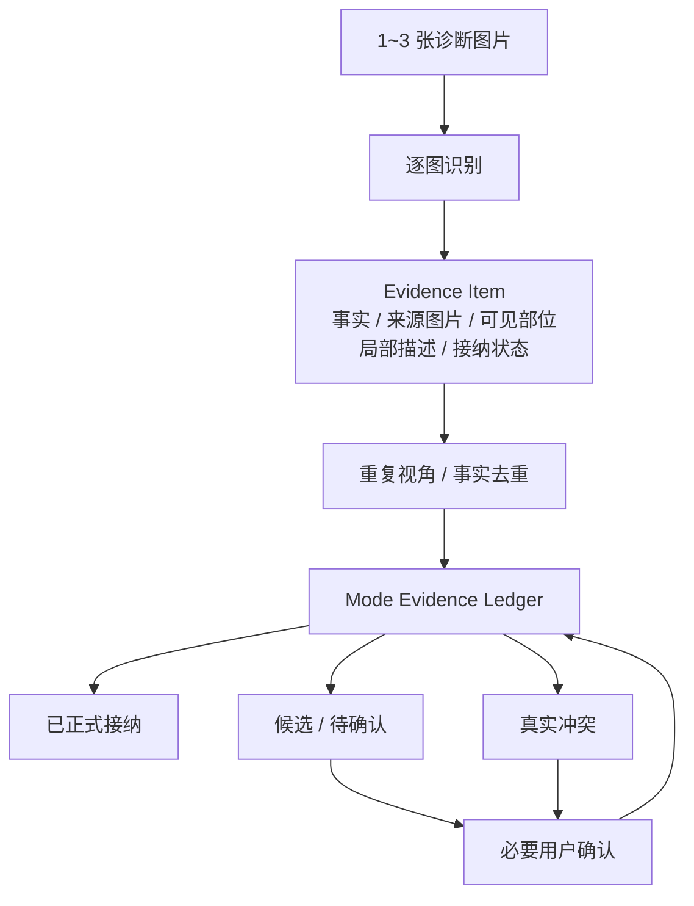
```mermaid
flowchart TB
  images["1~3 张诊断图片"]
  per["逐图识别"]
  item["Evidence Item<br/>事实 / 来源图片 / 可见部位<br/>局部描述 / 接纳状态"]
  dedup["重复视角 / 事实去重"]
  ledger["Mode Evidence Ledger"]
  accepted["已正式接纳"]
  candidate["候选 / 待确认"]
  conflict["真实冲突"]
  confirm["必要用户确认"]

  images --> per
  per --> item
  item --> dedup
  dedup --> ledger
  ledger --> accepted
  ledger --> candidate
  ledger --> conflict
  candidate --> confirm
  conflict --> confirm
  confirm --> ledger
```

## L1-08｜小青 Agent

> 父级：L0 → **小青 Agent**

小青读取 Persistent Plant Context 和相关记录；只读请求直接回答，写操作先形成 Tool Proposal，再经过用户确认调用正式领域能力。

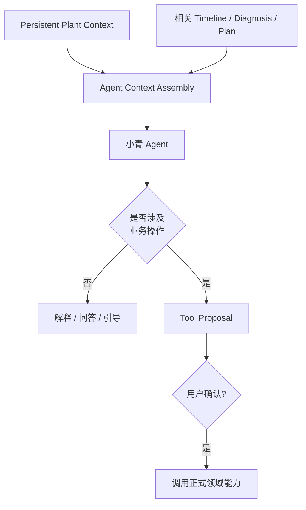
```mermaid
flowchart TB
  ctx["Persistent Plant Context"]
  records["相关 Timeline / Diagnosis / Plan"]
  agentctx["Agent Context Assembly"]
  xq["小青 Agent"]
  intent{"是否涉及<br/>业务操作"}
  answer["解释 / 问答 / 引导"]
  tool["Tool Proposal"]
  confirm{"用户确认?"}
  domain["调用正式领域能力"]

  ctx --> agentctx
  records --> agentctx
  agentctx --> xq
  xq --> intent
  intent -->|否| answer
  intent -->|是| tool
  tool --> confirm
  confirm -->|是| domain
```

> **边界/说明：** 永久边界：小青不能绕过领域能力直接写 Plant Facts、Plant State 或正式 Diagnosis。

## L1-09｜CMS / Published Content Governance

> 父级：L0 → **CMS 内容与规则治理**

解释 L0 中 CMS 如何接收治理候选并发布版本化内容。植物识别会向 CMS 提交 Catalog 扩种候选和植物百科缺口；CMS 审核发布后分别回流 Catalog 与用户百科，并继续供 Care、Diagnosis 消费其规则与知识。

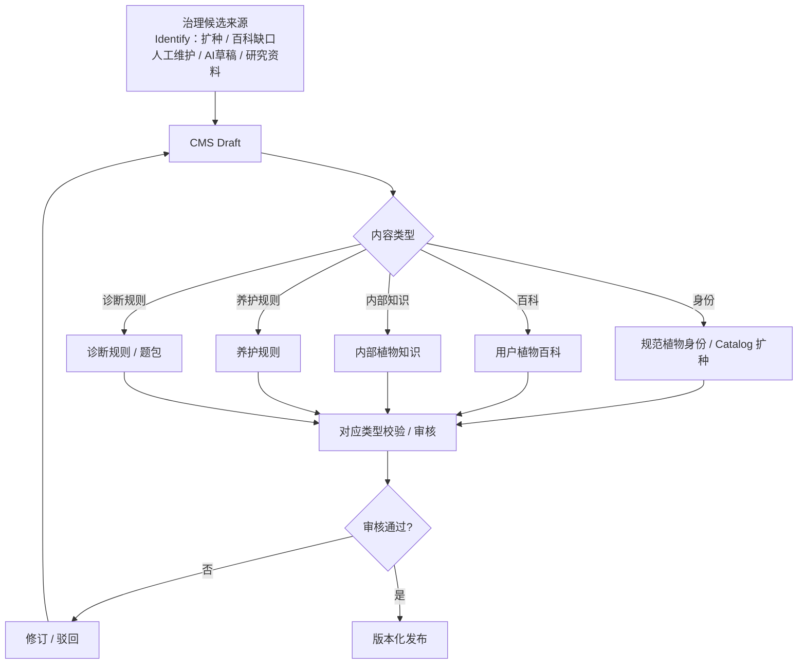
```mermaid
flowchart TB
  source["治理候选来源<br/>Identify：扩种 / 百科缺口<br/>人工维护 / AI草稿 / 研究资料"]
  draft["CMS Draft"]
  type{"内容类型"}
  identity["规范植物身份 / Catalog 扩种"]
  ency["用户植物百科"]
  knowledge["内部植物知识"]
  care["养护规则"]
  diag["诊断规则 / 题包"]
  validation["对应类型校验 / 审核"]
  review{"审核通过?"}
  revision["修订 / 驳回"]
  publish["版本化发布"]

  source --> draft
  draft --> type
  type -->|身份| identity
  type -->|百科| ency
  type -->|内部知识| knowledge
  type -->|养护规则| care
  type -->|诊断规则| diag
  identity --> validation
  ency --> validation
  knowledge --> validation
  care --> validation
  diag --> validation
  validation --> review
  review -->|否| revision
  review -->|是| publish
  revision --> draft
```

> **边界/说明：** Qwen 可以生成候选草稿，但不能直接成为规范 Identity、内部养护知识或安全事实的真相源。

### L2｜Catalog 扩种治理

> 父级：L1-09｜CMS / Published Content Governance

解释 CMS 侧如何处理 Identify 产生的 Catalog 扩种候选；这里只负责规范身份治理，不负责百科内容补全。

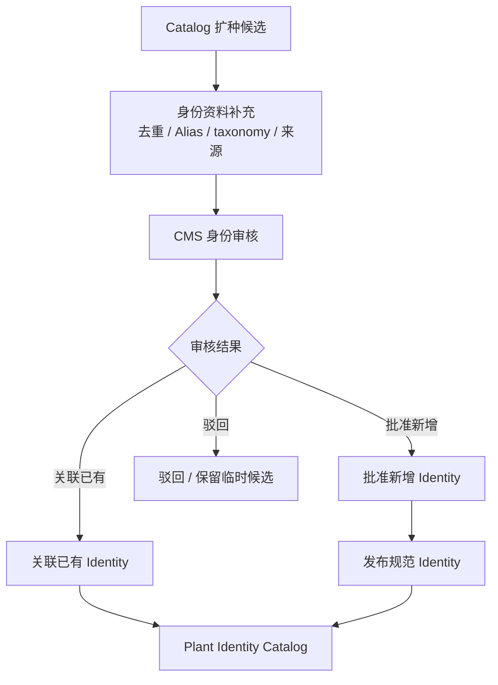
```mermaid
flowchart TB
  candidate["Catalog 扩种候选"]
  reviewData["身份资料补充<br/>去重 / Alias / taxonomy / 来源"]
  review["CMS 身份审核"]
  gate{"审核结果"}
  existing["关联已有 Identity"]
  new["批准新增 Identity"]
  reject["驳回 / 保留临时候选"]
  publish["发布规范 Identity"]
  catalog["Plant Identity Catalog"]

  candidate --> reviewData
  reviewData --> review
  review --> gate
  gate -->|关联已有| existing
  gate -->|批准新增| new
  gate -->|驳回| reject
  existing --> catalog
  new --> publish
  publish --> catalog
```

### L2｜Public Encyclopedia

> 父级：L1-09｜CMS / Published Content Governance

植物百科补全只针对“已有规范 Identity 但缺用户可见内容”的情况。

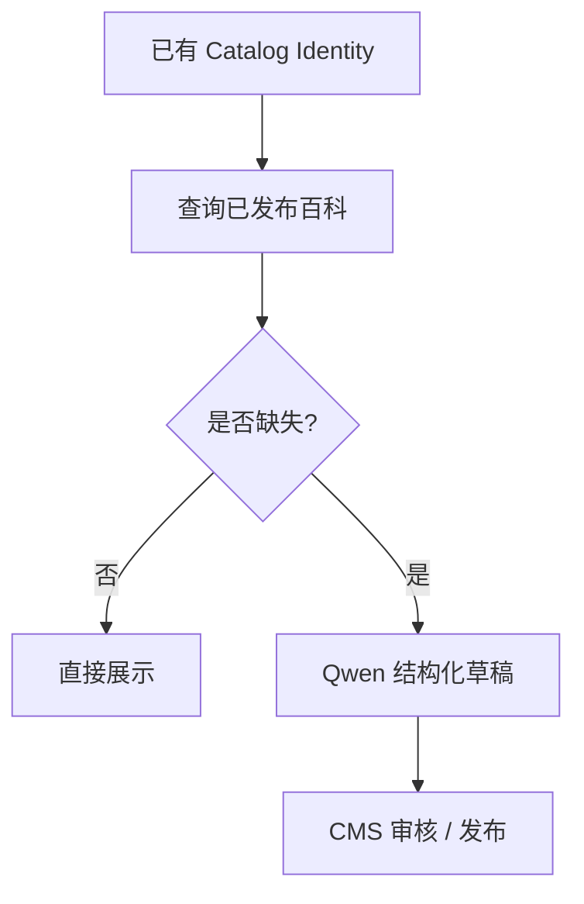
```mermaid
flowchart TB
  identity["已有 Catalog Identity"]
  lookup["查询已发布百科"]
  gate{"是否缺失?"}
  display["直接展示"]
  draft["Qwen 结构化草稿"]
  review["CMS 审核 / 发布"]

  identity --> lookup
  lookup --> gate
  gate -->|否| display
  gate -->|是| draft
  draft --> review
```

## 阅读约定

- `-->`：业务主关系 / 控制流。
- `-.->`：知识、数据或外部能力依赖。
- 菱形节点：条件门，单入口、多条件出口。
- 本文仅表达业务语义和父子关系；技术实现以根目录 README 的后端基础设施图和对应合同映射。
