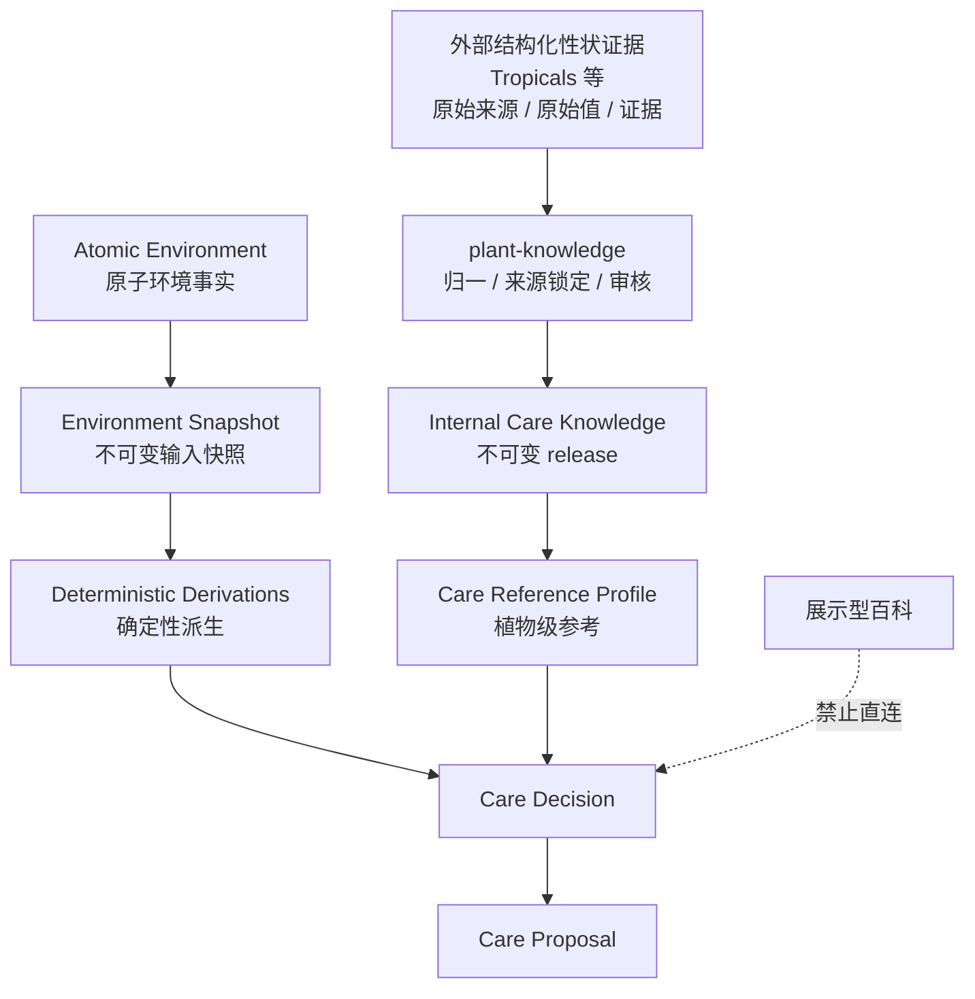
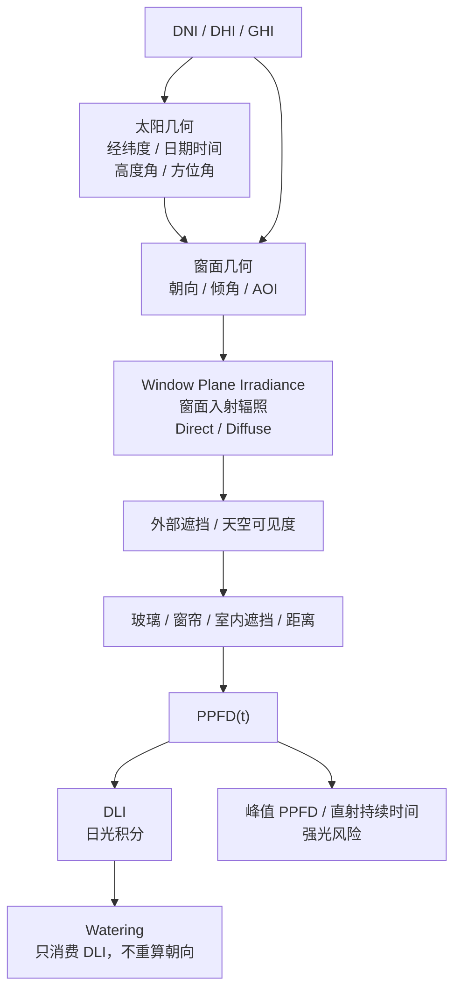
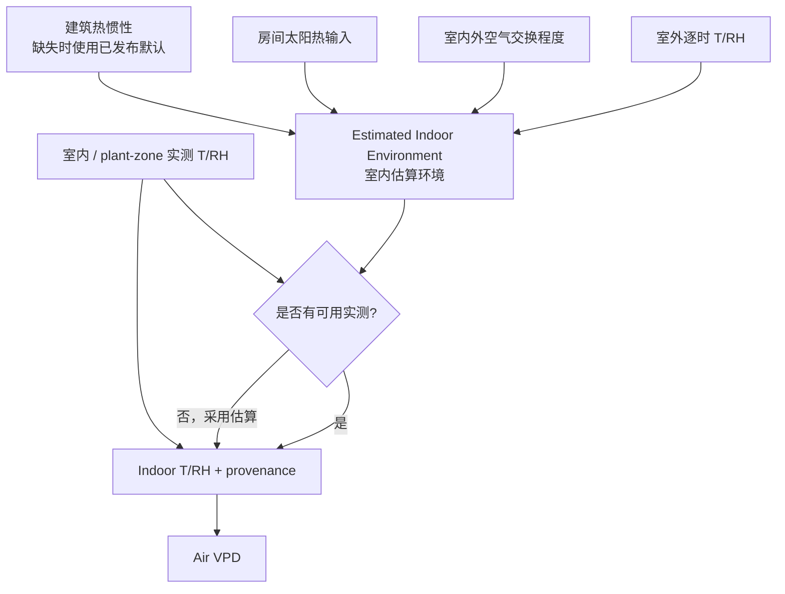
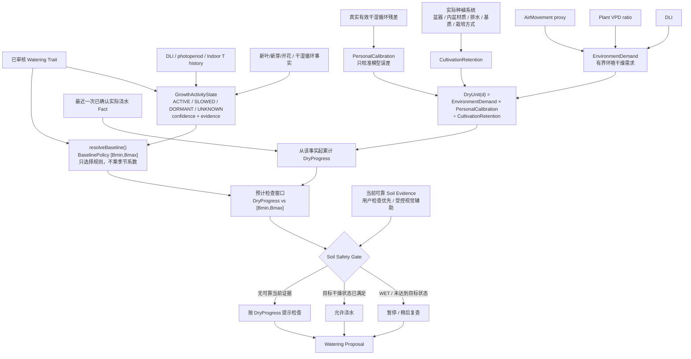

# Care 最新决策架构

> 状态：2026-10-03 当前目标架构基线。本文描述养护计算的职责边界与数据流；具体倍率、阈值和敏感度仍须通过版本化策略与影子数据校准，不能把产品参数包装成物理常数。

## 1. 总原则

青花植养护固定遵循：

```text
先事实 → 后确定性推导 → 再受约束综合 → 最后建议
```

AI 可以承担多证据归约、解释与建议，但不能定义输入事实，也不能重新计算已有确定性物理量。展示型百科不是养护知识源；外部结构化性状只有经过来源保留、归一、审核和不可变 release 后，才能进入 Internal Care Knowledge。



## 2. 光照：DLI 是浇水正式上游



硬规则：

- 不使用固定“南窗=有直射、北窗=无直射”的业务规则；是否有直射由太阳位置、窗面几何和遮挡决定。
- Direct / Diffuse 在进入植物位置前不应过早合并。
- MVP 不把地面反射作为核心计算项。
- `indoorEqHours` 退出浇水一级依赖。

## 3. 室内空气：实测优先，估算必须明示



室外天气永远保持 `outdoor` 范围。`Estimated Indoor Environment` 是派生值，不是室内实测。

## 4. 浇水：等效干燥进度而不是日期乘法



优先级固定为：

```text
当前可靠盆土证据
> 真实干湿循环个体校准
> 环境/栽培预测
> 名义日历天数
```

最近浇水建议、提醒或 Care Plan 都不能重置 DryProgress；只有用户确认已实际浇水形成的 Care Event / Plant Fact 才能重置。

## 5. Reference Profile

Reference Profile 不再是假设所有植物共享一个“标准室内环境”。目标结构是：

```text
WateringReferenceProfile
├─ baseline trait / trigger
├─ light reference        植物级
├─ VPD anchor             植物级，来自已审核温湿度性状
├─ air movement reference 全局普通室内参考 + 有界映射
└─ cultivation reference  植物级；仅在可用性状证据通过审核后启用
```

当前 `qinghuazhi_v2_test.tropicals_trait_ref` 为空，且现有百科表没有 `substrate_preference` 字段，因此植物级 cultivation reference 的数据来源仍未完成，不能在实现或图中宣称已具备。当前可先使用已经存在且可追溯的 watering tier、温湿度、光照 tier 与 growth-season knowledge，缺失部分必须显式 fallback。

## 6. Proposal → Plan → Fact


任何 AI 输出、建议、计划或通知都不能冒充事实。
