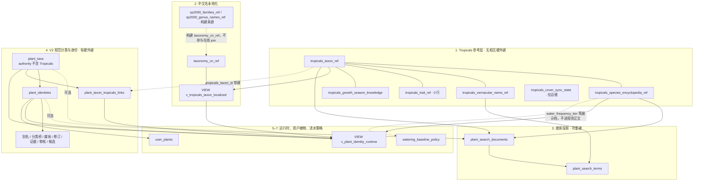
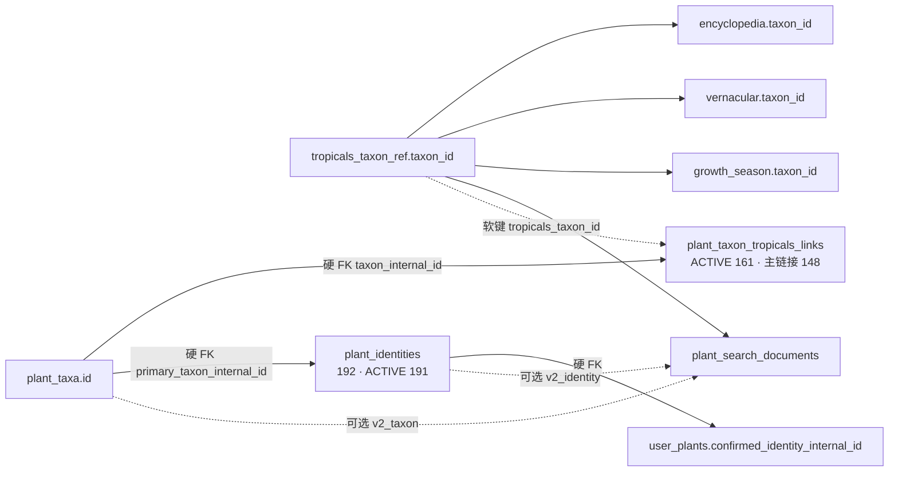
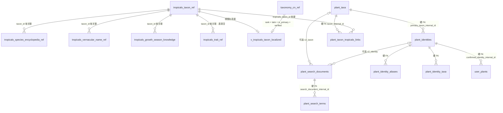
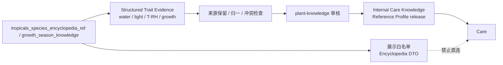

# 植物目录数据模型

> 2026-10-03 对 CloudBase `qinghuazhi_v2_test` 的只读核对。本文是植物目录各层表关系的规范说明。百科运行时裁决与代码差距见 [植物目录与百科 SQL 主读](tropicals-api-mvp.md)。
>
> **库里已有**与**代码尚未接上**必须分开读。下面的行数、外键和视图是库事实；首页仍直连 Tropicals 自动补全、百科详情尚未改读 SQL，是代码事实，不能反过来改写库结构。

## 一句话

Tropicals 参考表按 `taxon_id` 软关联，不合并成一张大植物表，也不整库物化成 PlantIdentity。可搜索的是可重建投影 `plant_search_*`。规范身份只存在于 V2 的 `plant_taxa` / `plant_identities`，经 `plant_taxon_tropicals_links` 有审计地桥到 Tropicals。搜索全集不等于业务身份全集。

## 分层

关联枢纽是 **`taxon_id`（稳定字符串，不是各表自增 `id`）**。V2 不把 Tropicals 当成权威来源，只在审核后的桥表上挂接。

## 逻辑键（含软关联）

硬外键只画在库里真实存在的约束上。Tropicals 参考表之间、以及桥表指向 `taxon_id` 的一侧，都是软关联。

## 1. Tropicals 参考层

来源快照。表与表之间 **没有正式外键**，用 `taxon_id` 软连接。禁止收成一张「植物大表」。

| 表 | 2026-10-03 行数 | 角色 |
|---|---|---|
| `tropicals_taxon_ref` | 精确 409,880 | 分类单元快照。`taxon_id` 是枢纽，不是自增 `id` |
| `tropicals_species_encyclopedia_ref` | 精确 271,810 | 百科展示行。注释约定同样用 `taxon_id` 连接。性状有一部分已经反规范化到本表（`water_frequency_tier`、`light_requirement_tier` 等） |
| `tropicals_vernacular_name_ref` | 精确 1,204,618 | 俗名。**不是唯一标识**：同一中文名可以对应多个分类，候选必须都保留 |
| `tropicals_trait_ref` | **0 行**（表在） | 性状表。空。不要假设还能从这里读出养护性状 |
| `tropicals_growth_season_knowledge` | 精确 47,131 | 生长季知识，键同样是 `taxon_id` |
| `tropicals_cover_sync_state` | 运维 | 封面同步状态，不参与目录或身份语义 |

`information_schema.TABLE_ROWS` 是 InnoDB 近似统计，不是精确 `COUNT(*)`。2026-10-03 实时 `COUNT(*)` 已确认分类 409,880、百科 271,810、俗名 1,204,618；这三个数与当前导入/源数据口径一致。搜索投影是否具备百科仍以 `plant_search_documents.has_encyclopedia` 的精确投影和可回放构建逻辑判断，不得用近似 TABLE_ROWS 否定覆盖。

## 2. 中文本地化

| 对象 | 2026-10-03 行数 | 角色 |
|---|---|---|
| `taxonomy_cn_ref` | TABLE_ROWS 约 4,972 | 已核对的中文名。在线本地化只读这张表 |
| `sp2000_families_ref` | 485 | 构建 `taxonomy_cn_ref` 的来源，不参与请求期 join |
| `sp2000_genus_names_ref` | TABLE_ROWS 约 3,999 | 同上，属名构建来源 |

视图 `v_tropicals_taxon_localized` = `tropicals_taxon_ref` **LEFT JOIN** `taxonomy_cn_ref`，连接条件是 rank、拉丁名、`is_primary`、verified。未命中中文名仍然保留分类行。

## 3. 搜索投影（库里已经存在）

可重建。**不是**规范身份表，也不是规范身份的替代物。`plant_search_*` 是当前 SQL 植物目录的正式运行时投影。

| 对象 | 2026-10-03 精确计数 | 含义 |
|---|---|---|
| `plant_search_documents` | **271,384** | 搜索文档全集。`searchable` = 271,384；`selectable` = 270,613；`has_encyclopedia` = 271,267 |
| 其中挂上 V2 身份 | **182** | `v2_identity` 有值。远小于文档总数 |
| 其中挂上 V2 分类 | **294** | `v2_taxon` 有值 |
| `plant_search_terms` · `tropicals_vernacular` | 782,025 | 来自俗名 |
| `plant_search_terms` · `tropicals_encyclopedia` | 664,028 | 来自百科 |
| `plant_search_terms` · `tropicals_taxon` | 541,603 | 来自分类名 |
| `plant_search_terms` · `qinghuazhi_alias` | 389 | 来自青花植别名 |
| `plant_search_terms` · `qinghuazhi_identity` | 191 | 来自青花植身份，与 ACTIVE 身份数同量级 |

外键：

- `plant_search_terms.search_document_internal_id` → `plant_search_documents.id`（硬）
- `plant_search_documents` 指向 `plant_taxa` / `plant_identities` 的 `v2_*` 列 **可空**。没有 V2 行的文档仍然可搜

排序规则约束（仓库内尚无 `plant_search_*` 建表语句，以下为硬约束，重建或迁移投影时必须遵守）：

- `plant_search_terms.normalized_term` 必须是 `utf8mb4` + **`utf8mb4_unicode_ci`**，并保留以它为首列的 `idx_search_term_exact`。目录搜索 SQL 把 `COLLATE utf8mb4_unicode_ci` 写在**参数侧**（`term.normalized_term LIKE CONVERT(? USING utf8mb4) COLLATE utf8mb4_unicode_ci`），列保持裸列才能走索引前缀 range。若列改成其他排序规则（如连接默认的 `utf8mb4_0900_ai_ci`），参数侧显式 COLLATE 优先级更高，MySQL 会先转换**列**再比较，索引失效，172 万词条退化为全量扫描。
- `plant_search_documents` 中参与匹配或排序的字符串列（`taxon_id`、`scientific_name`、`family`、`genus` 等）同样必须为 `utf8mb4_unicode_ci`，与 V2 schema（`docs/backend-v2/schema/*.sql` 表级 `COLLATE=utf8mb4_unicode_ci`）一致。
- 2026-10-09 已在 `qinghuazhi_v2_test` 用 `information_schema` 只读核对：上述列均为 `utf8mb4_unicode_ci`。该库连接默认 `collation_connection` 是 `utf8mb4_0900_ai_ci`，所以 SQL 里不能省略参数侧 COLLATE。

原则：**可搜索目录 ≠ 已物化的 PlantIdentity 集合。** 27 万搜索文档对 191 条 ACTIVE 身份，就是这个原则的当前证据。投影可以整表重建；重建不得顺手把 Tropicals 分类写成 `plant_identities`。

## 4. V2 规范分类与身份

| 对象 | 2026-10-03 | 关系 |
|---|---|---|
| `plant_taxa` | TABLE_ROWS 约 795 | `authority_source` **只能**是 `POWO`、`WCVP`、`WFO`、`RHS_ICRA`。Tropicals 不是权威来源 |
| `plant_identities` | **精确 192**（ACTIVE **191**） | `primary_taxon_internal_id` → `plant_taxa.id`（硬） |
| `plant_taxon_tropicals_links` | **精确 161**，全部 ACTIVE；其中主链接 **148** | `taxon_internal_id` → `plant_taxa.id`（硬）。另一侧 `tropicals_taxon_id` 软对齐参考层 `taxon_id`。这是有审计的桥，不是把两边主键当成同一个 id |
| `plant_identity_aliases` | 约 357 | 身份卫星，硬外键指向 `plant_identities` |
| `plant_identity_taxa` | 约 182 | 身份与分类的桥，硬外键指向身份 |

其余身份卫星（媒体、百科修订、证据、审核、候选）同样经硬外键挂在 `plant_identities` 上。运行时视图已使用 `plant_identity_media` 与 `plant_taxon_media`。本次未再单列这些卫星的精确行数；没有行数就不把它们说成已灌满。

用户植物：`user_plants.confirmed_identity_internal_id` → `plant_identities.id`。确认的是规范身份，不是搜索文档，也不是百科行。

## 5. 运行时组合视图

`v_plant_identity_runtime` 只服务 **已有规范身份** 的读模型，不扫描 27 万搜索文档：

1. `plant_identities`（ACTIVE）
2. JOIN `plant_taxa`（ACTIVE）
3. LEFT JOIN `plant_product_categories`
4. LEFT JOIN `plant_taxon_tropicals_links`（主链接且 ACTIVE）
5. LEFT JOIN `v_tropicals_taxon_localized`（分类 + `taxonomy_cn_ref`）
6. LEFT JOIN `tropicals_species_encyclopedia_ref`
7. LEFT JOIN `plant_identity_media` / `plant_taxon_media`

没有主链接的身份仍然返回身份与分类；百科与 Tropicals 分类是左连接，缺了不构成身份不存在。

## 6. 浇水策略、结构化性状证据与百科展示隔离

`watering_baseline_policy` 共 **22** 条 active 规则，把 `water_frequency_tier + trigger_state` 映射为当前名义基线。新的浇水模型会把该 min/max 迁移解释为标准参考条件下的 `minDryUnits/maxDryUnits`，而不是硬日历截止日期。

外部参考层必须拆成两条投影：

当前百科表已经存在 `water_frequency_tier`、`light_requirement_tier`、`humidity_preference`、`humidity_preference_details_json`、`optimal_temperature_range_c` 等结构化字段，`tropicals_growth_season_knowledge` 也已存在 **47,131** 条记录。这些字段可以作为性状**证据**，但不能因为和展示百科同表就直接成为 Care 规则。

同时必须承认当前数据缺口：`tropicals_trait_ref` 是 **0 行**，现有百科表没有 `substrate_preference`。因此当前不能宣称已经拥有植物级“典型栽培基质 Reference”；该能力只有未来获得可追溯性状并发布 Internal Care Knowledge 后才启用。

百科护理长文、病虫害正文和展示字段仍不得进入浇水、施肥、诊断或安全判定。

## 读路径

四条路径的主键命名空间彼此独立。

| 路径 | 库里怎么读 | 定位键 | 代码现状（2026-10-03） |
|---|---|---|---|
| 目录搜索 | `plant_search_terms` → `plant_search_documents`。可选再看 `v2_identity` / `v2_taxon`，没有也不影响可搜 | 搜索文档 id；词条不把俗名当成唯一键 | **目标合同已冻结但尚未接线。** 目录搜索使用 [plant-catalog-search/v1](../contracts/plant-catalog-search.md) 读取 `plant_search_terms → plant_search_documents`；首页 `PlantSearchToolbar` 仍走 Tropicals autocomplete。已发布身份公开搜索继续只做 `displayNameZh` / `acceptedScientificName` 字面前缀，两条搜索面明确分离 |
| 百科详情 | CloudBase SQL：`tropicals_species_encyclopedia_ref`，需要分类或俗名时再按 `taxon_id` 读 taxon / vernacular / 本地化视图 | **slug**：由 `scientificName` 去符号后的 kebab-case。例：`Monstera deliciosa 'Thai Constellation'` → `monstera-deliciosa-thai-constellation`。slug 不是已存储的 API 字段，也不是 `taxon_id`、API id 或 identity id | **尚未接上。** 首页选中后仍读 Tropicals 实时详情 |
| 身份运行时 | `v_plant_identity_runtime` | `plant_identities` 的内部 id | 视图已在库内。不要用它冒充目录搜索 |
| `ensurePlantIdentity` | 只在需要规范身份时写入或解析 `plant_taxa` + `plant_identities`，并用 `plant_taxon_tropicals_links` 记下 Tropicals `taxon_id`。权威来源仍只能是 POWO / WCVP / WFO / RHS_ICRA | 内部 taxon id 与 identity id；桥上另存 `tropicals_taxon_id` | 不得把搜索命中或百科行直接当成已确认身份，也不得把全部 Tropicals 分类物化成身份。用户植物只有在确认之后才写 `confirmed_identity_internal_id` |

实时 API 不是上述任一路径的运行时依赖。`nameEn`、COL、价格等 SQL 行没有的 API 字段，不阻断百科详情。

## 明确不做

- 不把 taxon、百科、俗名、性状合并成一张植物表。
- 不把俗名、中文名或 slug 当作唯一主键；重名分类全部保留。
- 不把约 39 万 Tropicals 分类或 27 万搜索文档物化成 PlantIdentity。当前身份只有 192 行。
- 不把 Tropicals 写进 `plant_taxa.authority_source`。
- 不把空的 `tropicals_trait_ref` 或百科护理长文当成养护/诊断规则；结构化性状必须经证据审核与 Internal Care Knowledge release 后才能进入 Care。
- 不把 API id、学名 slug、`taxon_id`、`plant_taxa.id`、`plant_identities.id` 互相等值。
- 不因为代码还在打实时 API，就回写成「搜索投影不存在」或「禁止创建 `plant_search_*`」。投影已经在库里，缺的是调用方。
