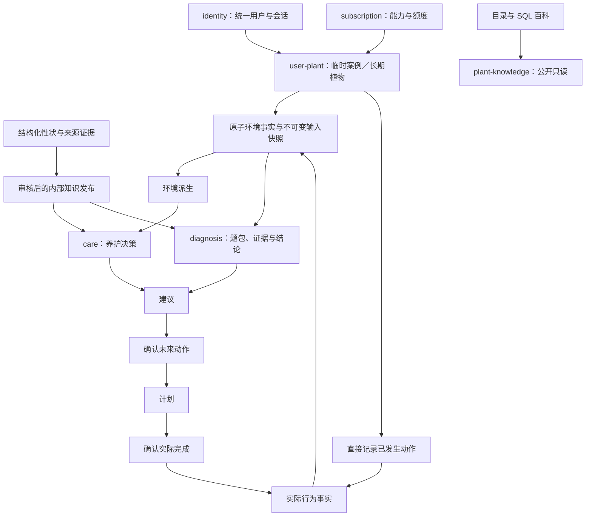
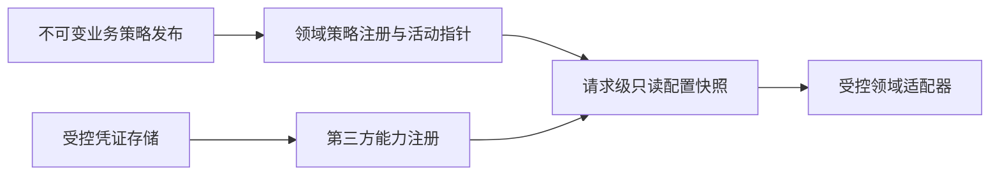
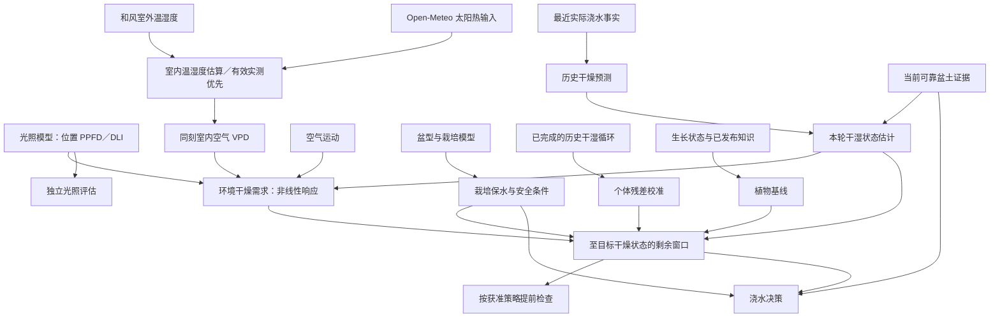

# backend-v2 整体重构计划：多版本交叉验证完整版

更新日期：2026-10-08。当前主线为 E04／E06 养护模型及最终浇水输出；已完成子项不重新实施，阶段状态以实际 ClickUp 读回和验收证据为准。

## 一、交叉验证结果与唯一目标

本计划完整替代本会话此前各版计划及单独的执行补充计划，承接 [评估青花植后端代码质量](codex://threads/01a09af6-e96d-7f51-bd90-78baf5c5de3d) 和原 ClickUp 任务，保持六个业务域及 P-1～P6 的重构方向。架构修订、养护模型、Camunda 模型、执行顺序、开票规则和每小时同步共同属于这一份计划。

唯一目标：在现有实现基础上修订必要的架构细节，完成“首次解决植物问题 → 显式保存或绑定植物 → 后续养护与复访”的后端闭环，并让养护、诊断模型能够版本化迭代、追溯和回放。

交叉验证采用本会话各版计划、关联会话的可见正文、原任务进展、本次实际读取的 32 张 ClickUp 票据及相关验收记录、OpenViking 相关知识及定向源码核验。没有重复读取完整架构包。

### 最终裁决

| 原表述或风险 | 最终采用 |
|---|---|
| 养护成为独立项目，掩盖原任务未完成项 | 身份、用户植物、首用能力、目录和问诊继续属于主线；养护是整体重构增量 |
| 先完成全部架构修订，再开发全部领域 | 按纵向切片冻结所需合同后立即开发；独立能力不等待无关模块 |
| 目录引用、学名 slug、API ID 与内部身份混用 | 分属不同命名空间；百科路径显式处理目录引用与 slug 的关系 |
| 把提出的百科路由当成已冻结接口 | 标记为本计划新增接口，先完成合同登记，再实现 |
| 用户确认建议后统一进入计划，再产生事实 | 确认未来动作生成计划；确认已经发生的动作可直接走事实记录用例 |
| 所有浇水必须先有完整 DryProgress | 可靠盆土证据可独立形成安全判断；缺预测输入时不得伪造进度或预测窗口 |
| 旧天数直接换名成为干燥单位 | 只有参考条件与迁移依据确认后才能转换；此前只是名义基线候选 |
| 候选风速、基质参数成为默认值 | 来源核验、配置裁决和策略发布之前保持 pending |
| OpenViking 资源更新代表仓库已修改 | 两者分别核验；召回不能证明源码、部署或真实服务已完成 |
| 原票据的所有目标都成为首版退出条件 | 首版与延后子项分别验收，保留目标态，不重新开放延后功能 |
| 全量测试只指 backend-v2 小套件 | 明确相关后端验证与仓库全量单元测试；未全绿不得宣称收工 |
| 同键重放“返回相同结果”套用于登录 | 平台登录 code 一次性消费，首响应丢失须重新取 code；不得再次披露令牌 |
| 按 Phase 或票据 running 状态推断当前进度 | 使用明确执行步骤、当前票据、验收环节和证据记录 |
| 定时同步兼做审计、开发或提交 | 自动化只同步已记录的任务进度，不承担其他职责 |

此前已验证的入口基线为 2333 行，SHA-256：

`c68e3a5555c0a121e356622fe41627299f72d64be92cdc2d202c4fb8e3c73d99`

这只证明当时计划入口的一致性，不代表整套架构或业务已经验收，也不代表合并后的计划已经落盘并重新校验。

## 二、实施硬规定与原任务接续点

### 2.1 实施硬规定

1. **恢复上下文优先 OpenViking。** 上下文压缩后先召回 planting 空间的相关稳定知识，不从头重读 `docs/backend-v2`、所有架构图和历史会话。接口、数据库、当前实现分别由对应合同、迁移和源码核验，相关读取须遵守第 9 条。
2. **同一事实不重复读取。** 保留精简的来源、版本、结论和待办索引；只有文件发生变化、存在冲突或缺少具体字段时，才重读相关片段。OpenViking 不可用不是进入文档目录的自动许可。
3. **业务纵向开发优先。** 每个增量必须明确入口、业务用例、持久化结果、公开响应和退出条件。架构工作只解决这个增量实际需要的边界，不为填满图而建设框架。
4. **子代理只用于获准且适合并行的独立工作。用户已授权在合适场景自动触发具名子代理处理琐碎、非高推理任务；主代理保留业务与配置裁决。** 分配前明确产物、读取范围、文件边界和验收条件；共享背景由主代理提供一次。禁止多个代理重复阅读同一架构或执行同一审计。原具名代理仍可用时优先复用。
5. **子代理恢复上下文同样优先 OpenViking。** 只读取自己负责部分的权威载体，不让每个代理重新探索整个仓库。
6. **机械核对交给脚本。** 计数、哈希、状态比对和批量证据匹配由脚本完成；模型处理歧义、冲突与业务裁决。无新事实不重写长交接或心跳。脚本不得用于绕过读取禁令。
7. **防止架构工作无限扩张。** 每个增量开始写明目标、关键假设、最小验证、继续与失败条件、回退方式和本轮时间上限。达到检查点时交付已验证结果及具体缺口，不以扩写文档替代推进。
8. **节流不得削弱真实性。** 不修改 Expected 吞掉失败，不绕过测试门，不用内存仓库或 HTTP 200 冒充真实闭环。
9. **严禁全量读取 backend-v2 文档。** 主代理及任何子代理均不得完整读取 `docs/backend-v2` 下的所有文件，也不得通过分批、分轮或代理分工变相完成全目录读取。任务上下文必须优先从 OpenViking 获取；只有针对当前任务逐层检索后，确认每一个 Layer 均无法提供所需上下文，才允许进入 `docs/backend-v2`。逐层检索只围绕当前任务，不得变成 OpenViking 全库读取。进入目录前必须明确各层召回结果、仍缺失的信息、所属领域及具体实现环节；仅允许定位并读取解决该缺口的特定文件或章节，禁止扩大到整个领域、全部架构图或其他无关资料。本规定适用于首次探索、上下文压缩后的恢复及子代理接续。此前条款中的“定向核验”“最小本地读取”等表述，凡涉及该目录，均须满足本条前置条件；不得将核验、服务异常或恢复上下文作为自动豁免理由。
10. **所有新任务先排序、再开票、后实施。** 新需求、缺陷、补证据和实施中发现的独立缺口，先按第七节确定优先级及依赖，再复用或创建 ClickUp 票据。没有票据的新任务不得进入实施。
11. **始终明确当前执行位置。** 每次承接、里程碑、阻断、待验收和完成，都记录当前步骤、票据、验收环节及下一动作。不得仅以“继续 P4”或“正在重构”表达进度。
12. **每小时同步只负责进度转发。** 自动化严格执行第七节的读取与写入边界，不自行开发、开票、排序或验收。

配置裁决、合同登记及必要架构维护仍遵守仓库宪章。涉及该目录的读取，同时满足上述第 9 条；不能借配置核验重新扩大读取范围。

### 2.2 已有工作与接续方式

2026-10-07 实际扫描原文件夹全部 32 张票据（包含已关闭任务，无后续分页）：16 项 done、6 项 codex running、2 项 ready for codex、1 项 human required、7 项 backlog。此处只保留结果及接续边界，不以历史百分比或旧描述覆盖当前状态。

已完成：P-1 五项审计、P0 四项证伪、P1 四项合同／配置架构、已发布身份公开搜索、E00 执行治理、E01 目录搜索。合同完成不等于领域运行能力全部完成，不能把 pending 参数一并批准；已完成工作不重新开票或实施。

| 领域与原票 | 实际状态 | 已有结果与剩余接续 |
|---|---|---|
| [统一身份 Principal](https://app.clickup.com/t/z8v0kmr970) | codex running | 会话与平台身份基础已有；正式微信 Provider 准入、HMAC／会话接线及真实登录仍待验收 |
| [用户植物核心实现](https://app.clickup.com/t/z8v0kmr9mj) | codex running | 已持有租约的认领、同键重放及提交未知读回已有验证；继续租约取得、可信身份及公开 HTTP，不重做已验证编排 |
| [游客、试用、会员和奖励闭环](https://app.clickup.com/t/z8v0kmr972) | codex running | 仅状态得到确认，无评论验收证据；继续核验首版临时案例／试用／认领子项，奖励延后范围不自动开放 |
| [CMS 分类、百科和发布](https://app.clickup.com/t/z8v0kmr971) | codex running | SQL 百科子项与审核／撤销／历史重放／发布拒绝已有验证；剩余正式 CMS 管理员及协议准入和发布闭环 |
| [盆土视觉和四类养护能力](https://app.clickup.com/t/z8v0kmr973) | codex running，High | 当前主线；已有光照、栽培、循环及 DMN 阶段产物，继续极简光照、室内 VPD、基质／盆土、水量依据和日期收口 |
| [诊断知识来源、园艺原因及 Outcome/Action 合同](https://app.clickup.com/t/z8v0kmrg8a) | codex running | V1 题包材料、来源校验和部分读回已有；只补剩余合同增量、知识发布及真实诊断链路 |
| [固定／动态问诊与小青工具](https://app.clickup.com/t/z8v0kmr974) | human required | 答案持久化与读取已有；85 个输入组合、57 个申报代码审核稿待语义／命名确认，确认前不发布映射 |
| [共享基础设施实现](https://app.clickup.com/t/z8v0kmr9mk) | ready for codex | 复用既有 HTTP、事务、幂等及事件能力；只补实际切片缺口和真实验收，不重建万能服务层 |
| [订阅、积分与 AI 额度核心实现](https://app.clickup.com/t/z8v0kmr9mh) | ready for codex | 额度预占、结算、释放及对账已有阶段证据；继续首版调用接线和真实网络／HTTP 验收，积分与支付保持延后 |

[执行队列与每小时 ClickUp 轻量同步](https://app.clickup.com/t/z8v0kmtktc)、[植物目录搜索 SQL 与 HTTP 纵向切片](https://app.clickup.com/t/z8v0kmtktd)、[已发布植物身份公开搜索纵向切片](https://app.clickup.com/t/z8v0kmrp1w) 已 done，只维护结果和回归，不重新列为待开发。

旧自建约 200 条植物表相关任务已退出有效队列；用户已确认测试库删除旧表，不能恢复其为迁移源。原 106 条身份证据任务不再成为 Tropicals 目录／百科的全局前置；正式内部身份和养护知识仍按各自准入规则处理。

构建入口按实际运行用例加入，不为“六域齐全”建立空服务。weather 为已有独立旁线，不据此改变六域主线或将户外气候匹配当成浇水模型。

## 三、整体架构与公开合同

### 3.1 身份、归属和行为链路

统一用户使用平台无关的 `user_id`。平台身份由 identity 集中验证、绑定和撤销；业务域不得自行读取平台主体标识。

首次创建用户植物使用注册时试用策略和当前植物数量上限生成能力快照。缺策略、摘要错误或资格无法证明时拒绝授予，不写隐式默认值。

游客临时案例和登录用户临时案例使用不同归属存储，共用临时案例语义。登录不自动创建植物；认领或绑定不修改原结果，不自动产生事实、计划或积分。



每个请求保留既定的请求限制、认证、适用的归属检查、DTO 校验、用例、领域规则、Repository、事务及脱敏输出链。公共只读请求不要求登录，但必须显式声明安全边界。

### 3.2 目录、百科和同步

- 保留现有已发布身份搜索，不改变其语义。
- 保留已完成的 `GET /api/v2/plant-knowledge/catalog/search`：精确／前缀检索、同一文档去重、同名多分类保留、确定性排序；遵循现有查询长度和 limit 合同，首版不加分页或个性化排序。
- 目录命中不等于已发布身份；只有有效且唯一的发布映射才能附带 `plantIdentityRef`。
- 保留已有 SQL／HTTP 子项验证的百科接口；所在 CMS 父票仍未整体验收：
  `GET /api/v2/plant-knowledge/encyclopedia/{scientificNameSlug}?catalogTaxonRef=...`
- `catalogTaxonRef` 在首版必填，服务端按目录引用定位 SQL 行，再验证其学名派生 slug 与路径一致。无需假设 slug 全局唯一，也不需要实时 API 解析；参数缺失、非法或不匹配按冻结合同拒绝。
- 百科 DTO 只公开允许展示的字段。缺英文名、价格或内部身份不阻断合法内容；无记录返回明确不存在，缺许可的图片不展示。
- 搜索结果附带学名与目录引用，足以构造百科请求；不新增自动身份桥或全量身份物化。

线上 `plant-knowledge-tropicals-cover-sync` 按用户提供的现状继续存在。本计划不改变其定时任务。需要修改时先核验实际版本、写入列和失败证据：

- 仅按已确认的字段所有权修正数据，不将“API 优先”扩大到内部分类或养护知识。
- 保护非空 `water_frequency_source_json`，不让同步丢失原始语义。
- 先补字段级拒绝原因，再分类处理失败记录。
- 数据集文本、API 服务和图片许可分别核验。
- 公开查询读 SQL，不调用 Tropicals 实时 API。

### 3.3 发布与模型迭代

复用已有类型化配置、不可变 release、SHA-256、活动指针及回滚设施，不建设万能配置表或通用模型引擎。

每次计算锁定输入快照和兼容版本组；算法升级追加新派生，不覆盖历史结果。环境派生和决策派生分别存储，数据库约束保证不可变性；缺失约束通过新的顺序迁移补齐。

公开响应保留用户可理解的证据摘要；内部 ID、模型原文、提示词和受限证据不进入响应或日志。历史版本保留受控读取能力，不形成长期双写运行路径。

既有配置治理关系继续保留，业务策略与供应商凭证分别管理：



## 四、养护与问诊的具体模型

### 4.1 讨论结论与参数边界

关联会话形成的有效结论如下：

| 模块 | 最终采用 | 尚不能宣称完成 |
|---|---|---|
| 光照 | 日光积分 DLI 为浇水上游，直射和散射分别计算 | 玻璃、遮挡、辐射换算和视觉衰减参数已校准 |
| 参考环境 | 植物级光照、空气干燥度和栽培参考 | 全部植物已有有效参考档案 |
| 生长状态 | ACTIVE／SLOWED／DORMANT／UNKNOWN，只选择条件基线 | 模型状态可以无证据覆盖基线 |
| 栽培 | 保留盆器、基质、几何输入及可用分类 | 旧倍率全部适用，或抽象分数是实测物理属性 |
| 干湿循环 | 当前盆土证据更新本轮状态并估算剩余干燥时间；已完成历史循环只校准预测残差 | 单次照片已量化根区水分，或少量低质量观察已经形成个体学习 |
| 盆土 | 当前可靠证据优先于周期预测 | 表土照片证明根区干燥 |
| 临时养护 | 游客和登录用户均可使用 | 临时建议已经成为长期植物事实 |

首版自然光输入为植物地理位置、阳台／窗户朝向及植物位置 Lux。专业几何、玻璃、遮挡参数和已落地证据继续保留，但不作为首版必填或默认启用路径。摄像头模拟 Lux 仍是实验估算，三星手机在散射自然光下的初步成果不代表跨机型、直射或人工灯场景已校准。

### 4.2 光照与室内环境

光照链路：

```text
户外辐射与时间
→ 太阳位置
→ 窗面直射／散射
→ 植物位置同一采集时刻的 Lux 锚点
→ 有边界的综合室内传播估算
→ 光合光子通量 PPFD 时间序列
→ 日光积分 DLI
```

- 窗面直射采用太阳方向与窗面法线的投影，不直接使用水平面公式。
- 首版不要求输入离窗距离、窗户尺寸、净层高、玻璃类型、窗帘或遮挡几何，也不要求植物／窗外两张照片。保留专业传播模型和数据，不套用点光源距离平方衰减。
- 辐射到 PPFD 的转换需明确单位、适用条件与版本；不能把两者直接等值。
- 用户侧使用“光照”，不要求理解 DLI。
- Lux 必须带采集时刻、对应位置、来源及可用的测量质量元数据；这些由系统记录，不增加用户的专业参数输入。摄像头估算与可靠仪表读数分开标识，不能因字段名相同就视为实测。
- 采集引导为白天植物日常位置、日常窗帘状态、关闭补光灯，并尽量避开明显直射光斑。人工灯混入、镜头遮挡、曝光饱和或时刻不匹配时，不以该值形成可靠自然光锚点；具体准入阈值先补证据、登记及确认。
- 同时刻窗面估算与位置 Lux 形成综合传播锚点；不得再叠乘已被锚点吸收的玻璃／距离／遮挡因子。一次观测不能同时识别直射与散射两套系数；散射锚点向直射推广的适用范围与不确定性必须显式记录。
- 位置、朝向或日常遮挡条件改变后重新采集；缺少有效锚点时保留户外／窗面结果，植物位置光照标为缺证据。不得用 Lux × 固定小时数伪造全天 DLI，也不使用“每日室外 DLI × 朝向档位”替代逐时模型。
- 强反光布尔值保留，首版不计算反射增强或任意固定人工灯补光。
- 未校准视觉数值只作为提示或回放候选，不直接改变正式建议。

普通天气预报（温度、湿度、风及相关字段）使用和风天气；太阳辐射 GHI／DNI／DHI 使用 Open-Meteo；太阳位置使用已批准的 SunCalc 2.1.0。不自动双源切换，不把和风室外温湿度直接称为室内事实。按请求获取并缓存时间序列；时间步不等于接口调用频率。下午首次请求优先补齐当天过去时段，区分历史估算与未来预报；缺段时明确覆盖范围，不伪造全天积分。

缓存、超时、重试和成本策略须先登记、验证及确认，不在实现中临时猜值。

室内温湿度以植物位置同刻的有效实测优先；没有有效实测时，先由和风室外温湿度时间序列与已准入的室内环境模型估算室内温湿度，再计算室内空气饱和水汽压差（VPD）。室内模型考虑空气交换、太阳热输入、建筑热响应及适用的空调／供暖条件；太阳辐射仍来自 Open-Meteo。输出保留温湿度的共同时间、位置、范围、来源与模型版本，明确标为估算，不把两组不同时间的数据拼成同刻 VPD。

室外温湿度不能唯一确定室内温湿度。相对湿度随温度和空气水分共同变化，不能只修正温度后机械沿用室外相对湿度；必须声明采用的热量与水分交换假设及适用边界。MVP 不要求用户输入专业建筑参数；已确认后台场景模型可以给出有依据的估算区间，空调等状态未知时保留不确定性。无已发布估算模型或依据不足时返回缺证据，不私设固定温差、湿度偏移或默认“不开空调”；室外风速也不能当作室内通风。当前已实现室内实测温湿度的 VPD 点值推导，室外到室内的估算与正式准入仍待完成。

已有显式参数的热湿平衡离线研究候选，依据区域热量／水分平衡分别推进温度和含湿比，再合成 RH／VPD；具体范围见 `cloudfunctions-v2/models/care/indoor-climate-experiment-contract.md`。已用 UCI 单栋住宅冬季数据进行时间分离的校准与验证：前四周拟合、后两周从一次室内初态连续递推，验证真值不回灌；来源、采样语义和误差见 `cloudfunctions-v2/models/care/indoor-climate-real-data.md`。在该样本中，候选湿度平均绝对误差为 1.40 个百分点，但温度和 VPD 误差分别为 1.05°C、0.111 kPa，未优于训练期均值对照的 0.94°C、0.088 kPa；这不是通用精度承诺，也不能据此准入正式模型。下一步核验后台室内初态及供暖／空调、太阳热输入等场景的可识别证据和独立验证资料；未经确认不增加模型复杂度、不用已看过的验证段调参后再宣称独立验证。获准房间参数、场景映射、跨住宅适用性和正式发布仍待完成；不要求小程序用户填写热容量、换气率等专业量。

另已完成无需室内初态的室外温湿度统计对照：IDEAL 单住宅固定四周训练、后两周验证，按预设覆盖规则入选 514／238 小时；温度、RH、VPD 平均绝对误差分别为 1.409°C、2.741 个百分点、0.110 kPa，均值对照为 1.466°C、3.736 个百分点、0.126 kPa。候选的温度与 VPD 最大误差仍高于均值对照，只能证明该样本内的平均误差收益，不能作为默认房屋参数；具体协议和结果见 `cloudfunctions-v2/models/care/indoor-outdoor-comparison.md`。它使用同小时室外观测及该住宅室内训练记录，尚未证明可迁移到无室内记录的新用户或和风预报；下一步固定候选进行跨住宅／时段验证，不利用当前验证段反复调参。正式室内估算及其 VPD 下游仍未准入。

### 4.2.1 城市户外气候匹配与植物筛选

`weather` 是共享气象供应能力的独立技术入口，六个用户业务域的职责不变。`v0-city-outdoor` 的城市档案、植物×城市缓存和推荐只说明户外气候适配；`light_match` 是城市×植物短波覆盖分，不是植物位置 PPFD／DLI、室内适配结论或浇水倍率。先复用并验收现有只读能力，不在请求时重算或扩展为室内模型。

正式入口为 `/api/v2/weather/city-climate/profiles`、`profiles/{cityCode}`、`fit`、`recommendations`，读取 `city_climate_profiles`、`plant_city_climate_fit_cache`。推荐仅联 `tropicals_species_encyclopedia_ref` 的展示字段；不能据此把展示百科直接接入 Care。现有 `plantId`／`plant_id` 是该接口的百科引用语义，不视为内部身份或目录引用。20城、90×20缓存须与真实数据库及策略来源分别核验，不能凭 HTTP 200 验收生成算法。过渡壳 `city-climate-fit-http` 只登记为 E08 退役候选。

植物视觉六轴属于 `plant-knowledge` 的筛选与展示能力。首版只准入 `LEAF_SHAPE`、`GROWTH_FORM`、`LEAF_SURFACE` 三轴；叶片大小、叶缘／裂孔、枝叶密度及其补证保留为数据能力，不默认上筛。六轴标签不授权身份确认，不直接成为养护或诊断知识。

筛选主读 `plant_visual_axis_results`，必须显式选择 `axis_code` 与 `extraction_version`：全量范围使用 `visual-axis-all-v1`，核心90使用 `visual-axis-v2`，不混版或按缺值偷偷回退。枚举与规则来自 `plant_visual_axis_rule_catalog`、`plant_visual_axis_values`；百科联表仅取名称与获准图片。`plant_visual_profile_v2` 是核心90宽表 VIEW，不代表全量。`plant_visual_source_quality`、`plant_visual_external_evidence` 保留来源依据；`plant_visual_density_visual_queue` 不是首版筛选结果源。诊断／浇水的 `*_visual_evidence` 与本筛选面严格分开。

筛选先核验真实列、枚举、结果状态、版本和索引，再冻结同轴多值、跨轴组合及排序合同。未知、冲突和未提取值不得伪造标签；数字百科引用、目录引用、内部身份使用显式映射。不得为扩大覆盖率重新抽取或批量修正已有数据。

补充校准资料已取得 IDEAL 的同一客厅与关联天气真实子集，保留 UTC 时间、来源单位、缺失和采样覆盖；文件及资格见 `cloudfunctions-v2/models/care/indoor-climate-data-qualification.json`。数据尚未拟合或获得正式准入，先裁定覆盖及状态时刻语义，再做独立验证。盆栽干燥实验资料的资格见 `cloudfunctions-v2/models/care/dry-cycle-data-qualification.json`；该候选缺少可用于多日预测的连续合格片段，探头相对刻度也不能用于水量换算。不得以外部数据集存在替代模型验收。

### 4.3 浇水

```text
Baseline = resolveBaseline(已发布浇水性状, 生长状态)

IndoorClimate(t)
  = 有效室内实测，或已准入模型对和风室外温湿度的室内估算

IndoorVpd(t)
  = 同刻室内温度与相对湿度推导的空气 VPD

EnvironmentDemand(t)
  = 已发布的光照／室内 VPD 联合响应模型
    （含植物响应、根区水分约束与适用的空气运动条件）

DryUnit(t)
  = EnvironmentDemand(t)
    × PersonalCalibration
    ÷ CultivationRetention

CurrentDryingState
  = 当前可靠盆土证据 + 可用历史预测，经有效映射估计的状态区间

RemainingDryingWindow
  = 从当前状态出发，按未来 DryUnit 积分至目标干燥状态

AdvanceCheckTime
  = 基于 RemainingDryingWindow 与已确认提前检查策略

最终建议
  = 当前盆土安全门 + 剩余干燥窗口 + 独立水量分支
```

光照和 VPD 是干燥需求的重要环境输入，不能假定为两个线性、互不相关的倍率。高 VPD 往往抑制气孔导度，蒸腾可能在达到一定范围后趋于平台或下降；不同植物、根区供水和环境下响应不同，不能登记统一气孔关闭阈值。同时基质表面仍可能失水，不能把气孔关闭等同于整盆停止干燥或必然变慢。模型可以保留有界干燥代理指标，但须用已核验的联合响应与适用范围生成，不能把 VPD／参考点的比值或简单钳制冒充生理响应。空气 VPD 不等于缺少叶温依据时的叶片与空气之间 VPD。依据：[Grossiord 等，Plant responses to rising vapor pressure deficit](https://nph.onlinelibrary.wiley.com/doi/full/10.1111/nph.16485)。

当前盆土证据具有两项职责：更新“现在干到什么程度”的估计，以及约束当前能否浇水。获取证据后应估算从当前状态到该植物目标干燥状态的剩余时间，作为检查提前量的基础；不能只保留末端湿土否决。证据须保留植物与位置归属、采集时刻、观察部位、来源、可靠性和有效范围。表土照片或“湿／干”标签没有经过验证的状态映射时，只提供相应的定性约束，不能直接换成根区含水率、干燥百分比或剩余天数。

当前循环估计与历史个体校准分别处理：新盆土证据追加本轮状态估计和预测，可以使剩余窗口提前、推后或变为缺证据，不改写旧结果；已完成历史循环才用于比较当时预测与后来观察的残差。不得让本轮更新后的预测充当自己的校准真值，也不得把一次拍照当成重新浇水。

本阶段 Care 主线的最终交付必须明确三项：当前是否应浇水、建议浇水量、预计下次浇水日期／窗口，并附证据、适用条件及版本。干燥进度不是实际耗水毫升数；浇水量是独立计算分支，需明确有效基质体积、基质保水依据、当前与目标含水状态、供水方式及排水安全边界。不得把盆器几何容积直接当作水量，或用未经批准的盆容积百分比补齐结果。相关依据和映射先核验、冻结 Expected，再实现；缺证据时明确该项暂不能估算，不把空值转为零。

预计下次浇水时间由当前盆土状态估计、可用的实际浇水历史、未来环境派生、植物基线、栽培保水和合格个体校准共同推导。同一已选条件基线是固定参考，环境和栽培变量改变干燥推进速度与最终预计时间，不直接改写基线；生长状态选择条件基线仍按已发布知识处理。时间区间须映射为植物所在时区的预计日期／窗口，保留缺段与误差；当前湿土／积水证据可以否决浇水行动。预计时间不是已确认计划或执行事实，不因生成建议重置干燥进度。浇水量与预计日期必须分别验收，不能以其中一项通过代表完整浇水能力完成。

执行规则：

- 参考条件未确认前，不将旧天数直接转换成已校准干燥单位。
- 植物温湿度推导的是养护气候参考点，不是生理最适 VPD；比值不能直接成为耗水倍率。
- 风速、基质持水量及空气空间的会话数值保持候选，确认前不作为默认。
- 生长状态只选规则，不再叠加季节倍率；低可信度或冲突使用 UNKNOWN。
- 校准残差基于未加入个体校准的预测，避免自我反馈；换盆、基质、明显位置或算法版本后重新判断资格。
- 缺最近实际浇水时间时不伪造进度为零；部分日和跨日按时间区间积分。
- 完整历史积分必须有真实浇水起点；若已准入的盆土状态映射足以支持观察时刻之后的剩余时间估计，可单独给出该剩余窗口，但不能声称已重建完整周期或补造过去浇水日期。当前已接通两类无需数值映射的观察处理：可靠有效根区证据明确已达目标时，窗口改为现在检查；根区湿态反驳已到窗口的旧预测时撤回当前日期并保留冲突。实际浇水之前或无法区分先后的同刻观察不进入新循环；原观察、历史积分和旧预测保留，不能把拍照当浇水重置。非零剩余时间的状态映射与观察起点积分仍待实现，映射不充分时只返回有依据的检查／安全判断。
- 建议、计划、提醒不重置进度；实际完成事实才重置。
- 可靠湿土或积水优先暂停浇水；可靠达到目标干燥状态时可形成相应判断。
- 缺预测条件时只输出有依据的安全判断或检查建议，不输出猜测窗口；证据也不足时返回 `insufficient_evidence`。
- 没有获准算法发布时返回 `temporarily_unavailable`，不偷偷启用旧算法。

### 4.3.1 水量与日期的独立收口

水量采用用户已确认的证据路径：先补齐基质和根区水分依据，再计算净补水缺口与实际施水量。后台核验有效基质体积、当前/目标体积含水率区间及供水、排水边界；MVP不新增前端专业输入，不以盆容积百分比或固定毫升兜底。缺失证据分别标明，不能把净缺口当成建议倒水量。具体裁决见 `cloudfunctions-v2/models/care/water-amount-evidence-decision.md`。

基质证据按“V1已确认9类材料选项 → 后台代表性样本与装填条件 → 物性来源和类别估算范围验证 → 当前根区水分依据 → 简易观察映射验证 → 同轮水量回放”推进。用户没有固定配方或供应商检测资料；不新增商品表、SKU或配方必填。勾选材料后自动均分的比例不是实测配方，盆器几何容积不是装土量。文献持水量须核对质量比/体积比和适用条件，不能把不同样本拼成通用上下界。当前水分不能仅靠材料名称确定；专业标定留在后台，不扩大MVP前端必填。具体来源和采样交接见 `cloudfunctions-v2/models/care/substrate-water-evidence.md`；未确认映射继续保持pending，独立日期与安全判断不因此停工。

水量策略与时间模型并列，不能由 DryProgress 换算毫升。水量先区分自由排水、有限排水和无排水；自由排水以根区均匀复湿及正常排水为目标，无排水不采用“浇到出水”的目标，必须有批准的上限策略。有效基质体积乘以目标与当前体积含水率差，只在相应证据有效时表示补水缺口，不自动等于施水量。MVP 不要求用户输入专业物理参数；可用已批准后台映射或区间，缺依据不私设比例。返回缺证据是必要行为，但不能据此宣称水量能力完成。

当前周期估计先使用有效盆土证据更新状态及不确定区间，再在共同有效环境预测范围内寻找达到目标干燥状态的最早／最晚时间。沿用等效干燥单位路径时，盆土证据到状态／阈值的映射必须验证，不能将体积含水率直接加到 DryProgress。现有历史积分提供先验；观察与预测冲突时保留冲突并按已发布证据规则处理，不强制取平均。仅覆盖最早阈值可给开放结束的窗口，未达阈值不外推假日期。预报范围按实际和风端点、太阳辐射数据及策略覆盖核验，不将“最多十天”写成全局供应商限制。

提前检查以获得盆土证据后本轮算法估算的剩余干燥窗口为依据，随新证据、环境、栽培和个体校准后的预测变化，不以固定植物基线天数计算提前量。先得到预计达到目标干燥状态的时间窗口，再由经确认的提前检查策略生成检查时间；提前比例、时间口径与日内偏好单独登记确认，不设隐式默认。长周期植物的预测覆盖不足时明确缺证据并在新数据到达后重算，不用固定基线日期冒充算法预测。历史积分缺实际起点且观察起点模型也未准入，或缺可靠预测时不能补造日期；已过检查时间提示复查，不补发重复历史提醒。

用户确认后才能写检查提醒；具体时刻使用已确认偏好，无偏好由确认流程选择。手机闹钟、通知送达与前端接入在后续阶段分别验收。检查时刷新预测并重新过盆土安全门。判断、水量、预测窗口、提前检查日期分别保存可用状态、来源、版本与缺失原因。

环境、栽培和历史校准是并列输入，不是“光照先算出 VPD，再算出盆型”的串行物理链；第七节列的是实施顺序。植物基线由 plant-knowledge 对单条 Tropicals 的 tier 与 measurementRemarks 运行确定性 compileWaterState，返回 tier＋trigger，再按 policy_version＋tier＋trigger 查 watering_baseline_policy；Care 只消费知识结果，不跨域读取百科 SQL。特殊供水和污染分流，TIER_DEFAULT 仅在已批准规则允许时使用；不丢掉 tier，不新增二十多万行 min/max 派生表，不批量回填百科状态字段。会话报告已有 v1 的 22 条规则和覆盖统计，仅作接续线索，正式承接仍核验实际版本、来源与读回，不把聊天报告当作当前数据库证明。

### 4.4 问诊

保留症状入口与园艺原因两轴，以及 Outcome 知识、本次诊断结果、Action 知识和映射的分层。

- 首版只复用 V1 黄叶 4 题、萎蔫 6 题及八类虫害的 14 条材料，使用锁定的兼容发布组。
- 虫害题数上限保留已批准的低可信 3、中可信 2、高可信 1、较可信 1、直判 0；此批准不覆盖旧阈值、自动直判或上线，无档位不默认问 2 题。
- 服务端锁定题包成员；复合答案不推定未观察的部位或病因。85 个输入组合、57 个申报代码审核稿等待语义／命名确认，未批准前不用于正式结果。
- 支持多原因、未知和证据冲突，不强制唯一确诊。
- 多图分别记录目标、区域、时间和冲突；补问与直接判断消费同一证据状态。
- 行动逐项核验植物适用范围、证据条件、来源、禁忌和复查要求；模型不得自由补造治疗知识。
- 诊断只产生建议；用户确认后的 care 用例负责计划或事实写入。
- 诊断知识的 CMS 审校发布仍是首版必要能力；百科自动扩种和拓百科继续延后。
- 小青先做受控只读解释、百科问答和引导，不开放业务写操作。

## 五、原票据映射、验证与交付

### 5.1 与原任务的关系

以下表格表达工作归属；**实际承接顺序以第七节 E00～E08 为唯一执行队列**，不能根据本表行序另行安排。

| 工作组 | 原票据 | 最小可验收增量 |
|---|---|---|
| 身份与首次创建 | P2 identity、user-plant、foundation、subscription | 首用策略接线、有效会话、实际登录、首次创建、归属读取 |
| 目录与百科 | plant-knowledge 既有任务 | 目录搜索与独立 SQL 百科；不等待全量身份准入 |
| 临时到长期 | P3 游客与试用、P2 user-plant | 两类临时案例、显式创建／绑定、认领及必要复访 |
| 基础诊断 | P1 诊断合同、P2 CMS、P4 diagnosis | 审核内容发布、题包运行、结果读回、安全行动建议 |
| 养护 | P4 care | 先固定输入和回放，再校准、发布及接正式 HTTP |
| 验收与冻结 | P5、P6 | 实际开放主旅程、安全与并发验证、前端合同冻结及清理准备 |

每个增量先修订自己需要的合同、配置与架构映射，不等待所有领域的文档一次性更新完毕。

养护首个增量按已选方案仅做回放比较：

1. 固化输入、来源和快照。
2. pending 参数只补证据、合同和 Expected；无参数的确定性部分可独立验证。
3. 对已确认算法或明确标为实验的离线候选进行比较，不冒充生产策略。
4. 评估可靠干湿循环残差，确认策略后才实现并开放正式建议。
5. 全过程不写实际行为、计划或提醒。

### 5.2 测试与退出条件

产品行为修改前执行 `test-matrix` 的测试驱动开发就绪判定；就绪或用户已启用时遵守测试先行。代表性独立 Expected 必须先于对应行为修改落盘；保留经典 RED，或受控突变／回退 RED 与恢复 GREEN。不得修改 Expected 吞失败。

未就绪时明确测试方式，不声称完成 TDD；无法找到权威 Expected 的现状保护测试不能作为合同验收。

每个切片验证适用的正常、权限、非法输入、幂等、失败恢复、持久化读回和脱敏场景。纯查询不制造不存在的写幂等要求。

重点场景包括：

- 登录 code 一次消费、重复平台绑定、无效会话、跨用户访问。
- 首次能力策略缺失或坏摘要、并发创建、认领重复和事务失败。
- 目录重名、多词命中去重、SQL 通配符输入、百科引用与 slug 不匹配。
- 辐射缺段、时间边界、单位错误、照片时刻与全天状态区别。
- 湿土否决、证据过期、缺浇水起点、校准失效及不可变记录拒绝更新。
- 问诊未知、混合与冲突证据、禁忌动作、撤回和跨版本引用。
- 直接记录实际行为、确认未来计划、确认计划完成的不同写入语义。

证据分清替身测试、真实数据／数据库测试和真实 HTTP 验收。使用真实 MySQL 不自动证明 HTTP 路径；使用替身 Provider 不证明真实平台验真。

开发中先跑相关套件；阶段收口运行后端全量验证及仓库规定的全量单元测试。全量失败时不得宣称收工，也不得擅改前端或测试期望绕过失败，应明确失败归属与处理范围。

### 5.3 风险、回退与范围

- 参数或来源缺失只阻断对应能力；无已发布降级策略则明确不可用，不阻断独立通过的链路。
- 发布采用兼容版本组和活动指针；安全撤回停止新建议，历史证据保留。
- 迁移先验证字段映射、约束、计数、读回及回退；已应用迁移不原地改写。
- 额度提交未知和 Provider 超时沿用对账路径，不盲重试、不自动释放。
- 根 README 的业务图与技术图分别维护摘要；当前目录同步标记不能代表养护总图已经一致。
- 不修改前端、不启用付费能力、不擅自部署或执行生产 DDL。真实外部调用与云端变更按已有授权边界执行。
- 积分、支付、完整施肥规划、自动扩种、拓百科、实时 API 代理及 Agent 写操作保持延后；混合范围票据按子项验收，不提前标记整票完成。
- OpenViking 只保存最终确认的长期规则；删除按精确 URI 和既定确认要求处理。
- 现有暂停自动化按第七节改为单一轻量同步任务；不得直接恢复旧提示词中的其他职责。

最终交付包含：修订后的唯一实施入口与必要架构图、冻结合同和配置裁决、原票据验收状态、已实现切片及可回放证据、模型文件、执行进度记录和未验收能力清单。

完成结论仅可写为“后端约定范围验收通过，等待前端阶段接入”；不得用计划、知识库更新、静态检查或局部通过代替实际业务完成。

## 六、简易光照模型承接与 Camunda 模型文件

本节属于整体重构中的养护增量，不改变六域范围、实施硬规定和第七节执行顺序。

用户所述“DDL”对应当前代码中的 **DLI（日光积分）**；数据库结构定义仍使用 DDL，二者不能混用。

### 6.1 已核实的前端简易模型

首页 [index.vue](/Users/jay/WebstormProjects/planting/src/pages/index/index.vue) 负责组织调用，计算分布在 Open-Meteo 客户端、户外光照、窗位光照及站点偏好模块中。本阶段只读这些实现，不修改前端。

| 当前链路 | 实际行为 | 后端承接裁决 |
|---|---|---|
| 户外光照 | `GHI × 2.02 → PPFD`，再 `×54 → Lux` | 保留换算职责与单位；数值作为日光光谱近似候选，独立核验后发布 |
| 当前辐射 | 优先 15 分钟序列，否则小时序列；部分字段取瞬时值 | 保留分辨率与来源元数据，禁止混淆瞬时和区间平均值 |
| 户外模式 | 跳过室内距离和玻璃，使用全天空辐射 | 保留独立路径 |
| 室内散射 | `DHI × 距离档位因子 × 遮挡因子 × 玻璃透过率` | 作为实验比较路径；正式模型澄清因子包含哪些效应，避免重复衰减 |
| 室内直射 | 太阳与竖窗几何、DNI 和云量门控决定是否加直射 | 保留几何计算职责；增加光线是否真正到达目标植物的判断 |
| 现场校准 | 参考 Lux 除以模型散射中值，室内只修正散射；站点改变清除 | 保留校准隔离和失效边界；参考来源、适用条件及误差须明确 |
| 摄像头 | blocked 提示；direct 可提高直射上界；low_light 可压低 Lux | blocked 保持提示；未经校准的数值提升和弱光换算不进入正式后端 |
| 当日 DLI | 对小时 PPFD 中值逐项乘 3600 秒再累计 | 改为明确时间区间、覆盖范围及上下界的积分 |
| 本地偏好 | 默认南窗、近窗、无遮挡；无定位时用上海 | 仅属原型便利行为，不能成为正式植物环境事实 |

必须修正的具体问题：

- 空值转换中存在 `Number(null)=0` 的路径，缺数据可能被当成零光照；正式后端区分缺失与有效零值。
- 当前估算使用新拉取辐射配合“此刻”太阳位置；后端使用与辐射区间一致的时间语义。
- Provider 返回的地点时区必须显式解析，不能依赖服务端或设备默认时区。
- DLI 不再假设每条样本都代表完整一小时；对去重、缺段、日界和区间重叠进行处理。
- 当前 DLI 实际使用小时平均序列，不能因当前样本有瞬时字段就宣称全天积分使用瞬时值。
- 直射和散射转换后的参考平面必须一致；窗面辐照不能未经说明直接等同植物叶面光照。
- 旧距离、玻璃、云量、弱光及校准范围常数只作为现状保护和候选证据，不作为新版合同 Expected。

### 6.2 后端光照与衰减模块

以推进中的光照结论和已确认养护依赖为顶层设计，在 care 内建立明确的领域边界：

| 模块 | 输入 | 输出 |
|---|---|---|
| 辐射适配 | 地点、目标日期／区间、已发布 Provider 策略 | 标准化辐射区间、单位、时区、来源与覆盖情况 |
| 太阳与窗面计算 | 辐射区间、地点、窗面朝向和倾角 | 太阳位置、窗面直射及散射 |
| 植物位置传播 | 首版：位置、朝向及同位置同时刻 Lux；保留专业几何和传播参数作为可选研究输入 | 同一参考平面上的有界估算；直射／散射分开，标明锚点适用范围 |
| 光照换算与积分 | 位置辐射、换算策略、实际时间区间 | PPFD、Lux 估算区间、DLI 区间及覆盖范围 |
| 光照适宜性 | 光照派生、已审核植物需求 | 稳定的光照能力结果 |
| 现场校准 | 同位置同时段参考读数、来源、未校准结果 | 校准候选、适用范围、失效条件 |

接口使用 TypeScript 类型与 AJV Schema，至少明确：

- 辐射：`intervalStart`、`intervalEnd`、平均／瞬时语义、GHI／DNI／DHI、来源、单位和获取时间。
- 位置：稳定的位置引用、地理位置、朝向及配置版本；专业窗面几何与空间参数保留但首版不必填。
- 锚点：Lux、采集时刻、位置、来源与质量；摄像头实验估算不等同可靠仪表实测。准入、失效与区间策略须有独立依据，不能临时猜测阈值。
- 衰减：直射与散射分开、每项效应及其来源、候选／已确认状态。
- 输出：PPFD、Lux、DLI 的区间，观测／估算／预报属性、时间覆盖、算法与策略引用。

首版不依赖视觉模型提取完整房间结构。模拟 Lux 作为候选现场锚点，其校准范围经验证后才由已发布模型消费；专业视觉证据与已落地参数保留，不重复叠加到锚点路径。输出须区分户外／窗面量与植物位置量，并保留时间覆盖和误差范围，不承诺未观测的直射光斑或晒伤判断。

入射量、传播衰减、光谱换算和现场校准分别记录，避免同一效应重复计入。

衰减因子与校准因子分别建模：衰减描述传播损失，校准描述模型与可靠参考的偏差。不能把校准值大于 1 解释成反射增强，也不能用校准掩盖输入错误。

对外继续使用既有养护结果合同；本增量先通过回放和能力内部调用实现，不为建模另开独立 HTTP 云函数。

### 6.3 模型依赖关系

根据已读取的《养护模型依赖关系》：

- 光照、空气 VPD、空气运动是并列派生输入。
- VPD 不是蒸腾模型本身；环境干燥需求是综合代理指标，不宣称测得真实耗水毫升数。
- 盆型／基质形成栽培保水与安全条件。
- 当前盆土证据进入本轮状态与剩余干燥窗口估计；已完成历史循环根据过去预测和后来可靠观察形成个体校准，不能互相替代。
- 浇水消费这些结果，不重复计算其上游。
- 历史反馈跨计算轮次发生，不在同一轮形成循环依赖。



### 6.4 Camunda 文件与职责

《回忆DMN会话》确认目标是 **Camunda Desktop Modeler + DMN（决策模型与标记）**，用于保存决策系统，而不只是画关系。采用 DMN 1.3，包含决策依赖图、输入数据、决策表、表达式和知识来源；该格式受 Camunda Modeler 支持。[Camunda 官方说明](https://docs.camunda.io/docs/components/modeler/dmn/)

维护以下已生成的模型文件，统一存放于 `cloudfunctions-v2/models/care/`：

| 文件 | 内容 |
|---|---|
| `light.dmn` | 光照输入准入、传播及衰减关系、校准适用性、光照派生和需求判断 |
| `pot.dmn` | 实际种植内盆、尺寸与有效体积、基质和排水条件、栽培保水准入 |
| `dry-cycle.dmn` | 有效循环资格、预测与观察残差、个体校准及失效条件 |
| `watering.dmn` | 基线选择、环境需求输入、干燥进度、盆土安全门与最终建议 |
| `care-models.dmn` | 由四个模型合成的完整依赖图，用于跨模型审阅 |

另交付最小模型说明与清单，记录稳定 decision ID、输入输出类型、来源、规则状态、模型哈希及对应 TypeScript 用例。

四个独立模型是编辑源；总图由确定性合成生成，禁止单独修改形成第二套规则。跨文件结果通过明确输入合同传递，不假设 Modeler 自动执行任意跨文件引用。

DMN 与 TypeScript 的分工：

- TypeScript 承担太阳几何、辐射转换、传播计算、时间积分及数值校准。
- DMN 展示这些计算的输入、输出、依赖与依据；规则判断使用决策表，简单且可验证的公式使用 FEEL（友好表达式语言）。
- 外部 TypeScript 计算结果在 DMN 中明确标为输入，不写成不存在的 FEEL 函数，也不声称由 Camunda 执行了物理计算。
- pending 参数在模型中作为明确的缺失策略输入和准入分支，不填入猜测常数。
- 决策、变量和输出名使用英文；展示名称、规则说明和依据使用中文。
- 互斥分类优先使用 `UNIQUE`；安全门使用明确优先顺序的 `FIRST`，并验证覆盖、冲突和兜底。[Camunda 命中策略说明](https://docs.camunda.io/docs/components/modeler/dmn/decision-table-hit-policy/)
- 本增量生成可编辑模型，不引入 Camunda 生产引擎、集群、BPMN 工作流或新的运行服务。

模型与运行代码分别核验。修改 DMN 规则不会自动改变线上行为；需同步受影响的 Expected、TypeScript 实现及发布版本，取得两侧一致性证据后才能生效。生产发布记录相应模型哈希，避免图与代码悄悄漂移。

### 6.5 实施与验收

本增量归入原 P4 care 任务，按第七节 E04、E06 推进。

1. 完成前端简易逻辑对照，分类为保留、重新论证、仅实验或禁止继承。
2. 冻结必要的光照输入、衰减边界、时间和参考平面合同；先登记参数状态。
   首版必填收敛为位置、朝向及 Lux；同时固定采集时刻／来源／质量、综合锚点与逐时 DNI／DHI 的适用关系，不要求两张照片或专业几何输入。专业参数和既有证据继续保留。
3. 按独立 Expected 实现 TypeScript 确定性计算与回放。
4. 按本次极简光照、VPD、水量及日期语义更新四个 DMN 并确定性生成总图，明确每个节点的执行责任。
5. 使用同一组独立场景验证代码与模型规则的一致性。
6. 参数及真实数据校准通过后，按原计划接入正式养护建议。

验收分开报告：

- **文件与可视化：** XML、引用、ID、类型和图形布局有效；可在 Camunda Desktop Modeler 打开、查看规则、保存并重新打开。
- **规则行为：** 结构检查零问题；FEEL 与决策表在明确版本的兼容执行环境中验证，覆盖命中、冲突、空值和优先顺序。
- **后端计算：** 独立数值基准、真实 Provider 响应制品、时间区间和单位验证通过。
- **跨模型一致性：** 同场景输出、版本与来源一致；历史回放不改事实。
- **真实性边界：** Modeler 能打开不代表规则执行正确；规则执行正确不代表 CloudBase HTTP 闭环完成。

五个 DMN 已有 dmnlint 1.0.0 结构检查通过证据；结构检查不代表行为验收。该工具要求 Node >=24，与 Node 22 云函数运行环境隔离。FEEL 执行、命中覆盖及 Modeler 保存重开仍分别验收；已批准的依赖不再次请求安装批准。此前未发现可直接使用的 `c8ctl` 或 DMN 执行依赖。执行阶段先核验工具环境；新增依赖仍遵守仓库确认要求，不静默使用另一种 FEEL 引擎。缺验证工具时可交付明确标为未行为验收的模型草案，不能把它标记为完成。

补充场景：

- 全天恒定 PPFD 的积分、有效零辐射与缺失辐射区分。
- 日期边界、地点时区、重复／缺失区间及当日中途首次请求。
- 户外路径跳过室内衰减；直射在窗后却未到植物位置。
- 玻璃或距离效应重复计入、未确认视觉证据进入计算。
- 未校准摄像头数值影响正式输出。
- 摄像头与仪表来源混淆、人工灯混入、直射采集外推到散射、Lux分母接近零、移动位置及锚点时间不匹配；阈值未批准时不偷偷设默认。
- 盆口／盆底／盆高非法、装饰外盆误作种植盆、无孔盆安全门。
- 无有效循环、条件改变、历史校准自我反馈和同轮循环依赖。
- 预测超窗但盆土仍湿、缺进度但存在可靠当前盆土证据。
- 同一室外天气在不同已验证室内条件下产生不同温湿度／VPD；实测优先、未发布估算拒绝、异时温湿度不拼接。
- 同一 VPD 在不同已验证植物／供水条件下具有不同响应；不要求原始 VPD 越高、日期必然越早，也不把高 VPD 统一改成停止干燥。
- 新盆土证据更新剩余时间，保留旧预测与真实浇水事实；表土干不能置根区进度为已完成，盆土湿不能把进度重置为零。
- 缺历史浇水时区分完整周期不可恢复与观察起点剩余预测是否准入；缺映射不伪造日期或水量。

交付物为：简易模型承接说明、后端光照与衰减类型及实现、四个独立 `.dmn` 文件、合成依赖总图和验证证据。

## 七、统一执行顺序、ClickUp 开票与每小时同步

### 7.1 固定执行队列

执行步骤采用 `E00～E08`，与 ClickUp 原有 P1～P6 阶段区分。Phase 表示任务所属阶段，执行步骤表示实际推进位置。

| 顺序 | 工作内容 | 完成条件 |
|---|---|---|
| E00 | 整理执行队列、优先级、原票及新增票；建立轻量进度记录和每小时同步 | 各工作有票据、依赖及验收条件；同步边界验证通过 |
| E01 | 目录搜索纵向切片 | `plant_search_terms → plant_search_documents → HTTP` 真实读回通过；保留同名多分类，不改变已发布身份搜索 |
| E02 | SQL 百科公开读取 | slug 与分类引用校验、展示字段、空值及错误响应通过验收；确认封面同步及浇水来源保护边界 |
| E03 | 可信登录、用户植物、首次使用策略及临时到长期闭环 | 验真、归属、权益读取、创建／读取、两类临时案例及显式认领形成可验证闭环 |
| E04 | 养护模型回放与对比、Camunda 模型文件 | 光照、盆型、干湿循环、浇水具备独立 Expected、版本及回放结果；模型文件完成相应验证 |
| E05 | 基础诊断 HTTP 纵向切片 | 审核知识、题包、候选校验、案例归属、锁定模型与提示词、建议响应及持久化读回通过 |
| E06 | 正式养护建议与用户确认写入 | 准入模型产生可解释建议；只有用户确认才写事件；实际浇水事实及盆土安全门生效 |
| E07 | 跨领域验收与发布准备 | 权限、并发、幂等、失败恢复、版本及脱敏验证通过；全量单元测试全绿；两套架构分别核验 |
| E08 | 切换与历史资源清理 | 替代物已验证；处置清单、调用方、回退及删除后验证完整；生产操作满足授权条件 |

E03 内部顺序：

**可信身份 → 策略及权益读取 → 用户植物写入与读回 → 临时案例显式创建／绑定及认领**

已有孤立实现继续复用，不重新制造整个身份或额度体系。

E04 内部顺序：

1. 收口光照：辐射时间归一化、窗面直射／散射、极简位置／朝向／Lux 锚点及有界 PPFD／DLI；专业参数保留，不成为首版前置。
2. 收口和风室外温湿度→室内温湿度估算→空气 VPD，分清实测与估算；再核验光照／VPD 非线性响应及适用范围，不以参考点比值或城市户外分数替代。
3. 收口盆型：实际内盆尺寸、几何容积、材质与排水安全，分清盆容积与有效基质体积。
4. 收口基质：真实分类、保水依据及栽培参考，明确未知／冲突和可发布参数，形成 CultivationRetention。
5. 收口盆土证据到当前干湿状态的有效映射及安全门：证据部位、时间、可靠性与状态区间；湿土／积水否决，表土照片不冒充根区含水量。
6. 收口植物基线、实际浇水起点、历史干湿循环及合格个体校准，避免重复计权和自我反馈。
7. 从当前盆土状态推导剩余干燥窗口，接已确认提前检查策略；保留 DryUnit／DryProgress 历史积分，独立完成浇水量与预计日期的回放，不从代理指标伪造耗水毫升数。
8. 四个 DMN 模型及合成关系图随上述用例验收一致性；E06 再接正式建议、用户确认与实际行为写入。

DMN 文件随对应模型推进，不另设脱离业务实现的长期建模阶段。

当前主线为原 E04／E06 票 `z8v0kmr973` 的上述 Care 模型收口及最终浇水输出。城市户外气候匹配验收票 `z8v0kmuqv5` 与三轴筛选票 `z8v0kmuqv6` 保留在原 Phase-P2 的旁线 backlog，不插入 Care 主线承接顺序，也不成为光照、VPD、盆型、基质、盆土或浇水实现的前置。E03 和 E05 原未验收项及 E00～E08 整体重构范围继续保留。

本队列决定优先承接顺序，**不制造无关领域间的阻塞**：

- 身份阻断不阻断目录、百科或使用脱敏样例的模型回放。
- 单个植物未准入只阻断它的正式养护建议。
- 某步骤阻断时，主代理登记原因后可以转入下一项前置已满足的工作。
- 尚未满足前置条件的工作保持等待，不通过更换名称或拆票隐式跳过。
- 同时只承接一个主线实施票；并行代理仍须符合明确授权和独立任务要求。

当前定位为 **E04：养护回放与对比**，主线票为 `z8v0kmr973`。已验证室内实测 VPD 点值、给定干燥需求的时间积分和当地日期表达；当前盆土目标确认／湿态冲突已能修正有效检查窗口，历史积分独立保留；尚未完成正式室外→室内温湿度估算、光照／VPD 非线性需求映射，以及盆土定量状态→非零剩余干燥窗口。按上述顺序补齐与验证，再接提前检查策略，水量继续补根区与实际施水依据；正式模型发布与HTTP仍未验收。E00 与 E01 已 done；E02 百科已验证子项保留，CMS 父票未整体验收；E03／E05 未完成项继续保留，不阻断独立 Care 回放。下一动作按 E04 内部顺序推进，不继续陈旧的 E03 下一动作。

E07 已有四张 backlog 票：[身份越权、绑定冲突和跨平台回放审查](https://app.clickup.com/t/z8v0kmr975)、[安全、脱敏、防刷和权限合同审查](https://app.clickup.com/t/z8v0kmr976)、[真实 MySQL 并发、事务、重放和读回](https://app.clickup.com/t/z8v0kmr977)、[真实 MySQL/API/安全/性能验收](https://app.clickup.com/t/z8v0kmr978)。E08 使用已有 [OpenAPI 冻结与精确清理](https://app.clickup.com/t/z8v0kmr979)，不重复创建。

旁线 [城市户外气候匹配缓存与 weather 验收](https://app.clickup.com/t/z8v0kmuqv5) 为 backlog／High，[植物三轴筛选只读纵向切片](https://app.clickup.com/t/z8v0kmuqv6) 为 backlog／Low。实际优先级保留，但按用户明确指示不抢占 Care 主线。

### 7.2 所有新任务先排序、后开票

新增需求、缺陷、模型补证据及实施中发现的独立缺口，先进入队列：

| 优先级 | 用途 | ClickUp 优先级 |
|---|---|---|
| 紧急 | 已证实的数据破坏、越权或正在发生的线上故障 | Urgent |
| 高 | 当前纵向切片的必要前置或实际阻断 | High |
| 普通 | 队列中下一项可独立交付工作 | Normal |
| 低 | 明确延后的能力及非必要优化 | Low |

原票名中的 P1、P2 等属于 Phase，不自动转换为紧急程度。同级任务按依赖先后、对当前闭环的解阻价值及既定执行顺序排列。

开票规则：

- 先检查已有票据。属于原任务的具体实施环节，使用原票或新增子票；只有独立交付目标才新建任务。
- 归入原 ClickUp 重构文件夹中对应 Phase 的现有列表，不另建项目体系。
- 每张实施票明确执行步骤、优先级及理由、前置票、交付行为、Expected 来源、验收条件、阻断范围和回退方式。
- 已识别的新工作必须有票据后才能实施。正常修复、测试和验证属于原票，不按每个文件或每次测试拆票。
- 创建后读回确认。依赖使用 ClickUp 阻塞关系登记，不只写在描述里。
- 开票失败时保留候选任务，暂停该新任务实施；可以继续已有票据授权范围内的工作。
- 不重复创建已完成能力的票据。只有新证据表明存在缺陷或新增合同要求时，才登记对应工作。

所有新任务的固定流程：

```text
识别工作
→ 确定必要性与范围
→ 排优先级及依赖
→ 复用原票或创建新票
→ 读回确认
→ 满足前置后承接
→ 实现与验证
→ 验收
```

### 7.3 明确记录“现在在哪一步”

主代理维护小型执行记录 `.codex/backend-v2/task-progress.json`，供会话恢复及自动化同步使用。它不承载架构正文、源码摘要或历史讨论。

固定内容：

- 当前执行步骤。
- 主线票据 ID 与链接。
- 当前验收环节。
- 已完成交付项及证据引用。
- 阻断原因、影响范围和恢复条件。
- 下一动作及下一张可执行票。
- 更新版本、更新时间及最终验收记录。

每张票按以下环节推进：

**待承接 → 合同与配置确认 → 独立 Expected／测试就绪判定 → 实现 → 验证与持久化读回 → 待验收 → 完成**

ClickUp 状态采用已有状态：

| 实际情况 | 状态 |
|---|---|
| 未进入近期队列 | `backlog` |
| 前置满足，等待承接 | `ready for codex` |
| 已承接实施 | `codex running` |
| 有明确依赖或环境阻断 | `blocked` |
| 必须由用户作出决定或提供授权 | `human required` |
| 实施验证完成，等待最终验收 | `review needed` |
| 验收完成且证据齐全 | `done` |

不能根据耗时、代码量或代理自述估算完成百分比。用验收项完成数量表达进度；父票只有全部约定范围通过才完成。

主代理在承接、里程碑、阻断、待验收和完成时更新执行记录。面向用户的进度更新固定包含：

> 当前步骤及票据 → 当前验收环节 → 已完成内容 → 阻断 → 下一动作

上下文恢复先读取这份小记录，再按原规则从 OpenViking 获取必要知识。定时同步不承担上下文恢复任务。

### 7.4 每小时 ClickUp 与模块进度 H5 轻量同步

维护现有已启用的单一每小时 ClickUp 自动化，名称为“青花植 ClickUp 与 H5 轻量进度同步”，作为当前会话每小时跟进任务。只保留一套同步自动化。

移除旧提示词中的安全提交、页面核验、全任务回读和代理调度职责，不直接启用旧版本。

执行前统一相关票据中的旧“每 30 分钟更新”约定：

**主代理按里程碑记录，每小时同步 ClickUp。**

每小时仅执行：

1. 读取小型执行记录及 `.codex/backend-v2/clickup-sync-state.json`。
2. 找出尚未同步的票据变更；没有变化跳过 ClickUp 写入，仍独立进行 H5 投影差异检查。
3. 仅读取有变更的已登记票据的必要远端字段。
4. 将主代理明确记录的状态或简短进度同步至对应票据。
5. 读回变更字段确认成功，再记录已同步版本。
6. 从两个小记录生成 H5 执行进度投影；无变化不写入。投影不得推断验收、百分比或远端完成。

模块进度 H5 保留旧模块百分比并明确标为历史快照；新增当前步骤、票据、验收环节及逐票同步展示。每小时数据投影与页面展示刷新分开，缺同步记录明确显示尚未同步。

唯一允许执行的投影生成器为 `node scripts/backend-v2/write-execution-progress.mjs`：仅读取上述两个小记录，写固定 `docs/backend-v2/tracker/execution-progress.json`，维护同步记录中的投影摘要。不得读取生成器正文、架构文档、业务源码或 tracker 脚本，不扩大自动化职责。

自动化硬限制：

- **不得读取 `docs/backend-v2`，包括 README、架构图、合同及 tracker 脚本；不得运行间接遍历该目录的脚本。**
- 不读取源码、OpenViking 正文、完整历史会话或整个 ClickUp 项目。
- 不执行测试、构建、部署、Git 提交、迁移或业务开发。
- 不创建任务、不调整优先级、不改变依赖、不启动子代理。
- 不自行验收，不根据日志或测试输出推断完成；只能转发主代理已确认的验收记录。
- 无变化不写重复评论、不生成心跳长文。进度说明最多五行，证据只保留引用。
- 远端字段与待同步记录冲突时保留双方记录，通知主代理，不覆盖用户修改。
- 写入结果不确定时先读回核对，不盲目重发；失败保留待同步版本，下一周期继续核对。
- 同步失败不能把业务票改成 `blocked`，也不能刷新成功同步时间。
- 缺少进度记录时只报告缺失，不扩大搜索重建进度。
- 正常同步及无变化保持安静；只在需要处理的冲突、失败或异常时通知。

自动化统一提示词：

> 每小时同步青花植 backend-v2 已登记任务的 ClickUp 与模块进度 H5。只读取本项目 `.codex/backend-v2/task-progress.json` 和 `.codex/backend-v2/clickup-sync-state.json`，按版本差异处理待同步票据。无变化立即结束。只访问有变更的已知 ClickUp 票据，核对后同步主代理明确记录的状态和最多五行进度说明，读回确认成功再更新同步记录。不得自行验收、开票、排序、修改依赖或开展开发。严禁读取 docs/backend-v2、源码、OpenViking 正文或完整会话；不得调用间接遍历这些内容的脚本，不执行测试、构建、Git、部署或迁移，不启动子代理。冲突不覆盖，结果不确定先读回，失败保留待同步记录，不伪报成功。每轮最后仅允许执行 `node scripts/backend-v2/write-execution-progress.mjs`，从两个小记录生成固定 H5 投影；无变化不写。不得读取生成器正文或 tracker 脚本。无变化及正常同步保持安静，只在需要处理的冲突、失败或异常时通知。

### 7.5 执行治理验收

E00 已验收；维护和后续变更继续验证：

- 新任务未排序或无票据时，不能进入实施。
- 当前步骤、票据、验收环节和下一动作可以从小型记录直接恢复。
- 无变化不产生 ClickUp 写入，只同步发生变化的票据。
- 重复运行、响应丢失和远端冲突不会重复评论或覆盖用户状态。
- 缺少进度、认证失败或同步失败不会触发扩大读取。
- 自动化不能自行将未验收任务标成完成。
- 已同步版本只在读回成功后推进。
- 原有架构范围、读取禁令、测试要求及纵向切片原则保持有效。

本计划是一份完整的统一基线，不再保留独立“执行补充计划”。实施进度以 `.codex/backend-v2/task-progress.json` 为准；计划正文不按每次进度变化重复改写。
