# 青花植后端 v2 底层架构重构计划（完整融合闭环终版）

## 一、计划定位、融合规则与总目标

本计划以《青花植后端 v2 底层架构重构计划（闭环版）》为完整基线，在不删减其既有架构、技术基线、数据边界、API 合同、Phase、TDD、验收、风险和多代理治理的前提下，完整融合：

1. 《CMS 风险闭环与 Phase 1 植物身份准确性计划》。
2. 《青花植后端重构增补计划：植物身份、CMS 治理与养护奖励体系》。

融合规则固定为：

- 闭环版中未被后续计划明确推翻的内容全部继续有效。
- 后续计划增加的植物分类准确性、CMS 治理、积分、养护等级、AI 奖励和可靠事件机制，必须进入原架构的相应领域，不另建平行体系。
- 出现明确冲突时，采用后续已确认的业务语义，并在本计划中形成唯一结论。
- 不允许实现代理自行简化架构、删除业务节点、复制合同或重新解释奖励规则。
- 本计划是唯一 Master Plan；Phase 子计划只能细化执行任务，不得修改这里冻结的业务含义。

本次重构只处理后端：

- CloudBase HTTP 云函数。
- CloudBase MySQL。
- CMS 与发布版本。
- 云存储服务端适配。
- 数据库 Schema、迁移和初始化。
- 后端测试、API 合同与 OpenAPI。
- OpenViking 工程知识治理。
- 测试数据及旧后端资源的审计、归档和清理。

本次不处理：

- `src/**` 前端实现。
- uni-app 页面与交互改造。
- Figma 页面还原。
- 小程序端上自动化。
- 新建小青专属云函数。
- 用户图片公开授权体系。
- 积分商城中除 AI 额度兑换之外的实物或现金权益。
- 成长记录、连续养护周、诊断恢复反馈的积分实现；仅保留未来事件名称空间，不在 MVP 发放积分。

固定执行顺序：

```text
README 两套架构分别钉死
→ Phase -1 旧代码、数据、CMS、Storage、外部依赖和 OpenViking 只读盘点
→ 旧能力与资产逐项处置
→ P0 关键产品决策和 CloudBase 可行性证伪
→ P1 业务合同、植物身份准确性、数据字典、状态机、DDL、Expected 冻结
→ Foundation 与领域实现
→ 游客、身份、用户植物、CMS、会员、积分、养护、诊断、小青闭环
→ 真实 MySQL 和真实 HTTP 验收
→ OpenAPI 3.1 冻结
→ 测试资源和旧后端精确清理
→ 等待前端接入
```

基础合同、身份准确性、安全、权限和真实验证等硬门未满足，不得进入依赖它们的下一阶段。P2–P6 同时标注首版运行验收与目标架构后续实现；延后能力不构成首版上线阻断，但原目标任务不得因此被标记完成。

### 1.1 总体验收条件

- 任何实现开始前，必须存在带版本和 SHA-256 的架构、业务—技术映射、旧能力处置、数据字典、状态机、API、DDL、Expected 和依赖所有权清单。
- 所有长期个体化数据必须归属 `user_id + user_plant_id`；公共知识、游客及已登录用户主动选择的临时案例、用户级权益账户是明确例外。已登录不等于自动写入长期植物。
- 用户植物是业务架构、数据库、API、诊断、养护、时间线和小青上下文的共同中心。
- 识别只能产生候选；未经规范身份审核和用户确认，不得自动写成用户植物当前身份。
- 临时识别、问诊和浇水结果只能在同一会话中显式归属或绑定：游客先登录，已登录用户直接选择目标植物；不得静默迁移，也不得自动变成事实、计划或已执行行为。
- 诊断只能产生结果和建议；`care` 是养护计划、提醒与实际养护事实的唯一负责人。
- 浇水视觉只产生短时证据；不得由视觉模型直接决定已经浇水或写入浇水事实。
- 光照、通风、浇水和施肥必须通过稳定、版本化的统一养护能力合同输出。
- CMS 展示百科、规范植物身份和内部养护/安全知识必须彻底分离。
- Qwen 不能创建或修改分类学事实，也不能生成内部养护、安全和诊断基本面。
- 植物身份准确性门未通过时，不得开始 `plant-knowledge` 和依赖身份的 `user-plant` 正式实现。
- CMS 贡献奖励必须以内容或身份实际进入不可变发布版本为准，不能在模型生成、草稿创建或仅审核通过时发放。
- 积分只奖励服务端可验证的正确养护参与，不奖励登录、浏览、浇水次数、施肥次数或重复操作。
- 会员、试用、CMS 奖励、等级奖励和积分兑换产生的 AI 额度必须进入统一额度账本。
- 后端验收完成只能声明“后端服务验收通过，等待前端接入”，不得声称完整产品或真实小程序已经验收。

### 1.2 最新产品方向与首版节奏

产品主张和架构方向统一为 **Everything is for your plant**：一次识别、问诊或浇水建议先为眼前这株植物解决问题；当用户选择长期照顾时，通过创建或绑定 `user_plant_id`，把可认领的结果、后续事实、状态、计划、时间线及小青上下文归到同一株真实植物。游客首次只能走临时上下文；已有 `user_id` 的用户仍可主动选择临时使用；临时结果转长期关系必须经过显式确认。根目录 README 为业务与技术两图的事实源，[分层业务架构](docs/backend-v2/architecture/business-domain-layers.md)展开 L0/L1/L2，[首版运行边界](docs/backend-v2/phases/first-release-scope.md)给每个节点标注运行深度。

目标业务架构与核心归属合同保持完整。首版优先验证“首次有效体验 → 创建/绑定用户植物 → 再次养护或问诊”的闭环：身份与能力判定、临时/长期分流、用户植物、事实/状态/时间线、识别、浇水安全门、黄叶/萎蔫/虫害问诊和基础 CMS 版本发布进入首版；多图、环境周期修正、自动内容草稿和小青只读解释属于受控实验。积分、等级、兑换、复杂施肥、环境分区、成长玩法和小青正式写操作保留在目标架构，首版运行延后。已经完成的内部积分代码与合同继续保留并测试，不等于首版开放或发放积分。CMS 内容贡献 AI 奖励与积分分离，仅随审核发布的扩种实验单独验收。

诊断的首版结果与行动建议应更充实，但生成式表达只能基于已接纳证据和已发布内部知识，不能代替诊断规则生成新的事实。现行锁定 Prompt/Schema 保持有效；增强候选须作为新版本，按[诊断内容增强实验合同](docs/backend-v2/contracts/diagnosis-rich-response-experiment.md)测量 Token、图片、模型循环、真实供应商成本、单动作预占与结算点数及用户感知，再决定是否开放。不能为了增加建议文字静默提高同一用户动作的扣点。候选失败可安全回退，但原有薄结果不能被冒充为“首版诊断内容已充实”的产品验收；持续不达标时需由用户裁决质量、成本与用量取舍。

诊断内容的来源本身必须形成双轴知识合同：黄叶、萎蔫、疑似虫害是收集证据的**症状入口**，不是病因；园艺原因另按非生物性养护/环境问题、生物性害虫、病原相关病害、混合或待判定归类。Outcome（结论）与 Action（行动建议）分别建立稳定代码、来源证据、适用植物、支持/反驳条件、禁忌和复查条件，再由受审核映射关联；两者都经 CMS 独立草稿、人工审核和不可变兼容发布包扩展，不能从展示百科自动补全或 Qwen 自由生成中直接获得事实。首版只覆盖黄叶、萎蔫、虫害所需的最小可靠知识面，具体准入、版本和分阶段验收见[诊断知识来源合同](docs/backend-v2/contracts/diagnosis-knowledge-sources.md)。

已登录用户主动选择临时植物是首版核心路径，但既有 `guest-session-claim/v1` 只证明匿名游客持有权，不能用于已登录主体。P1 增量合同门须先冻结主体证明、临时案例归属、绑定事务、DDL 和 RED Expected，见[已登录临时植物合同补充门](docs/backend-v2/contracts/authenticated-ephemeral-plant-case.md)；未通过之前，该路径不得进入 P3 完成判定。已验证的其他 P1 合同无需无故重做。

---

## 二、不可混淆的两套架构

README 与本计划同时维护两套独立架构：

1. 业务领域架构：描述青花植实际业务事实、能力、关系和闭环。
2. 后端基础设施架构：描述这些能力如何由 CloudBase、云函数、领域核心、数据库、CMS、Storage 和外部适配器实现。

两张图分别计算 SHA-256。技术架构不得反向删除或简化业务架构中的业务语义。

### 2.1 业务领域架构

```mermaid
flowchart TB

  %% ========== 访问主体、身份与权益 ==========
  Visitor[游客<br/>匿名访问主体<br/>不是正式用户] --> VisitorGrant[游客基础能力]
  PlatformIdentity[平台身份绑定<br/>微信 / 抖音 / 小红书 / 手机号] --> Identity[统一用户主体<br/>user_id]
  Identity --> FreeGrant[登录免费能力<br/>可创建用户植物]
  Identity --> RegistrationFact[统一用户创建事实<br/>服务端 user_created_at]
  RegistrationFact --> TrialGrant[终身一次 24 小时试用<br/>绝对到期]
  Subscription[会员与支付事实] --> MemberGrant[会员权益<br/>9.9 元 / 订阅周期]

  BusinessPolicyGovernance[关键业务策略治理<br/>类型化草稿 / 校验 / 审批 / 生效 / 回滚] --> BusinessPolicyRelease[已发布业务策略<br/>不可变版本 / SHA-256 / 领域负责人]
  BusinessPolicyRelease --> CapabilityCatalog
  BusinessPolicyRelease --> TrialGrant
  BusinessPolicyRelease --> MemberGrant
  BusinessPolicyRelease --> GenerativeGate

  VisitorGrant --> EffectiveEntitlement[生效权益投影<br/>会员 ＞ 试用 ＞ 登录免费 ＞ 游客]
  FreeGrant --> EffectiveEntitlement
  TrialGrant --> EffectiveEntitlement
  MemberGrant --> EffectiveEntitlement

  CapabilityCatalog[能力目录<br/>适用层级 / 是否消耗 AI 额度] --> CapabilityGate[能力决策]
  Visitor --> CapabilityGate
  Identity --> CapabilityGate
  EffectiveEntitlement --> CapabilityGate

  TrialGrant --> TrialAIBudget[试用 AI 额度<br/>一次性 200 点 / 24 小时]
  MemberGrant --> MemberAIBudget[会员 AI 额度<br/>每订阅周期 2,000<br/>无日限额 / 周限额]
  CMSReward[CMS 贡献 AI 奖励<br/>新身份 100 / 展示内容 50<br/>三个月有效] --> UnifiedAIBudget
  LevelReward[积分等级 AI 奖励<br/>每等级终身一次<br/>三个月有效] --> UnifiedAIBudget
  RedemptionReward[积分兑换 AI 额度<br/>三个月有效] --> UnifiedAIBudget
  TrialAIBudget --> UnifiedAIBudget[统一 AI 额度来源]
  MemberAIBudget --> UnifiedAIBudget
  UnifiedAIBudget --> GenerativeGate[生成式 AI 成本门<br/>原子预占 / 分配 / 结算 / 释放]

  %% ========== 植物业务入口与临时能力 ==========
  CapabilityGate --> PlantEntry[植物业务入口<br/>识别 / 问诊 / 养护]
  PlantEntry --> SubjectGate{当前主体已有 user_id?}
  SubjectGate -->|否 · 游客| EphemeralCase[临时植物会话<br/>游客 / 已登录用户均可使用<br/>有有效期 / 不生成 user_plant_id]
  SubjectGate -->|是 · 已登录| PlantModeGate{本次是否绑定长期植物?}
  PlantModeGate -->|否 · 临时使用| EphemeralCase
  PlantModeGate -->|是 · 长期使用| PlantSelection[选择已有或创建用户植物]
  PlantSelection -->|选择已有| PlantRoot
  PlantSelection -->|创建新株| CreatePlant
  CapabilityGate -->|所有层级 / 不扣 AI 额度| Identify
  CapabilityGate -->|已发布固定题包 / 不扣 AI 额度| TemporaryDiagnosis[游客基础问诊]
  CapabilityGate -->|游客与免费用户基础能力| TemporaryCare[独立浇水顾问]
  CapabilityGate -->|登录后允许| CreatePlant[创建用户植物]

  EphemeralCase --> Identify
  EphemeralCase --> TemporaryDiagnosis
  EphemeralCase --> TemporaryCare
  TemporaryDiagnosis --> TemporaryDiagnosisResult[临时问诊结果]
  TemporaryCare --> TemporaryAdvice[临时浇水建议]

  EphemeralCase --> PlantPromotion[用户显式保存本次临时体验<br/>不自动创建或绑定植物]
  TemporaryDiagnosisResult --> PlantPromotion
  TemporaryAdvice --> PlantPromotion
  PlantPromotion --> PromotionSubjectGate{已有 user_id?}
  PromotionSubjectGate -->|否 · 游客先登录| PromotionLogin[登录并取得统一用户主体]
  PromotionSubjectGate -->|是 · 已登录| PromotionTarget{选择长期归属目标}
  PromotionLogin --> PromotionTarget
  PromotionTarget -->|创建新植物| PromotionCreatePlant[复用创建用户植物用例<br/>提升路径]
  PromotionTarget -->|绑定本人已有植物| ExistingPlantTarget[本人已有用户植物<br/>须校验目标归属]
  PromotionCreatePlant --> PlantRoot
  PromotionCreatePlant -->|创建目标后认领| SessionClaim[同一会话一次性归属命令<br/>两类主体分别验权 / 幂等 / 可审计]
  ExistingPlantTarget --> SessionClaim
  SessionClaim -->|只增加来源记录归属，不改变记录语义| PlantRoot

  %% ========== 用户植物核心 ==========
  Identity -->|拥有| PlantRoot

  subgraph UserPlantCore["核心：用户植物 User Plant"]
    PlantRoot[用户植物<br/>user_plant_id<br/>一株真实植物的稳定身份]
    Profile[个体档案<br/>昵称 / 图片 / 种植日期 / 备注]
    Lifecycle[生命周期<br/>活跃 / 归档 / 删除中 / 已删除]
    PlantState[当前状态投影<br/>完整度 / 最近活动 / 风险状态]
    PlantIdentity[当前植物身份<br/>暂未识别 / 候选待确认 / 已确认]
    CareContext[养护环境<br/>位置 / 盆器 / 介质 / 栽培方式<br/>光照 / 通风 / 空气环境]

    PlantRoot --> Profile
    PlantRoot --> Lifecycle
    PlantRoot --> PlantState
    PlantRoot --> PlantIdentity
    PlantRoot --> CareContext
  end

  PlantRoot --> PersistentPlantContext[长期植物上下文<br/>身份 / 档案 / 环境 / 事实 / 状态]
  EphemeralCase --> EphemeralPlantContext[临时植物上下文<br/>本次输入与结果 / 有效期内可显式绑定]
  PersistentPlantContext --> RuntimePlantContext[本次运行植物上下文<br/>按能力只读组装 / 不新增植物实体]
  EphemeralPlantContext --> RuntimePlantContext
  RuntimePlantContext --> Identify
  RuntimePlantContext --> TemporaryDiagnosis
  RuntimePlantContext --> TemporaryCare
  RuntimePlantContext --> CareInput
  RuntimePlantContext --> Diagnosis

  %% ========== 分类、产品身份、识别与 CMS ==========
  Authority[权威分类来源<br/>POWO/WCVP / WFO / RHS/ICRA] --> TaxonomyEvidence[分类证据快照<br/>来源版本 / 稳定 ID / 证据哈希]
  TaxonomyEvidence --> TaxonomyReview[分类准确性审核]
  TaxonomyReview --> Taxon[规范分类实体<br/>科 / 属 / 种 / 种下 / 杂交种]
  Taxon --> IdentityCatalog[青花植产品身份<br/>规范身份 / 栽培品种 / 园艺组 / 市场身份]
  IdentityCatalog --> PlantIdentity

  IdentifyEvidence[百度识别结果<br/>只作为候选证据] --> Identify[植物识别能力]
  Identify --> IdentityProposal[身份候选<br/>强匹配 / 弱匹配 / 未识别]
  IdentityProposal -->|用户确认已发布身份| PlantIdentity
  IdentityProposal -->|无法解释| CandidatePool[新植物种类候选池<br/>聚合 / 去重 / 证据]
  CandidatePool --> IdentityReview[CMS 身份审核<br/>关联已有 / 别名 / 新身份 / 驳回]
  IdentityReview --> TaxonomyReview
  TaxonomyReview -->|审核并发布新身份| IdentityCatalog

  PublicEncyclopedia[展示型百科<br/>简介 / 外观 / 分布 / 约 3 个 Q&A] --> EncyclopediaLookup[已发布百科查询]
  IdentityProposal --> EncyclopediaLookup
  EncyclopediaLookup -->|缺失且由登录用户触发| KnowledgeGap[展示百科缺口]
  KnowledgeGap --> DemandAggregation[需求聚合与优先级]
  DemandAggregation --> PlatformBudget[平台内容预算<br/>不扣用户 AI 额度]
  PlatformBudget --> QwenDraft[Qwen 展示百科草稿<br/>严格结构 / 禁止分类与养护字段]
  QwenDraft --> DraftValidation[结构 / 长度 / 禁区 / 来源校验]
  DraftValidation --> CMSDraft[CMS 草稿]
  CMSDraft --> CMSReview[人工审核]
  CMSReview -->|实际发布| PublishedPublic[不可变展示百科 release]
  PublishedPublic --> PublicEncyclopedia

  InternalEditorial[内部维护和权威审核] --> PublishedInternal[不可变内部知识 release]
  PublishedInternal --> InternalKnowledge[内部知识<br/>毒性 / 安全 / 浇水 / 施肥<br/>光照 / 通风 / 病虫害 / 诊断基本面]

  IdentityReview --> Contribution[登录用户内容贡献<br/>记录 user_id / 贡献类型 / 全局主题键]
  CMSReview --> Contribution
  Contribution -->|首次发布规范身份| IdentityReward[100 AI 点]
  Contribution -->|首次发布基础展示内容| ContentReward[50 AI 点]
  IdentityReward --> CMSReward
  ContentReward --> CMSReward

  %% ========== 植物事实与状态 ==========
  PlantRoot --> Facts[不可变植物事实<br/>浇水 / 施肥 / 换盆 / 位置变化 / 用户观察]
  CareContext -->|配置变更事件| Facts
  Facts --> PlantState
  Profile --> PlantState
  Lifecycle --> PlantState
  CareContext --> PlantState

  %% ========== 天气、盆土视觉、原子环境事实与派生指标 ==========
  CareContext --> Weather[天气能力]
  WeatherProvider[和风天气<br/>地点 / 实时 / 小时 / 预报 / 历史] --> WeatherSnapshot[标准化天气快照<br/>来源 / 地点 / 时间 / 新鲜度]
  WeatherSnapshot --> Weather

  PlantRoot --> SoilVisual[盆土表面视觉评估<br/>图片质量 / 湿润度 / 积水迹象]
  Storage[CloudBase 云存储] --> SoilVisual
  SoilVisual --> SoilEvidence[短时盆土视觉证据<br/>植物归属 / 采集时间 / 有效期]

  %% ========== 养护 ==========
  CareContext --> EnvironmentAtoms[原子环境事实<br/>光照 / 温度 / 相对湿度 / 空气运动<br/>盆器 / 基质 / 排水 / 盆土表面<br/>来源 / 范围 / 时间 / 单位 / 置信度]
  Weather -->|保持 outdoor 来源范围| EnvironmentAtoms
  SoilEvidence --> EnvironmentAtoms
  EnvironmentAtoms --> EnvironmentSnapshot[不可变环境输入快照<br/>观察引用清单 / 配置版本 / SHA-256]
  EnvironmentSnapshot --> EnvironmentDerived[派生环境指标<br/>VPD / 光照暴露 / 空气交换<br/>基质干燥特征 / 环境干燥需求 / 预计干湿周期]

  PlantRoot --> CareInput[养护上下文组装]
  Facts --> CareInput
  EnvironmentSnapshot --> CareInput
  EnvironmentDerived --> CareInput
  InternalKnowledge --> CareInput

  CareInput --> Watering[浇水规划<br/>时机 / 水量 / 盆土安全门]
  CareInput --> Fertilizing[施肥规划与条件检查]
  CareInput --> Lighting[光照评估与调整]
  CareInput --> Ventilation[通风与空气环境评估]

  Watering --> Proposal[养护建议]
  Fertilizing --> Proposal
  Lighting --> Proposal
  Ventilation --> Proposal

  Watering --> StableCareOutput[统一养护能力合同<br/>稳定外壳 / 明确版本 / 中文语义]
  Fertilizing --> StableCareOutput
  Lighting --> StableCareOutput
  Ventilation --> StableCareOutput

  EphemeralCase --> TemporaryCareInput[临时浇水输入<br/>候选身份 / 盆器介质 / 回答 / 受控视觉]
  TemporaryCareInput --> TemporaryEnvironmentAtoms[临时原子环境输入<br/>仅属于本次案例 / 不回写已有植物]
  TemporaryEnvironmentAtoms --> EnvironmentSnapshot
  EnvironmentDerived --> TemporaryCare

  %% ========== 诊断 ==========
  SymptomEntry[症状入口与题包<br/>黄叶 / 萎蔫 / 疑似虫害<br/>收集证据，不等于病因] --> Diagnosis
  SourceClaims[已审核园艺来源主张<br/>原文定位 / 适用范围 / 核验时间] --> HorticulturalCauses[园艺原因分类<br/>非生物性 / 害虫 / 病原相关<br/>混合 / 待判定]
  HorticulturalCauses --> OutcomeCatalog[已发布 Outcome 结论库<br/>适用植物 / 证据条件 / 来源]
  ActionCatalog[已发布 Action 行动库<br/>步骤 / 禁忌 / 复查 / 来源]
  SourceClaims --> OutcomeCatalog
  SourceClaims --> ActionCatalog
  OutcomeCatalog --> OutcomeActionMapping[受审核结论-行动映射<br/>适用条件 / 禁忌 / 版本]
  ActionCatalog --> OutcomeActionMapping
  OutcomeActionMapping --> Diagnosis
  PlantRoot --> Diagnosis[植物诊断<br/>症状 / 题包 / 证据 / 结论]
  Facts --> Diagnosis
  EnvironmentSnapshot --> Diagnosis
  EnvironmentDerived --> Diagnosis
  InternalKnowledge --> Diagnosis
  InternalEditorial --> CMSDiagnosisDraft[诊断知识独立草稿]
  CMSDiagnosisDraft --> CMSDiagnosisReview[诊断知识人工审核与发布准入]
  CMSDiagnosisReview --> PublishedDiagnosisKnowledge[独立诊断知识 release<br/>来源 / 原因 / Outcome / Action / 映射]
  PublishedDiagnosisKnowledge --> SourceClaims
  PublishedDiagnosisKnowledge --> HorticulturalCauses
  PublishedDiagnosisKnowledge --> OutcomeCatalog
  PublishedDiagnosisKnowledge --> ActionCatalog
  PublishedDiagnosisKnowledge --> OutcomeActionMapping
  CapabilityGate --> Diagnosis
  GenerativeGate --> DiagnosisAI[AI 视觉诊断 / 生成式解释]
  DiagnosisAI --> Diagnosis
  Diagnosis --> Proposal

  %% ========== 建议、计划、行为与提醒 ==========
  Proposal --> Confirmation[用户确认]
  Confirmation --> PlantWriteGate{已有 user_plant_id<br/>且归属校验通过?}
  PlantWriteGate -->|否 · 维持临时结果| EphemeralResultOnly[仅保留临时建议<br/>不创建计划或事实]
  PlantWriteGate -->|是 · 未来动作| CarePlan[养护计划 / 待办]
  CarePlan --> Reminder[提醒任务]
  Reminder --> Notification[平台通知<br/>触达不等于完成]
  PlantWriteGate -->|是 · 明确确认已实际发生| CareEvent[养护事件]
  CareEvent --> Facts

  %% ========== 时间线 ==========
  Facts --> Timeline[植物时间线]
  Diagnosis -->|仅归属长期植物的结果| Timeline
  Profile --> Timeline
  CarePlan --> Timeline
  Timeline --> PlantState

  %% ========== 积分与等级 ==========
  PlantRoot --> RewardableAction[可奖励养护行为<br/>有效档案 / 到期检查 / 固定题包]
  RewardableAction --> CarePoints[积分账户与不可变账本]
  CarePoints --> CareLevel[养护等级]
  CareLevel --> LevelReward
  CarePoints --> RewardCatalog[积分兑换目录]
  RewardCatalog --> RedemptionReward

  %% ========== 小青 ==========
  PlantRoot --> AgentContext[小青用户植物上下文]
  PlantState --> AgentContext
  Facts --> AgentContext
  Timeline --> AgentContext
  Proposal --> AgentContext
  Diagnosis --> AgentContext
  CarePlan --> AgentContext
  AgentContext --> Xiaoqing[CloudBase 小青 Agent]
  GenerativeGate --> Xiaoqing
  Xiaoqing --> AgentUI[流式对话]
  Xiaoqing --> ToolProposal[受控工具建议]
  ToolProposal --> Confirmation

  %% ========== 文件资产 ==========
  Storage --> Profile
  Storage --> Diagnosis
```



业务架构硬语义：

- 百度识别候选不等于规范植物身份。
- 展示百科不等于养护、安全或诊断事实。
- 用户私有图片不等于公共百科素材。
- 通知送达不等于行为完成。
- 养护建议不等于植物事实。
- 积分奖励的是正确检查和判断，不是浇水或施肥次数。
- 养护等级与付费会员是两个独立维度。
- 积分消费、会员到期和 AI 额度耗尽都不能改变用户植物历史。

### 2.2 后端基础设施架构

```mermaid
flowchart TB

  %% ========== 外部入口 ==========
  Client[多平台小程序<br/>uni-app<br/>微信 / 抖音 / 小红书] --> CloudBaseAuth[CloudBase Auth v2<br/>匿名主体 / 平台登录主体]
  Client --> Gateway[CloudBase HTTP Gateway<br/>/api/v2]
  CloudBaseAuth --> Gateway
  Gateway --> RoutePolicy[路由访问等级<br/>public / guest / authenticated / service]

  Agent[CloudBase 小青 Agent] --> AgentAPI[Agent API<br/>用户范围令牌 + 服务签名]
  Scheduler[CloudBase 定时任务 / 受控调度] --> JobAPI[Job API<br/>HMAC / 内部签名]
  Provider[支付 / 第三方回调] --> CallbackAPI[Callback API<br/>验签 / 幂等]

  %% ========== 主体解析 ==========
  RoutePolicy --> PrincipalResolver[访问主体解析<br/>GuestPrincipal / UserPrincipal / ServicePrincipal]

  %% ========== 六个应用服务 ==========
  subgraph Application["应用服务层"]
    IdentityApp[identity<br/>匿名/正式主体 / 平台绑定 / session]
    KnowledgeApp[plant-knowledge<br/>分类 / 产品身份 / 识别 / 百科 / CMS]
    UserPlantApp[user-plant<br/>植物入口 / 临时案例 / 显式绑定<br/>用户植物 / 档案 / 生命周期 / 时间线]
    PlantEntryService[user-plant 内部入口与归属用例<br/>先分主体，再选临时或长期<br/>提供作用域与植物归属证明]
    CareApp[care<br/>临时与个体养护 / 事实 / 计划 / 四类养护能力]
    EnvironmentAssembler[环境证据组装<br/>原子事实 / 输入快照 / 来源与新鲜度]
    DiagnosisApp[diagnosis<br/>临时与个体问诊 / 题包 / 证据 / 结果]
    SubscriptionApp[subscription<br/>试用 / 会员 / 支付 / 通知<br/>积分 / 等级 / AI 额度 / 奖励]
  end

  PrincipalResolver --> IdentityApp
  PrincipalResolver --> KnowledgeApp
  PrincipalResolver --> UserPlantApp
  PrincipalResolver --> CareApp
  PrincipalResolver --> DiagnosisApp
  PrincipalResolver --> SubscriptionApp

  AgentAPI --> UserPlantApp
  AgentAPI --> CareApp
  AgentAPI --> DiagnosisApp
  JobAPI --> CareApp
  JobAPI --> SubscriptionApp
  CallbackAPI --> SubscriptionApp

  IdentityApp --> PrincipalContract[冻结 Principal 合同]
  PrincipalContract --> SubscriptionApp
  SubscriptionApp --> CapabilitySnapshot[生效能力快照]
  CapabilitySnapshot -.-> KnowledgeApp
  CapabilitySnapshot -.-> UserPlantApp
  CapabilitySnapshot -.-> CareApp
  CapabilitySnapshot -.-> DiagnosisApp

  UserPlantApp --> PlantEntryService
  PrincipalContract --> PlantEntryService
  PlantEntryService -.作用域证明；各域按能力组装只读上下文.-> KnowledgeApp
  PlantEntryService -.作用域证明；各域按能力组装只读上下文.-> CareApp
  PlantEntryService -.作用域证明；各域按能力组装只读上下文.-> DiagnosisApp

  CareApp -.AI 额度预占/结算.-> SubscriptionApp
  DiagnosisApp -.AI 额度预占/结算.-> SubscriptionApp
  AgentAPI -.AI 额度预占/结算.-> SubscriptionApp

  CareApp -.用户植物查询.-> UserPlantApp
  DiagnosisApp -.用户植物查询.-> UserPlantApp
  CareApp -.知识查询.-> KnowledgeApp
  DiagnosisApp -.知识查询.-> KnowledgeApp
  CareApp -.诊断结果校验.-> DiagnosisApp
  DiagnosisApp -.只读环境快照查询.-> CareApp

  %% ========== 领域核心 ==========
  subgraph Domain["领域核心<br/>禁止直接访问网络和数据库"]
    IdentityDomain[身份领域<br/>游客主体 / 统一用户 / 平台绑定]
    EntitlementDomain[权益领域<br/>试用 / 会员 / 能力目录]
    RewardDomain[奖励领域<br/>积分 / 等级 / 兑换 / AI 额度]
    PlantDomain[用户植物核心<br/>稳定身份 / 生命周期 / 环境配置]
    KnowledgeDomain[植物知识领域<br/>分类 / 产品身份 / 发布知识]
    EnvironmentDomain[养护环境事实核心<br/>原子事实校验 / 派生指标]
    CareDomain[养护领域<br/>事实 / 建议 / 计划 / 四类算法]
    DiagnosisDomain[诊断领域<br/>题包 / 状态 / 证据 / 结果归约]
  end

  IdentityApp --> IdentityDomain
  SubscriptionApp --> EntitlementDomain
  SubscriptionApp --> RewardDomain
  UserPlantApp --> PlantDomain
  KnowledgeApp --> KnowledgeDomain
  CareApp --> EnvironmentAssembler
  EnvironmentAssembler --> EnvironmentDomain
  EnvironmentDomain --> CareDomain
  DiagnosisApp --> DiagnosisDomain

  %% ========== 共享基础设施 ==========
  subgraph Shared["共享基础设施<br/>禁止包含业务规则"]
    HTTP[HTTP<br/>路由 / CORS / 大小与类型限制]
    Auth[Auth<br/>Token / HMAC / 服务签名机械校验]
    Validation[AJV<br/>DTO / 外部响应 / 模型输出校验]
    Logging[Pino<br/>结构化脱敏日志]
    DB[DB<br/>Repository / Transaction]
    Security[安全<br/>幂等 / 防重放 / 防滥用 / 审计]
    Observability[可观测性<br/>指标 / Trace / 告警]
    Cache[缓存<br/>版本内容 / 热数据<br/>不是事实源]
    OutboxDispatcher[可靠事件分发器<br/>租约 / 重试 / 对账]
  end

  %% ========== 配置治理 ==========
  subgraph Configuration["配置治理<br/>不新增万能配置云函数"]
    PolicyRegistry[领域业务策略注册表<br/>类型化 release / active 指针<br/>owner 属于各业务域]
    ProviderRegistry[第三方 Provider 注册表<br/>能力 / Adapter / endpoint 档案<br/>超时 / 重试 / 限流 / 成本 / 回退]
    ConfigValidator[配置发布校验<br/>AJV / 语义 / 引用 / SHA-256]
    ConfigSnapshot[请求级配置快照<br/>一次请求内不可变]
    CredentialStore[受控凭证系统<br/>配置只保存 credential_ref]
    LastKnownGood[最近一个已验证版本<br/>受有效期与能力风险约束]
  end

  IdentityApp --> Shared
  KnowledgeApp --> Shared
  UserPlantApp --> Shared
  CareApp --> Shared
  DiagnosisApp --> Shared
  SubscriptionApp --> Shared

  IdentityApp --> ConfigSnapshot
  KnowledgeApp --> ConfigSnapshot
  UserPlantApp --> ConfigSnapshot
  CareApp --> ConfigSnapshot
  DiagnosisApp --> ConfigSnapshot
  SubscriptionApp --> ConfigSnapshot
  PolicyRegistry --> ConfigValidator
  ProviderRegistry --> ConfigValidator
  ConfigValidator --> ConfigSnapshot
  LastKnownGood --> ConfigSnapshot

  %% ========== 持久化与所有权 ==========
  subgraph Persistence["CloudBase MySQL planting_v2"]
    IdentityStore[(身份域表)]
    TaxonomyStore[(分类 / 产品身份 / 证据 / 别名)]
    KnowledgeStore[(百科 / 内部知识 / release / 补全任务)]
    UserPlantStore[(用户植物 / 环境 / 档案 / 资产<br/>临时案例主体、有效期与显式绑定状态)]
    CareStore[(事实 / 计划 / 天气 / 盆土证据<br/>原子环境观测 / 输入快照 / 派生指标 / 临时养护结果)]
    DiagnosisStore[(长期结果归属 user_id + user_plant_id<br/>临时结果归属案例 / 证据 / AI 审计)]
    SubscriptionStore[(试用 / 会员 / 支付 / AI 额度<br/>积分与等级为目标能力，首版延后)]
    RewardInbox[(subscription 奖励事件 inbox)]
    ConfigurationStore[(不可变策略 / Provider release<br/>active 指针 / 发布审计)]
    AuditStore[(共享审计记录)]
  end

  IdentityApp --> IdentityStore
  KnowledgeApp --> TaxonomyStore
  KnowledgeApp --> KnowledgeStore
  UserPlantApp --> UserPlantStore
  CareApp --> CareStore
  DiagnosisApp --> DiagnosisStore
  SubscriptionApp --> SubscriptionStore
  SubscriptionApp --> RewardInbox
  Shared --> AuditStore
  PolicyRegistry --> ConfigurationStore
  ProviderRegistry --> ConfigurationStore

  UserPlantApp --> UserPlantOutbox[(user_plant_outbox_events)]
  CareApp --> CareOutbox[(care_outbox_events)]
  DiagnosisApp --> DiagnosisOutbox[(diagnosis_outbox_events)]
  KnowledgeApp --> KnowledgeOutbox[(knowledge_outbox_events)]
  UserPlantOutbox --> OutboxDispatcher
  CareOutbox --> OutboxDispatcher
  DiagnosisOutbox --> OutboxDispatcher
  KnowledgeOutbox --> OutboxDispatcher
  OutboxDispatcher --> RewardInbox
  RewardInbox --> RewardDomain

  %% ========== 存储和内容 ==========
  UserPlantApp --> Storage[CloudBase 云存储]
  CareApp --> Storage
  DiagnosisApp --> Storage

  CMS[CloudBase CMS] --> PublishPipeline[发布校验 / 版本记录]
  PublishPipeline --> IdentityRelease[不可变植物身份 release]
  PublishPipeline --> PublicContentRelease[不可变展示百科 release]
  PublishPipeline --> InternalKnowledgeRelease[不可变内部知识 release]
  CMS --> DiagnosisKnowledgeReview[诊断知识人工审核<br/>来源主张 / 症状与原因<br/>Outcome / Action / 映射]
  DiagnosisKnowledgeReview --> DiagnosisKnowledgePublisher[diagnosis 发布准入<br/>领域单一写者 / 兼容校验]
  DiagnosisApp --> DiagnosisKnowledgePublisher
  DiagnosisKnowledgePublisher --> DiagnosisKnowledgeRelease[不可变诊断知识发布包<br/>来源 / 适用性 / 禁忌校验<br/>兼容版本与 SHA-256]
  DiagnosisKnowledgeRelease --> DiagnosisApp

  IdentityRelease --> KnowledgeApp
  PublicContentRelease --> KnowledgeApp
  InternalKnowledgeRelease --> KnowledgeApp
  InternalKnowledgeRelease --> CareApp
  InternalKnowledgeRelease --> DiagnosisApp

  %% ========== 外部能力适配 ==========
  KnowledgeApp --> BaiduAdapter[百度植物识别 Adapter]
  KnowledgeApp --> TaxonomyAdapter[权威分类来源 Adapter]
  KnowledgeApp --> QwenContentAdapter[Qwen 展示内容 Adapter]
  DiagnosisApp --> QwenDiagnosisAdapter[Qwen 诊断 Adapter]
  DiagnosisApp --> RichResponseExperiment[结构化诊断解释实验<br/>证据约束 / 行动建议 / 不确定性<br/>独立 Prompt 与 Schema 版本]
  RichResponseExperiment -.同一产品动作预占与结算.-> SubscriptionApp
  RichResponseExperiment --> QwenDiagnosisAdapter
  CareApp --> SoilVisionAdapter[盆土视觉 Adapter]
  CareApp --> WeatherAdapter[和风天气 Adapter]
  SoilVisionAdapter --> EnvironmentAssembler
  WeatherAdapter --> EnvironmentAssembler
  SubscriptionApp --> PaymentAdapter[支付 Adapter]
  SubscriptionApp --> NotifyAdapter[平台通知 Adapter]

  ProviderRegistry -.受控配置.-> BaiduAdapter
  ProviderRegistry -.受控配置.-> TaxonomyAdapter
  ProviderRegistry -.受控配置.-> QwenContentAdapter
  ProviderRegistry -.受控配置.-> QwenDiagnosisAdapter
  ProviderRegistry -.受控配置.-> SoilVisionAdapter
  ProviderRegistry -.受控配置.-> WeatherAdapter
  ProviderRegistry -.受控配置.-> PaymentAdapter
  ProviderRegistry -.受控配置.-> NotifyAdapter
  CredentialStore -.凭证引用.-> BaiduAdapter
  CredentialStore -.凭证引用.-> QwenContentAdapter
  CredentialStore -.凭证引用.-> QwenDiagnosisAdapter
  CredentialStore -.凭证引用.-> WeatherAdapter
  CredentialStore -.凭证引用.-> PaymentAdapter

  %% ========== 运行约束 ==========
  Observability --> Monitor[监控 / 告警]
  Security --> AuditStore
```



### 2.3 业务—技术映射合同

| 业务能力 | 唯一负责人 |
|---|---|
| 游客主体、统一用户、平台绑定、session | `identity` |
| 试用、会员、能力目录、生效权益 | `subscription` |
| 积分、养护等级、积分兑换、统一 AI 额度 | `subscription` |
| 用户植物聚合、档案、生命周期、环境、当前身份 | `user-plant` |
| 分类实体、产品身份、别名、证据、百科、内部知识 | `plant-knowledge` |
| 百度识别候选与身份候选审核 | `plant-knowledge` |
| 原子环境事实、输入快照、派生环境指标 | `care` |
| 植物事实、天气、盆土证据、浇水、施肥、光照、通风、计划、提醒 | `care` |
| 固定/动态问诊、诊断证据、结果与建议 | `diagnosis` |
| 小青运行时 | 现有 CloudBase Agent |
| 小青个人植物上下文和工具合同 | `user-plant`、`care`、`diagnosis` 的受控内部 API |
| CMS 发布版本 | `plant-knowledge` 管理发布合同，CMS 作为编辑审核控制面 |
| 养护奖励行为判定 | 行为所属业务域 |
| 积分和 AI 奖励实际入账 | `subscription` |
| 云存储资产 | 资产所属业务域，使用统一安全合同 |
| OpenViking | 工程知识治理，不进入用户运行时 |

映射门禁：

- 业务节点覆盖率必须为 100%。
- 每个业务关系必须有应用服务、领域负责人、API/事件、表和 Expected。
- 禁止出现无业务来源的技术能力。
- 禁止共享层成为植物、养护、诊断、权益或奖励事实负责人。
- 禁止跨域直接 SQL。
- 禁止 Agent 直连业务表。
- 禁止长期个体数据缺少 `user_id + user_plant_id`。
- 禁止一个业务事实由多个域同时写入。

### 2.4 架构硬规则

- `user_id + user_plant_id` 是所有长期个体化植物数据的归属边界。
- 游客主体不是正式用户，不拥有用户植物、积分、等级、会员或个人小青上下文。
- CloudBase 匿名 UID、设备 ID 和 IP 都不是 `user_id`。
- 身份解析顺序固定为：平台凭证验证 → 统一 `user_id` → Principal。
- 权益决策顺序固定为：有效会员 ＞ 有效 24 小时试用 ＞ 登录免费用户 ＞ 游客。
- 会员或试用到期只限制未来能力，不删除用户植物、事实、计划或时间线。
- 24 小时试用从统一用户首次创建时开始，同一用户终身一次，换平台、换设备、重装或重新登录不得重置。
- 试用不是无限生成式 AI；试用 AI 额度必须在 P0 冻结。
- 会员每成功订阅周期发放一次 2,000 AI 点，不设日、周或滚动窗口，不结转。
- 百度识别、天气、确定性算法、固定题包和平台 CMS 补全不扣用户 AI 额度。
- 小青、AI 视觉诊断和面向用户的生成式解释进入统一 AI 额度账本。
- 生成式调用必须先预占，再调用，再结算；禁止先调用后尽力扣费。
- 用户植物允许“暂未识别”；身份不足时宁可停留在属级或未知，也不得错误确认到种。
- 识别候选必须由用户确认，候选不能直接进入当前植物身份。
- 诊断结果不能直接写养护事实或计划。
- 养护建议确认只产生未来计划；只有用户明确确认实际行为发生才产生不可变事实。
- 提醒触达不能作为事实。
- 游客临时记录认领只增加归属，不改变其“候选、结果、建议”的语义。
- 独立浇水顾问不得创建假用户植物。
- 盆土视觉只提供有时效证据，不得自动记录浇水。
- 室外风速不得直接等同于室内通风。
- 室外天气不得冒充室内或植物周围实测；缺少室内证据时必须降级或返回证据不足。
- 算法变化不得改写原子环境事实；派生指标必须保留输入快照、算法 release 和结果哈希。
- 展示百科不得进入养护与诊断基本面。
- 用户私有图片不得进入公共 CMS release。
- Qwen、百度和客户端都无权修改权威分类键、审核状态和 release。
- 积分只允许服务端根据已提交的业务事实发放，客户端不能提交分值。
- CMS 贡献奖励不经过积分，不享受等级倍率。
- 养护等级和会员完全独立。
- 积分消费不降低养护等级。
- 所有外部来源必须标准化为带提供方、版本、时间、有效期和原始引用边界的快照。
- 小青只能通过用户范围令牌和受控工具访问个人数据。
- OpenViking 只保存经代码、Schema、合同和测试共同证明的稳定工程知识。
- 任何架构偏离都必须停止实现并提交架构变更单。

### 2.5 业务关键变量与第三方 Provider 配置治理

配置治理是实现任何业务域之前的 P1 硬门，不是上线后再补的运维功能。完整实施入口为：

- `docs/backend-v2/architecture/configuration-and-providers.md`：三层配置、Provider 合同、快照、发布、回滚和安全边界；
- `docs/backend-v2/architecture/configuration-variable-catalog.json`：机器可校验的业务关键变量唯一目录；
- `docs/backend-v2/architecture/configuration-variable-catalog.md`：按领域渐进阅读的中文目录。

每个功能进入 DTO、领域实现或 DDL 前，必须先经过配置化裁决：只有变量在真实场景中确有变化可能，并且版本化配置在运营、安全、成本、兼容或回滚方面的收益明显大于类型、校验、发布、测试和运维复杂度时，才允许配置化。否则保留为清晰代码常量或不可配置硬规则，禁止为假想未来制造开关。领域子代理只可提交证据和建议；最终哪些能配置、属于哪层、当前状态和值由主代理写入唯一变量目录。

配置固定分成三层：

1. 部署与密钥配置：EnvId、地域、数据库连接和 `credential_ref`，只由 CloudBase 受控环境或凭证系统提供；
2. 第三方能力配置：Provider、能力、已审计 Adapter、端点档案、模型、超时、有限重试、限流、熔断、价目、成本策略与回退链；
3. 领域业务策略：试用/会员、积分/等级、AI 额度、游客期限、植物上限、CMS 补全、数据保留、养护阈值、题包、Prompt/Schema 与产品动作上限。

关键变量目录逐项登记配置 ID、中文名称、类型和单位、当前已冻结值或 `P1_PENDING`、领域 owner、来源、消费方、变更规则、失败边界、阻断范围、Phase、ClickUp ticket 与 Expected。规则如下：

- `confirmed` 才能进入实现；
- `pending` 只能补证据、合同和 RED，严禁以源码默认值绕过，其 `blockingScope` 必须保持停止；
- `hard_rule` 不进入运营配置，必须由代码、数据库约束与测试共同保证；
- 新增关键常量必须先入目录，目录覆盖率是 P1 退出条件；
- 禁止万能 KV/JSON 配置表，每类策略必须有独立 TypeScript 类型、AJV Schema、不可变 release 和领域 owner。

Provider 统一采用“领域端口 → 受控 Adapter → Provider”合同。首批分别纳管百度识别、分类权威源、百炼问诊、百炼百科、和风天气、微信支付、平台通知、CloudBase Auth/Storage/CMS/Agent/MySQL，不得用一个“CloudBase”或“AI”总配置掩盖差异。业务域不读取供应商 SDK 环境变量或原始响应；配置只保存 `credential_ref`，端点只能选择代码白名单中的 `endpointProfile`。每次发布执行结构、语义、引用和样例校验，生成规范化 JSON 与 SHA-256，原子切换 active 指针；回滚是切回仍有效的旧 release 并追加审计，禁止覆盖历史。

每个请求在完成主体、归属和能力校验后解析一次 `ConfigSnapshot`，用例、Adapter、成本和审计全程使用同一快照。身份、支付、权限、AI 成本和写操作没有安全有效版本时失败关闭；天气、通知等可降级能力必须显式返回新鲜度不足或未送达，不能伪造成功。最近一个已验证版本必须仍在目录规定的允许期限内，不能回退到空值或隐式源码常量。

以下边界永远不可配置：用户植物归属、游客不是正式用户、身份准入、诊断只产生建议、用户确认后才形成事实、客户端不能提交价格/积分/AI 点数、私图隔离、密钥不落库、固定 HTTP 安全顺序、Repository 单一 SQL 入口、跨域表写入所有权及可靠事件幂等语义。

---

## 三、TypeScript 与后端开发基线

### 3.1 CloudBase 运行方式

v2 后端开发语言固定为 TypeScript。CloudBase Node.js 运行时最终执行编译后的 JavaScript，不代表开发语言退回 JavaScript。

构建链路：

```text
TypeScript 源码
→ tsc 严格类型检查
→ esbuild 构建 CommonJS
→ 生成每个函数独立部署包
→ CloudBase Node.js 22 执行 dist/server.cjs
```

运行约束：

- 新函数统一 Node.js 22。
- HTTP 监听端口固定为 `9000`。
- 使用 `scf_bootstrap` 启动。
- 入口产物固定为 `dist/server.cjs`。
- `scf_bootstrap` 使用 Node 22 绝对路径并启用 source map 支持。
- HTTP 云函数访问 CloudBase 服务必须使用显式、受控凭证。
- 重构开始前将 `AGENTS.md` 的 JavaScript 技术基线修正为 TypeScript。

### 3.2 TypeScript 规范

- 后端业务源码全部使用 `.ts`。
- 禁止新增业务 `.js`、`.mjs`。
- 源码使用 ES `import/export`，部署产物统一为 CommonJS。
- 后端使用独立 `tsconfig`，不复用前端配置。
- 编译目标为 `ES2022`，模块解析为 `Node16`，类型环境为 Node 22。
- 必须开启：
  - `strict`
  - `noUncheckedIndexedAccess`
  - `exactOptionalPropertyTypes`
  - `useUnknownInCatchVariables`
  - `noImplicitReturns`
  - `noFallthroughCasesInSwitch`
  - `forceConsistentCasingInFileNames`
- 禁止 `any`、`as any`、`@ts-ignore`、`@ts-nocheck`。
- HTTP 请求、环境变量、SQL 行、CMS、支付、天气、百度和模型响应进入系统时一律视为 `unknown`。
- DTO 的 TypeScript 类型与 AJV `JSONSchemaType<T>` 必须相互校验。
- 数据库行类型只能存在于 Repository 适配层。
- `UserId`、`UserPlantRef`、`DiagnosisRef`、`ContributionRef` 等使用不透明类型，避免普通字符串误传。
- 所有源码文件不得超过 500 行。

### 3.3 依赖基线

候选锁定版本：

| 类型 | 依赖 | 用途 |
|---|---|---|
| 构建 | `typescript@5.9.3` | 严格类型检查 |
| 类型 | `@types/node@22.20.3` | Node 22 类型 |
| 构建 | `esbuild@0.28.2` | CommonJS 独立构建 |
| 运行 | `@cloudbase/node-sdk@3.18.3` | CloudBase 服务端 SDK |
| 运行 | `mysql2@3.24.4` | 连接池、参数化 SQL、事务 |
| 运行 | `ajv@8.20.0` | DTO、外部响应与模型结构校验 |
| 运行 | `pino@10.3.1` | 结构化脱敏日志 |
| 测试 | TypeScript `*.spec.ts` + Vitest 后端独立配置 | Node 环境正式测试；RED 套件与绿色回归分离 |
| 质量 | oxlint、oxformat | lint 与格式化 |

安装前必须审计：

- Node 22 与 CloudBase 兼容性。
- 精确版本和锁文件。
- 维护状态与下载量。
- 许可证。
- 传递依赖树。
- 已知漏洞。
- 是否与 Node 原生能力重复。
- 可替代方案。

任何审计不通过都停止安装，不允许实现代理自行换包。

正式后端测试必须使用 TypeScript 与 Vitest。合同、领域、Repository、HTTP、DDL 结构和安全行为测试不得用 `.js`/`.mjs` 充当通过证据；`.mjs` 仅用于生成、哈希与读回、构建和部署校验。尚未实现的 TDD Expected 以 `*.red.spec.ts` 单独执行，默认回归必须保持全绿。

部署包只包含：

```text
dist/server.cjs
scf_bootstrap
package.json
package-lock.json
生产依赖 node_modules
部署 manifest
```

不得包含：

- TypeScript 源码。
- 测试。
- 开发依赖。
- 旧函数代码。
- 在线 `npm install` 步骤。
- 包含源码正文的 source map。

每个部署 ZIP 必须保存 SHA-256，并支持独立部署和回退。

---

## 四、遗留代码、数据和知识处置

### 4.1 Phase -1 旧能力处置矩阵

每项遗留能力必须记录：

```text
旧入口 / 路由 / 函数 / 表 / CMS 模型 / Storage 前缀
业务用途
真实调用方
现有测试
v2 负责人
处置决定
新 API / 表 / release
Expected 来源
数据处理方式
验收用例
删除前置条件
```

最低覆盖：

| 能力组 | 必须清点内容 |
|---|---|
| 身份 | 多平台登录、手机号、绑定、解绑、session |
| 植物知识 | 搜索、列表、详情、分类、别名、识别映射 |
| 用户植物 | CRUD、图片、盆器、介质、环境、位置、归档、删除 |
| 养护 | 独立浇水、植物浇水、施肥、光照、通风、提醒、完成/撤销 |
| 盆土视觉 | 图片、证据、有效期、用户植物绑定 |
| 诊断 | 开始、题包、回答、补拍、结果、恢复、历史、反馈 |
| 诊断治理 | 复核、批量导入、范围外候选、映射 |
| CMS | 模型、底表、发布状态、运行时消费者 |
| 存储 | 私有图片、临时 URL、绑定、解绑、清理 |
| 权益支付 | 套餐、订单、回调、额度、旧次数限制 |
| 小青 | 植物摘要、时间线、工具调用 |
| 调度 | 天气、提醒、对账、清理、补偿 |
| OpenViking | 稳定知识、过期知识、临时记录、删除候选 |

处置维度分开记录：

- 内容转换决定：`REUSE_AS_IS / TRANSFORM / MERGE / SPLIT / REBUILD / REJECT / QUARANTINE`。
- 旧资源清理决定：`KEEP / ARCHIVE / DELETE`。

不得把“需要转换”误写为“应该删除”，也不得把“保留审计证据”误写为“进入运行时”。

### 4.2 当前测试数据的统一结论

青花植尚未正式上线。现有环境中被命名为 `prod` 或 `production` 的资源仍是测试资源，不是正式生产数据。

可以在精确清单、EnvId、表名、模型名、对象前缀和回退证据确认后清理：

- 用户。
- 用户植物运行记录。
- 诊断、视觉和养护流水。
- 临时会话。
- 订单、支付和订阅测试记录。
- 缓存。
- 对应测试图片和派生对象。

不得直接删除或直接复制，必须先审计：

- 植物主数据。
- 规范身份与别名映射。
- 黄叶、萎蔫固定题包。
- 虫害动态题包规则。
- 症状、诊断和养护知识。
- 已验证算法规则。
- 锁定提示词。
- CMS 字段映射。
- 可作为 Expected 来源的真实数据制品。

旧运行流水不是 v2 迁移源；经审计的内容资产可以成为 v2 初始化输入。

### 4.3 Phase -1 七类交付物

1. `legacy-capability-disposition`
2. `legacy-code-atom-manifest`
3. `data-and-cms-asset-manifest`
4. `storage-object-manifest`
5. `external-provider-manifest`
6. `openviking-disposition-manifest`
7. `test-asset-manifest`

每份制品必须包含输入 SHA、输出 SHA、生成时间、环境标识、责任人、处理决定和验证证据。

---

## 五、植物分类、植物身份与 CMS 治理

### 5.1 四层知识模型

1. 规范分类实体  
   科、属、种、亚种、变种、变型、杂交种，以及接受名/异名关系。

2. 青花植产品植物身份  
   面向用户的规范身份、栽培品种、园艺组和市场身份，可多个身份共享同一分类实体。

3. 展示型百科  
   简介、外观、分布和约 3 个简短问答，只用于展示。

4. 内部养护、安全和诊断知识  
   毒性、儿童/宠物安全、浇水、施肥、光照、通风、温湿度、病虫害、诊断和治疗基本面，只能内部维护和审核发布。

四层之间禁止字段回流：

- Qwen 展示草稿不能写规范分类。
- 展示百科不能进入养护和诊断。
- 百度候选不能直接成为分类事实。
- 内部知识不能由用户贡献草稿自动覆盖。

### 5.2 权威分类来源

- 维管植物接受名、分类层级和科属关系以 POWO/WCVP 为主要依据。
- WFO 用于稳定标识、批量交叉核对和接受名/异名检查。
- POWO/WCVP 与 WFO 可能共享来源，不能伪装成完全独立的双重证明。
- 两者冲突、缺失或无法表达园艺身份时，进入人工审核。
- 栽培品种和园艺组使用 RHS 或相应国际栽培植物登记机构。
- 缺少正式登记依据的商品名只能是市场名称或别名。
- 中文名只用于展示、搜索和别名，不参与分类唯一性判断。
- `Genus spp.` 只能落为属级未确定身份，不得作为种级科学名。
- 证据不足时降到可证实的较粗层级，禁止为了完整率错误确认到种。

### 5.3 Phase 1 植物身份准确性硬门

交付物：

```text
plant-identity-validation-manifest/v1
```

执行步骤：

1. 冻结输入  
   只读导出现有身份、别名和引用关系，记录结构、数量、来源环境、导出时间和 SHA-256。

2. 全量结构审计  
   检查每条记录的真实层级、父链、科学名语法、杂交符号、种下等级、栽培品种写法、`spp.`、重复身份、中文名混用和字符串关联风险。

3. 权威来源核验  
   每个拟进入 v2 的分类实体必须保存权威来源、稳定标识、接受名、层级、父链、来源版本、获取时间和证据哈希。

4. 逐条处置  
   每条旧身份必须取得以下终态之一：

   - `REUSE_AS_IS`
   - `TRANSFORM`
   - `MERGE`
   - `SPLIT`
   - `REBUILD`
   - `REJECT`
   - `QUARANTINE`

5. 字段模型评审  
   验证当前字段是否足以区分分类实体、产品身份、别名和证据，不允许继续用单一“科学名”字段混装不同概念。

6. 种子数据生成  
   只有证据通过的记录才能进入 v2 种子；生成过程必须可重复。

P1 退出条件：

- 全部旧身份都有终态处置，不得存在 `PENDING`。
- 所有拟发布身份都有可追溯权威证据。
- 科、属、种父链关键错误为 0。
- `spp.` 错当物种为 0。
- 无来源活动身份为 0。
- 活动分类唯一键冲突为 0。
- 所有重复科学名已解释或处置。
- 输入、证据、裁决、转换和种子都有 SHA-256。
- 空库导入、重新导出、记录数、引用和哈希验证通过。
- `QUARANTINE` 和 `REJECT` 不得被公开 API、CMS 发布、识别确认、养护或诊断读取。

### 5.4 目标表

- `plant_taxa`
- `plant_taxon_names`
- `plant_taxon_relations`
- `plant_identities`
- `plant_identity_aliases`
- `plant_identity_evidence`
- `plant_identity_reviews`
- `plant_encyclopedia_revisions`
- `plant_knowledge_releases`
- `knowledge_gap_aggregates`
- `knowledge_enrichment_jobs`
- `cms_review_items`
- `content_releases`
- `active_content_releases`

约束：

- 分类实体按 `(authority_source, authority_taxon_id)` 唯一。
- 产品身份拥有独立公开引用。
- 多个产品身份允许共享一个分类实体。
- 分类改名通过接受名、异名和重定向表达，不原地破坏历史引用。
- 审核动作统一进入 `audit_events`，不重复建同义日志表。
- 所有字段和枚举必须有中文注释。

### 5.5 CMS 补全闭环

```text
百度候选
→ 标准化识别证据
→ 匹配已发布规范身份
→ 无法匹配时进入候选聚合
→ 分类准确性审核
→ 发布规范身份
→ 检查展示百科缺口
→ 聚合登录用户需求
→ 按固定优先级排队
→ 平台预算批准
→ Qwen 生成展示草稿
→ 严格 Schema 和禁区校验
→ 写入不可变 revision
→ CMS 人工审核
→ 发布不可变 release
→ 运行时读回
→ 全局首次贡献奖励
```

任务状态：

```text
aggregating
→ queued
→ leased
→ generating
→ validating
→ draft_ready
→ review_pending
→ approved
→ released
```

异常状态：

```text
budget_paused
rejected
failed
cancelled
```

治理规则：

- 身份未审核发布前不得创建百科生成任务。
- 同一候选只能有一个活动审核项。
- 同一内容缺口只能有一个活动生成任务。
- Worker MVP 并发固定为 1。
- 单任务最多尝试 3 次。
- 租约过期后允许安全接管。
- 模型预算耗尽时暂停生成，但继续聚合需求。
- 真实模型预算默认关闭，取得明确授权后才启用。
- 假模型可以完成合同测试，但不能冒充真实模型验收。
- 排序固定为：
  1. 近 30 天不同登录用户数降序。
  2. 有效证据数降序。
  3. 近 30 天命中数降序。
  4. 首次等待时间升序。
  5. 候选编号升序。
- 同一用户对同一候选每天最多贡献一次需求计数。
- 识别 HTTP 请求只负责返回识别结果和幂等入队，不同步等待 Qwen 或 CMS。
- 后续生成失败不得回滚识别成功。

### 5.6 Qwen 展示内容边界

允许字段：

- 简短介绍。
- 外观概览。
- 分布概览。
- 约 3 个简短问答。

Schema 必须拒绝额外字段，以下内容一旦出现整份草稿拒绝：

- 科、属、种或规范分类键。
- 科学名修改。
- 毒性。
- 食用、药用结论。
- 宠物和儿童安全。
- 浇水、施肥频率。
- 光照、通风、温湿度要求。
- 病虫害。
- 诊断和治疗。
- 审核状态。
- 发布状态。

### 5.7 私有图片边界

- 用户植物图片、识别图片、盆土图片和诊断图片在 MVP 永远是私有资产。
- CMS 不得引用、复制或发布这些图片。
- “用户获得贡献奖励”不能推定其授予图片公开权。
- 公共百科图片只能来自完成权利审计的平台自有或明确许可素材。
- 未来如需用户授权公开，必须独立建设授权、撤回、下架和奖励撤销流程。

---

## 六、用户、游客、用户植物、事实和养护边界

### 6.1 用户植物状态

用户植物身份状态：

```text
unidentified
→ candidate_pending
→ confirmed
```

已确认身份重新识别时：

```text
confirmed
→ candidate_pending
→ confirmed / superseded
```

规则：

- “暂未识别”是合法状态。
- 候选保留在识别会话，不写入当前规范身份。
- 用户明确确认后才能进入 `confirmed`。
- 当前身份变更必须保留历史。
- 规范身份被权威来源替代时，通过重定向和新版本表达，不破坏历史事实。

用户植物生命周期：

```text
active ↔ archived
active / archived → deleting → deleted
```

`deleted` 不可恢复或继续写入。

### 6.2 临时植物会话与显式归属

临时植物与登录状态是两个独立维度：游客首次只能临时使用；已登录用户可主动选择临时或长期植物。以下匿名会话状态与游客证明仅适用于游客路径。已登录临时路径必须按[合同补充门](docs/backend-v2/contracts/authenticated-ephemeral-plant-case.md)另行冻结主体证明、案例归属、期限、绑定事务和失败恢复，禁止套用游客凭证。

游客临时会话：

```text
active → completed / failed / expired
completed → claimed
```

认领必须满足：

- 同一匿名会话持有者。
- 已登录并解析到统一 `user_id`。
- 用户明确选择新建或已有用户植物。
- 临时会话仍在有效期内。
- 一次性幂等。
- 跨用户拒绝。
- 同键异参返回冲突。
- 认领事务失败不得留下半绑定。
- 认领后只增加 `user_id + user_plant_id` 归属。
- 问诊结果仍是结果，浇水建议仍是建议。
- 不追溯发放积分。
- 用户另行确认实际行为后，才能创建事实。

### 6.3 事实、建议与计划

- `plant_facts` 只保存已经发生的事实。
- 事实创建后不可变；纠错通过 `correction_of` 新事实表达。
- `diagnosis` 只保存结果和行动候选。
- 用户确认诊断建议用于未来执行时，由 `care` 创建计划和提醒。
- 计划完成且用户确认实际执行时，`care` 创建唯一事实。
- 重复确认返回原结果。
- 建议、提醒、通知、模型输出和计划创建都不能冒充事实。

### 6.4 原子环境事实是养护基石

养护域必须先建立共享证据底座，再实现任何单项算法：

```text
光照 / 温度 / 相对湿度 / 空气运动 / 盆器 / 基质 / 排水 / 盆土表面
→ 带来源、空间范围、时间、单位、置信度和哈希的原子环境事实
→ 某次计算锁定的不可变输入快照
→ 带算法 release 的派生环境指标
→ 养护上下文
→ 浇水 / 施肥 / 光照 / 通风 / 诊断
```

原子事实不得包含“应该浇水”之类结论。VPD、光照暴露、空气交换、基质干燥特征、环境干燥需求和预计干湿周期都是可重算的派生值，不得写回为原子事实或永久植物属性。室外天气只保留 `outdoor` 范围，不得冒充室内实测。

浇水统一管线固定为：植物基准周期（必须带标准参考环境）→ 有界环境和盆器/基质修正 → 预计干湿周期 → 最近浇水事实与当前盆土证据安全门。多肉、观叶、蕨类都走同一证据管线，差异来自基准周期和有证据的版本化敏感度策略。MVP 不把 FAO Penman–Monteith 或真实蒸腾毫升量作为前提，VPD 也不得与旧温湿度分桶重复计权。

长期环境快照归属 `user_id + user_plant_id`；游客只能把同语义的输入清单、算法版本和哈希嵌入 `guest_plant_case_ref` 所属的临时结果。认领只增加归属，不改写当时输入和结果。

### 6.5 统一养护能力合同

浇水、施肥、光照、通风统一输出：

```text
capabilityType
contractVersion
status
confidence
evidenceSummary
recommendedActions
generatedAt
validUntil
details
```

稳定规则：

- 同一版本可以新增可选字段。
- 不得删除字段、重命名字段、改变单位或枚举语义。
- 破坏性变化必须发布新版本并提供迁移期。
- 低证据场景返回“待确认”或低可信结果，不输出伪精确分数。
- 光照使用用户环境、植物需求和天气光照证据。
- 通风使用室内空气交换、空间开放度、局部风源、闷湿和直吹风险。
- 室外风速只能是上下文证据，不能直接替代室内通风。

---

## 七、会员、积分、等级与统一 AI 额度

本章定义完整目标合同，不等于首版全部运行。会员、试用、AI 额度与已开放的 CMS 贡献奖励按首版边界验收；积分账户、养护等级、积分兑换及其公开入口首版延后，已经完成的内部实现不得默认激活或发放。其后续任务仍按本章的账本、幂等和并发要求验收，不能因首版收敛而删除目标语义。

### 7.1 权益层级

| 层级 | 能力 |
|---|---|
| 游客 | 百度识别、已发布固定题包、独立基础浇水 |
| 登录免费用户 | 游客能力、创建用户植物、使用仍有效且能力兼容的奖励 AI 额度；查看积分和等级属于后续开放能力 |
| 24 小时试用 | 付费能力限时开放；生成式能力仍受有限试用 AI 额度约束 |
| 会员 | 付费能力和每订阅周期 2,000 AI 点 |

24 小时试用额度、免费用户植物数量和允许奖励额度支付的能力清单在 P0 冻结并经用户确认。

### 7.2 积分账户

“养护值”正式统一命名为“积分”，不再存在第二套养护货币。

账户保存：

- 当前可用积分。
- 累计净获得积分。
- 累计消费积分。
- 当前养护等级。
- 账户版本。

规则：

- 积分永不过期。
- 不可转账、不可提现。
- 客户端不能指定分值。
- 积分消费只扣当前可用积分，不降低累计净获得值和等级。
- 只有经审计确认的欺诈或错误奖励冲正，才可降低累计净获得值并重算等级。

### 7.3 养护等级

| 等级 | 名称 | 累计净获得积分 | 首次达到的 AI 奖励 |
|---|---|---:|---:|
| L0 | 萌芽 | 0 | 0 |
| L1 | 扎根 | 100 | 50 |
| L2 | 展叶 | 300 | 100 |
| L3 | 生长 | 800 | 150 |
| L4 | 茂盛 | 1,800 | 250 |
| L5 | 共生 | 4,000 | 400 |

- 每个等级终身只发一次。
- 等级奖励总计 950 AI 点。
- 等级奖励自发放日起三个月有效。
- 等级与会员独立。
- 会员到期不清空积分、等级或未过期等级奖励。

### 7.4 目标态首批可奖励行为（首版运行延后）

| 行为 | 积分 | 防刷与幂等 |
|---|---:|---|
| 首株用户植物首次完成有效档案 | 20 | 每用户终身一次；必须满足冻结的最低完整度 |
| 完成系统到期的盆土/浇水检查 | 5 | 按计划发生编号唯一；浇水和暂不浇水奖励相同 |
| 完成系统到期的施肥条件检查 | 5 | 按计划发生编号唯一；不要求实际施肥 |
| 完成有效固定题包问诊 | 10 | 同一用户植物、同一症状类型滚动 30×24 小时最多一次 |

明确不奖励：

- 登录和签到。
- 打开应用或浏览百科。
- 百度识别次数。
- 创建或删除植物本身。
- 浇水次数。
- 施肥次数。
- 任意照片上传。
- 重复修改档案。
- AI 对话或 AI 诊断消费。
- 游客行为被认领后的追溯补分。

后续仍延后的奖励行为：

- 成长记录。
- 诊断后改善/不变/恶化反馈。
- 连续养护周。

### 7.5 CMS 贡献奖励

- 新规范植物身份首次实际发布：100 AI 点。
- 某规范身份首次发布当前内容结构版本的基础展示百科：50 AI 点。
- 不发积分。
- 不享受等级倍率。
- 游客不具备奖励资格。
- 科级、属级集合、市场名称、既有别名和重复合并不获得新增植物奖励。
- 正式登记栽培品种可以获得新身份奖励。
- 两类奖励条件分别满足时可以分别发放。

奖励资格排序：

```text
eligible_at 升序
contribution_ref 升序
```

全局业务唯一：

```text
UNIQUE(reward_type, reward_subject_key)
```

请求幂等：

```text
UNIQUE(user_id, contribution_ref, reward_type)
```

主题键：

```text
new_identity:{authority_source}:{authority_taxon_id}
new_cultivar:{base_authority_taxon_id}:{registered_cultivar_key}
base_content:{canonical_identity_public_ref}:{content_schema_version}
```

奖励自实际 release 入账日起按日历月加三个月到期，不随会员退款、降级或到期提前失效。

### 7.6 统一 AI 额度模型

统一表：

- `ai_quota_grants`
- `ai_quota_accounts`
- `ai_quota_reservations`
- `ai_quota_reservation_allocations`
- `ai_quota_ledger`

额度来源：

```text
TRIAL
MEMBER
CMS_IDENTITY
CMS_CONTENT
CARE_LEVEL
CARE_REDEMPTION
```

每笔额度保存：

```text
sourceType
sourceRef
grantedAmount
remainingAmount
grantedAt
expiresAt
capabilityScope
policyVersion
```

消费流程：

```text
校验能力范围
→ 选择可用 grant
→ 按 expires_at、granted_at、稳定引用排序
→ 原子预占
→ 记录跨 grant 分配
→ 调用模型
→ 实际结算
→ 释放剩余预占
→ 异常进入 pending_reconciliation
```

会员额度不结转。CMS、等级和兑换奖励有效期为三个月。试用额度按 P0 冻结的有效期和能力范围执行。

### 7.7 积分兑换

公开兑换只能提交：

```text
rewardItemCode
```

幂等通过 `Idempotency-Key` 请求头提供，客户端不得提交兑换比例或 AI 数量。

服务端读取已发布、不可变的奖励策略版本，在同一事务内：

```text
校验项目和能力范围
→ 校验可用积分
→ 写积分 spend 账本
→ 更新积分账户
→ 创建 AI grant
→ 写 AI 账本
→ 返回原子结果
```

兑换档位和防刷边界在 P0 经成本测算和用户确认后冻结。

---

## 八、数据库、内部主键与表所有权

### 8.1 标识规则

- MySQL 内部行主键使用 `BIGINT UNSIGNED`。
- 该主键只用于服务端索引、连接和排序。
- 内部数值主键永不进入公开响应。
- 原因：
  - 连续数字容易枚举。
  - 会泄露记录规模。
  - 会把客户端与数据库结构耦合。
  - 可能超过 JavaScript 安全整数范围。
  - 未来迁库或拆表会破坏客户端引用。
- 客户端长期引用对象必须使用带类型前缀的高熵公开标识，如 `upl_...`、`dgn_...`。
- 幂等键、外部订单号和内容代码仍按业务语义使用字符串。

### 8.2 所有权

| 域 | 主要表 |
|---|---|
| `identity` | users、platform_identities、user_sessions、service_replay_nonces；不另建 principal_mappings，其语义由平台绑定与已认证会话共同承担 |
| `plant-knowledge` | plant_taxa、plant_identities、aliases、evidence、revisions、release、enrichment、review |
| `user-plant` | user_plants、profiles、care_contexts、identity_history、assets、timeline_projection |
| `care` | plant_facts、care_proposals、care_plans、reminders、weather_snapshots、soil_evidence、temporary_care_sessions |
| `diagnosis` | diagnosis_sessions、answers、evidence、results、temporary_diagnosis_sessions、AI audit |
| `subscription` | trials、entitlements、subscriptions、orders、payments、care_point_accounts、care_point_ledger、redemptions、AI quota tables、reward inbox |
| 共享审计 | audit_events，由受控基础设施写入 |

每个函数使用独立数据库账号和最小表权限。

### 8.3 关系与迁移

- `user_plants` 建立用户与公开植物引用的唯一约束。
- 个体化子表通过用户与用户植物复合归属约束防止跨用户绑定。
- 跨聚合删除使用 `RESTRICT`。
- 历史数据优先归档，不使用级联误删。
- 时间以 UTC 毫秒存储；业务日历携带 IANA timezone；API 输出 ISO 8601。
- 金额使用最小货币单位整数。
- 计数器使用原子更新和唯一业务键。
- 发布内容不可原地修改。
- 数据库迁移独立、顺序化、可回放，带 advisory lock、前置条件和文件哈希。
- 禁止在函数启动时执行 DDL。
- 连接池必须满足：

```text
最大实例数 × 单实例连接池上限
< 数据库连接总上限的安全预算
```

---

## 九、状态机

| 对象 | 状态 | 禁止项 |
|---|---|---|
| 用户植物 | `active ↔ archived → deleting → deleted` | deleted 不可恢复 |
| 识别会话 | `processing → matched/weak_matched/unresolved/failed/expired` | 候选不得直接确认 |
| 游客临时会话 | `active → completed/failed/expired；completed → claimed` | 不得跨用户或重复认领 |
| 已登录临时案例 | P1 增量合同冻结后确定状态机；绑定目标须属同一 `user_id` | 未冻结前不得按游客证明实现 |
| 试用 | `not_started → active → expired` | 不得重置 |
| 会员周期 | `pending → active → expired/refunded/revoked` | 未验签不得生效 |
| AI 预占 | `reserved → settled/released/pending_reconciliation` | 不得负余额 |
| 用户植物身份 | `unidentified → candidate_pending → confirmed` | 候选不得冒充已确认 |
| 植物分类审核 | `collected → matched/review_required → accepted/rejected/quarantined` | 无证据不得发布 |
| CMS 补全 | `aggregating → queued → leased → generating → validating → draft_ready → review_pending → approved → released` | 禁区内容不得发布 |
| CMS 补全异常 | `budget_paused/rejected/failed/cancelled` | 不得丢失聚合需求 |
| CMS 奖励 | `eligible → claimed → granted/rejected/reversed` | 同主题不得重复发放 |
| 积分账本 | `grant/spend/reverse` 不可变记录 | 禁止直接改余额 |
| 积分兑换 | `pending → completed/failed/reversed` | 禁止部分扣分 |
| AI grant | `active → partially_used/used/expired/reversed` | 到期或不兼容额度不得消费 |
| 资产 | `issued → uploaded → verified → bound`，异常进入 `quarantined/deleting/deleted` | 未验证或跨用户不得绑定 |
| 养护证据 | `active → expired/superseded` | 过期证据不得参与决策 |
| 诊断 | `collecting → awaiting_answer/processing → completed/uncertain/failed/cancelled/expired` | 终态不得继续答题 |
| 养护建议 | `proposed → confirmed/dismissed/expired/superseded` | confirmed 不等于已执行 |
| 养护计划 | `planned → active/completed/cancelled/expired` | 未确认执行不得写事实 |
| 植物事实 | 创建后不可变 | 纠错必须新增反向事实 |
| 提醒 | `scheduled → delivered/completed/cancelled/failed` | delivered 不等于 completed |
| 订单 | `prepay_processing → pending/paid/prepay_failed/closed；paid → refunded` | 金额或用户不一致不得授予权益 |

每个转换必须定义：

- 发起角色。
- 前置条件。
- 幂等键。
- 事务边界。
- 审计记录。
- 失败返回。
- 可重试性。
- 过期处理。
- 对积分、额度和事实的影响。

---

## 十、公开 API 与内部合同

统一前缀：

```text
/api/v2
```

成功响应：

```json
{
  "data": {}
}
```

公开错误：

```json
{
  "error": {
    "type": "VALIDATION_FAILED",
    "message": "请求内容不完整"
  }
}
```

### 10.1 主要路由

| 函数 | 路由职责 |
|---|---|
| `identity` | Principal、session、绑定、解绑、`GET /api/v2/me` |
| `plant-knowledge` | 搜索、百科、识别候选；补全和审核使用内部入口 |
| `user-plant` | 植物业务入口、临时案例和显式绑定、`/api/v2/user-plants/**`、身份确认、资产绑定、时间线；已登录临时路径待 P1 增量合同冻结 |
| `care` | `/api/v2/care/watering-advice`、临时结果；`/api/v2/user-plants/{userPlantRef}/care/**` |
| `diagnosis` | `/api/v2/diagnosis/sessions/**`、临时结果；`/api/v2/user-plants/{userPlantRef}/diagnoses/**` |
| `subscription` | 套餐、订单、权益、AI 额度、支付回调；积分、等级、兑换目标合同保留但首版运行延后 |

奖励公开接口：

以下为目标合同，首版不得因路由实现存在就开放积分/等级/兑换入口；开放时间以[首版运行边界](docs/backend-v2/phases/first-release-scope.md)和独立验收票据为准。

```text
GET  /api/v2/subscription/rewards/summary
GET  /api/v2/subscription/rewards/ledger
GET  /api/v2/subscription/rewards/catalog
POST /api/v2/subscription/rewards/redemptions
```

奖励摘要公开字段：

```text
availableCarePoints
lifetimeEarnedCarePoints
lifetimeSpentCarePoints
levelCode
levelName
nextLevelName
nextLevelThreshold
progressPercent
availableAiQuota
expiringAiRewards
```

禁止返回：

- 内部主键。
- 事件编号。
- 策略哈希。
- 账本内部键。
- 审核人。
- 平台 OpenID。
- 内部状态。
- Prompt。
- 原始模型输出。

### 10.2 HTTP 规则

- 每条路由显式声明 `public / guest / authenticated / service`。
- 游客优先使用 CloudBase Auth v2 匿名 Token。
- 设备、IP、UA 和客户端静态签名只用于风险判断。
- 所有写接口定义 `Idempotency-Key` 的作用域、有效期、响应重放和同键异参冲突。
- 覆盖型写入使用版本号或 `If-Match`，并发冲突返回 `409`。
- JSON 默认最大 1 MiB。
- 图片优先使用短时、限用户、限路径、限 MIME、限大小的直传凭证。
- 不允许 Base64 大图和任意 URL 抓取。
- 列表使用不透明游标，默认 20，最大 50。
- 公开响应采用 DTO 白名单。
- 支付回调保留原始请求体供验签。
- 小青工具令牌有效期五分钟，绑定用户范围和工具 allowlist。
- 内部任务签名：

```text
key_id
timestamp
nonce
body_sha256
HMAC-SHA256
```

- OpenAPI 3.1、TypeScript DTO、AJV Schema 和路由清单必须一致。

---

## 十一、跨域一致性与可靠奖励事件

### 11.1 同步跨域规则

- 禁止函数跨域直接写表。
- 跨域读取使用带服务签名、用户范围和版本的内部 Query API。
- 请求顺序固定：

```text
Principal
→ CapabilitySnapshot
→ 业务域
```

- 业务域不得自行读取订单、试用、积分或 AI 额度表。
- 生成式业务动作只提交 `product_action_id + cost_policy_version` 申请额度。
- `subscription` 负责预占、分配、结算、释放、冲正和未知结果对账。
- `diagnosis` 不写 `care` 表。
- `care` 校验诊断结果后，在本域事务中写计划和提醒。
- 时间线只读取已经提交的事实和结果。

### 11.2 奖励事件是“禁止异步跨域写”的唯一受控例外

闭环版原有“MVP 不引入 outbox/inbox”的规则，在积分和奖励加入后被这一条明确替换：

- 普通跨域业务继续使用同步内部合同。
- 只有可奖励行为投递使用可靠 outbox/inbox。
- 不宣称分布式事务或 exactly-once（恰好一次）。
- 语义固定为至少一次投递 + 消费端幂等。

流程：

```text
业务事务
→ 同事务写本域 outbox
→ Dispatcher 租约领取
→ 带签名调用 subscription
→ subscription inbox 去重
→ 同事务写积分账本、账户、等级和 AI grant
→ 返回消费结果
→ 源域标记 delivered
```

为保持单一写者，不使用所有域共同写入一个 `domain_outbox_events` 表，而采用：

- `user_plant_outbox_events`
- `care_outbox_events`
- `diagnosis_outbox_events`
- `knowledge_outbox_events`
- `subscription_reward_inbox`

事件：

```text
user_plant.profile_completed.v1
care.soil_check_completed.v1
care.fertilizing_check_completed.v1
diagnosis.fixed_package_completed.v1
knowledge.contribution_released.v1
```

事件必须携带：

```text
eventId
eventType
eventVersion
producerDomain
userRef
userPlantRef
aggregateRef
occurrenceRef
policyVersion
occurredAt
payload
payloadHash
```

`knowledge.contribution_released.v1` 的 `userPlantRef` 可为空，其他养护奖励事件必须具有合法用户植物归属。

---

## 十二、CMS、模型、题包与发布合同

- CMS 是编辑审核控制面，不是请求级运行时数据源。
- 运行时只读取 MySQL 中带版本的不可变 release。
- 展示百科、身份和内部知识分别发布。
- 发布流程必须原子切换 active release。
- 发布失败不得产生半发布。
- 回滚只切回已经验证的旧 release。
- 已开始的诊断、浇水和施肥会话锁定原 release。
- 新 release 只影响新会话。
- AI 调用审计保存：
  - provider。
  - 精确模型标识。
  - prompt hash。
  - 输入/输出 Schema 版本。
  - 题包/规则版本。
  - release。
  - 耗时和用量。
- 不保存思维链。
- Prompt 全文和原始响应不进入公开 API 或普通日志。
- 黄叶、萎蔫固定题包和虫害动态题包必须定义：
  - 路由优先级。
  - 最大轮次。
  - 补拍上限。
  - 未知和拒答。
  - 非法 JSON。
  - 超时。
  - 恢复。
  - 最终不确定状态。
- 内容初始化必须包含：
  - 权威输入到目标字段映射。
  - 记录数。
  - 引用完整性。
  - 中文文案抽样。
  - 输入/输出 SHA-256。
  - 发布读回。
  - 可重复执行证明。

---

## 十三、外部依赖、安全和数据生命周期决策卡

| 依赖 | P0 必须验证 | 失败处理 |
|---|---|---|
| 游客身份 | 各小程序平台匿名身份能否安全传递 | 整体切换受限 guest-session，不长期双轨 |
| 试用 | 起始时间、试用 AI 点数、能力目录、在途请求 | 阻断试用实现 |
| AI 额度 | 预占、结算、释放、退款、未知结果对账 | 阻断用户生成式 AI |
| 积分兑换 | 兑换档位、有效期、能力范围、防刷 | 阻断兑换，不阻断积分累计 |
| CMS 奖励 | 主题键、获奖排序、三个月、撤销冲正 | 阻断奖励，不阻断 CMS 发布 |
| 游客认领 | 持有权、范围、有效期、回退 | 阻断认领，不阻断游客能力 |
| 多平台身份 | 凭证、统一用户、绑定、解绑、撤销 | 对应平台阻断 |
| 分类来源 | 稳定 ID、版本、父链、冲突处理 | 阻断身份发布 |
| 百度识别 | 三态合同、供应商额度、标准化 | 阻断识别，不写身份 |
| 云存储 | 直传、归属、MIME、大小、隔离、清理 | 使用受限 multipart；仍失败则阻断上传 |
| Qwen 诊断 | 精确模型、endpoint、Prompt、Schema、成本 | 阻断 AI 诊断，不静默换模型 |
| Qwen 百科 | 预算、禁区、队列、CMS 映射 | 只阻断后台补全 |
| 盆土视觉 | 独立 Prompt、Schema、有效期、安全门 | 要求重拍或摸土 |
| 和风天气 | 地点、时区、新鲜度、历史/预报边界 | 返回证据不足 |
| 光照 | 环境、需求、天气证据、版本 | 低可信输出 |
| 通风 | 换气、空间、局部风源、直吹 | 不用室外风速替代 |
| 支付 | 平台、金额、币种、验签、查单、退款 | 阻断订阅 |
| 小青 Agent | 用户范围、工具 allowlist、审计 | 仅开放公共知识 |
| 调度 | HMAC、防重放、漏跑补偿 | 人工补偿，不影响支付事务 |

数据生命周期在 DDL 前冻结：

- 用户植物归档。
- 用户植物删除。
- 账号删除。
- 诊断保留。
- 图片删除。
- 支付法定保留。
- 业务审计保留。
- 积分和额度账本保留。
- CMS 贡献审计保留。

删除流程：

```text
标记删除
→ 禁止新写
→ 清理本域数据和 Storage
→ 对账
→ 完成
```

失败进入可见补偿任务，禁止留下无主资产。

---

## 十四、多代理并行实施

### 14.1 基础治理

- 使用明确基线 SHA 创建 `codex/backend-v2-integration`。
- 每个写代理使用独立分支和 worktree。
- 不暂存、不覆盖、不清理用户现有修改。
- 主代理独占：
  - README。
  - AGENTS。
  - Master Plan。
  - 公共合同。
  - Expected。
  - 公共测试。
  - 总 DDL。
  - OpenAPI。
  - 根依赖和锁文件。
  - CloudBase/CMS/DDL/Storage/OpenViking 写操作。
- 子代理不得 merge、rebase、push、修改公共文件或全仓格式化。
- 代理输入锁定：
  - `base_sha`
  - 两张架构 SHA
  - `AGENTS_sha`
  - `contracts_sha`
  - `schema_sha`
  - `expected_sha`
  - 允许路径
  - 模型和推理档位

任一哈希漂移，任务立即失效。

### 14.2 模型成本路由

| 任务 | 模型 |
|---|---|
| 文件、路由、表、Storage、测试清单 | gpt-6-luna / max |
| 有界代码审计、迁移对照、内容转换 | gpt-6-luna / max |
| 常规领域实现 | Terra Medium |
| 复杂额度并发、CMS 租约、复杂状态机 | Terra High，必须主代理批准 |
| 架构、合同、Expected、冲突裁决 | 主代理 |

所有子代理必须显式指定：

```text
task_name
model
reasoning_effort
fork_turns=none
输入哈希
允许路径
时间盒
```

禁止默认继承主代理高成本模型。

### 14.3 具名代理

只读：

- `audit_legacy_code_luna`
- `audit_data_cms_luna`
- `audit_external_sources_luna`
- `audit_storage_memory_luna`
- `taxonomy_inventory_luna`
- `identity_review_luna`
- `security_review_terra`
- `real_db_runner_luna`
- `real_api_runner_luna`
- `docs_diff_luna`

写代理：

- `foundation_terra`
- `identity_terra`
- `subscription_terra`
- `knowledge_terra`
- `user_plant_terra`
- `care_terra`
- `diagnosis_terra`

不再单独设立可以与 `subscription_terra` 抢写奖励表的 `reward_ledger_terra` 或 `reward_policy_terra`。积分、等级、兑换、CMS 奖励和 AI 额度全部由 `subscription_terra` 单一写入。

### 14.4 计划外依赖

代理发现未计划依赖时必须提交：

```text
DEPENDENCY_CHANGE_REQUEST
requesting_module
dependency_owner
expected_source
blocking_evidence
required_contract
affected_paths_tables_apis
breaking_change
downstream_nodes
```

处理等级：

1. 现有合同内实现细节：退回原所有者。
2. 新增可选合同能力：暂停请求方，主代理补合同和 RED。
3. 字段、权限、所有权或状态机变化：退回 P1。
4. 改变游客、会员、用户植物、CMS、积分或奖励语义：暂停整个 Phase，取得用户确认。

---

## 十五、Phase 执行计划

### P-1：遗留资产与事实来源审计

交付：

- 七类处置清单。
- 两张架构图 SHA。
- 当前函数、路由、表、模型、Storage 和 OpenViking 清单。
- 植物身份输入快照。
- 内容资产来源审计。
- 测试数据清理候选。
- 旧代码原子复用候选。

退出条件：

- 所有旧能力有负责人和处置状态。
- 所有内容资产有来源和目标。
- 所有删除候选有替代物和验证条件。
- 测试数据不再被错误当作生产迁移 blocker。

### P0：产品决策与最短证伪

必须冻结：

- 24 小时试用 AI 点数。
- 付费能力目录。
- 免费用户植物数量。
- 奖励 AI 额度可使用的能力范围。
- 积分兑换档位。
- 游客盆土视觉范围。
- 游客会话认领。
- CloudBase 匿名身份。
- 分类权威源。
- CMS 队列、租约、预算和背压。
- 贡献奖励主题键。
- Node 22 + TypeScript 构建。
- CloudBase MySQL 事务和唯一约束。
- `/api/v2` 网关路由。
- Qwen 精确模型、Prompt hash 和 Schema。
- 百度、和风、支付、Storage 和 Agent 可行性。

所有证伪卡必须得到 `GO` 或 `STOP`，不能含糊进入实现。

### P1：合同、Expected、Schema、身份准确性与 Foundation

主代理先完成：

- Principal 合同。
- CapabilitySnapshot。
- User Plant 合同。
- Guest Session Claim。
- 已登录临时植物案例与显式绑定增量合同；独立于游客证明，冻结 DTO、状态机、DDL、归属和 RED Expected。
- 诊断知识来源增量合同：黄叶/萎蔫/疑似虫害症状入口与园艺原因分轴，Outcome/Action/映射分别冻结来源、适用性、禁忌、兼容 CMS release、DTO/DDL 和 RED Expected；旧内容先审计，不直接发布。
- Taxonomy/Identity/Provenance。
- CMS Enrichment。
- 诊断园艺原因、结论与行动的独立 CMS 草稿/人工审核/不可变发布合同，不与展示百科自动补全混用。
- Care Capability Result。
- Care Points。
- Care Level。
- Rewardable Domain Event。
- AI Quota Reservation。
- Contribution Reward。
- OpenAPI 骨架。
- 状态机。
- 数据字典。
- 总 DDL。
- 代表性 RED。
- 业务关键变量完整目录：全部变量逐项分类为已冻结、待冻结或不可配置硬规则。
- 类型化领域策略 Schema、Provider 配置合同、发布/active 指针、请求级配置快照和回滚审计合同。
- 配置目录、README 架构、Master Plan 与实施资料的 SHA-256 清单。

并完成植物身份全量准确性硬门。

退出条件：

- 所有拟进入 v2 的身份可追溯。
- 空库建表成功。
- 所有合同有版本和 SHA。
- 业务关键变量目录覆盖当前业务架构 100%，每项有 owner、来源、消费方、失败边界、Phase、ClickUp ticket 与 Expected。
- P1 实现依赖的变量全部冻结；待冻结项的阻断范围未被源码默认值绕过。
- Provider 和领域策略不存在万能 KV、密钥原文或同请求多版本混用。
- 公共 Expected 已 RED。
- 已登录临时植物路径的增量 P1 门通过后，才允许该路径的 P3 实现及验收；此前通过的其余 P1 合同继续有效。
- `AGENTS.md` 已对齐 TypeScript。
- 无业务实现先行。

### P2：核心领域并行实现

并行：

- `identity`
- `subscription`
- `plant-knowledge`
- `user-plant`
- `foundation`

退出条件：

- 单元和合同测试 GREEN。
- 无跨域 SQL。
- 无公共合同漂移。
- 植物身份隔离记录不可读。
- 积分与 AI 账本并发安全。

### P3：身份、游客、CMS、会员和奖励闭环

闭环：

- 游客识别、题包、浇水。
- 游客登录和临时会话认领。
- 已登录用户主动临时使用并显式创建或绑定用户植物；只在 P1 增量合同、DDL 和 RED 冻结后实施。
- 登录免费用户创建用户植物。
- 24 小时试用。
- 会员与 AI 额度。
- 百度候选到规范身份审核。
- CMS 展示百科补全。
- 新身份和内容发布奖励。
- 首株有效档案积分作为目标架构后续任务，首版不发放。
- 免费用户使用有效且能力范围匹配的 CMS 奖励额度，仅随扩种实验单独验收。

退出条件：

- 真实 HTTP + MySQL 闭环。
- 重复请求不重复建植物或发 AI 额度；积分任务未开放时不得发积分。
- CMS 失败不影响识别结果。
- 私有图片无法发布。

### P4：养护、诊断与小青

目标态实现清单；首版仅按 1.2 节和首版运行边界开放相应子集：

- 原子环境事实、不可变输入快照与版本化派生环境指标。
- 固定执行“先事实、后推导、再建议”，禁止任何养护算法跳过快照直读多个可变来源。
- 浇水以及光照、通风的稳定评估输出；完整施肥规划作为后续任务。
- 盆土视觉证据。
- 固定黄叶/萎蔫题包。
- 动态虫害题包。
- 症状入口与园艺原因双轴分类；Outcome 结论、Action 行动及映射各有来源、适用条件和人工审核的 CMS 不可变发布版本；Qwen 不得充当病虫害事实源。
- 诊断建议确认。
- 计划、提醒、实际行为事实。
- 到期浇水检查、施肥条件检查与固定题包完成积分作为目标架构后续任务。
- 小青首版以受控上下文的只读解释与引导为受控实验；正式写工具作为后续任务。
- 黄叶、萎蔫、虫害诊断的丰富解释和行动建议按新版本实验合同测质量、成本与额度，不覆盖现行锁定 Prompt。

退出条件：

- 首版已开放的养护能力与相关诊断消费同一份带哈希的输入快照，且能回放原子证据、算法 release 和派生结果；后续施肥也必须复用该合同。
- 室外天气不冒充室内实测，派生指标不改写原子事实，证据不足时失败关闭。
- 游客临时养护结果保留可回放快照与算法版本，认领不改写原结果。
- 首版已开放的养护能力符合四类统一合同；完整施肥后续按同一合同验收。
- 诊断不越权写事实。
- 首版黄叶、萎蔫、虫害代表样本能追溯题包、原因、Outcome、Action 和来源 release；同症状多原因、混合/未知、证据冲突及禁忌动作均有安全结果与版本回放。
- 小青不能跨用户访问。
- 视觉不得自动记录浇水。
- 后续奖励实现不得诱导重复浇水或施肥；首版没有积分运行入口。

### P5：真实集成与影子部署

按首版已开放能力先验证，延后能力上线前再完成对应专项验证：

- 真实 MySQL。
- 真实 HTTP。
- 并发额度预占。
- 并发积分兑换（后续积分开放前的专项门，不阻断首版已开放能力）。
- outbox/inbox 重放。
- CMS 全局奖励竞争。
- 身份发布读回。
- 队列背压与预算恢复。
- 租约过期接管。
- 真实 Storage 归属。
- 故障注入。
- 性能和成本。
- 回滚。
- 安全和敏感日志。
- 影子 `/api/v2` 部署。

### P6：API 冻结与精确清理

交付：

- OpenAPI 3.1。
- DTO/Schema。
- 错误目录。
- Principal/session 流程。
- 幂等说明。
- release 规则。
- 测试账号和已知限制。
- 回滚入口。
- 前端接入包。
- 旧资源精确清理清单。
- OpenViking 最终稳定事实。

只有后端闭环和文档冻结后，才能进入前端阶段。

---

## 十六、TDD 与验收

固定顺序：

```text
独立 Expected
→ 测试先落盘
→ 保存 RED 证据
→ TypeScript 实现
→ GREEN
→ 真实 MySQL 读回
→ e2e_real_api
→ 安全和脱敏审查
```

主代理是 Expected 和公共测试的唯一写者。子代理不得修改测试来迎合实现。

测试层次：

- `unit_fake`
- `unit_real_data`
- `e2e_real_api`

每个用例必须说明：

- Expected 来源。
- 真实经过路径。
- 替换了什么边界。
- 能捕获什么错误。
- 明确未覆盖什么。

### 16.1 必测场景

身份和归属：

- 多平台首次登录、重复登录、冲突绑定、解绑、session 失效。
- 同一用户跨平台归并。
- 用户 A 无法读取或修改用户 B 的植物。
- 小青无法跨用户访问。
- 匿名 UID 不能拥有用户植物、积分和会员。

用户植物：

- 创建、并发编辑、重复提交、归档、删除。
- 暂未识别、候选待确认、已确认。
- 资产替换、解绑、删除失败补偿。
- 时间线排序和来源。

游客认领：

- 同一会话成功认领。
- 跨用户拒绝。
- 过期拒绝。
- 重复认领返回原结果。
- 同键异参冲突。
- 认领不自动写事实、计划和积分。

分类和 CMS：

- 科、属、种、亚种、变种、变型、杂交种、栽培品种、异名和 `spp.`。
- 父链错误、异名、来源缺失和错误层级拒绝发布。
- 多个产品身份共享一个分类实体。
- 百度候选不能越过分类审核。
- 全量身份种子可重复生成。
- 并发贡献同一身份只奖励一次。
- 相同别名合并、回调重放、重复发布不重复奖励。
- 单用户高频命中不提高不同用户数。
- 预算暂停和租约过期不丢候选。
- Qwen 输出禁区字段时整份拒绝。
- 私有图片不能进入 CMS release。
- 展示百科不能进入养护和诊断上下文。

积分和 AI 额度：

- 同一行为只发一次积分。
- 暂不浇水和确认浇水积分相同。
- 直接记录浇水或施肥不发积分。
- 积分兑换不降低等级。
- 并发兑换不出现负余额。
- 同一等级只发一次奖励。
- 等级奖励累计为 950。
- 会员到期不清空积分、等级和未过期奖励。
- CMS 奖励不进入积分账本。
- outbox 消费者宕机后重放不重复发放。
- 额度跨多个 grant 预占和分配。
- 余额不足在模型调用前拒绝。
- 未知模型结果进入对账，不盲目释放。

养护和诊断：

- 盆土视觉 wet/moist/dry/uncertain。
- 图片不可用、过期、跨用户和跨植物。
- 湿土安全门。
- 人工摸土确认。
- 光照弱、合适、偏强和证据不足。
- 通风不足、闷湿、封闭、循环风、直吹和未知。
- 黄叶、萎蔫和虫害题包正常、未知、中断恢复、轮次上限。
- 诊断会话锁定 release。
- 诊断建议不直接产生计划或事实。
- 计划完成只产生一个事实。

安全与运维：

- 请求过大。
- 非法 MIME。
- SQL 注入。
- HMAC 重放。
- 支付重复、乱序和验签失败。
- 数据库不可用。
- 外部服务超时。
- CMS release 不可读。
- Storage 删除失败。
- 内部 API 超时。
- 公开响应和日志不泄露内部 ID、OpenID、Token、Prompt 和模型原始响应。

### 16.2 性能、稳定性和可观测性

P0 采集基线，P1 冻结数值目标。至少覆盖：

- 普通读。
- 普通写。
- 时间线。
- 上传授权。
- 识别。
- AI 诊断。
- 盆土视觉。
- 内部工具。
- 奖励事件。
- CMS Worker。
- 定时任务。

每类记录：

- 冷/热延迟。
- 总超时。
- 错误率。
- 并发。
- 响应大小。
- 数据库连接。
- 外部调用成本。
- 模型成本。
- 队列积压。

外部依赖分别设置连接、首包和总超时。只有幂等读操作可以有限重试；支付、写入和模型调用禁止盲目重试。

可观测性必须包含：

- 内部请求关联标识。
- 函数、路由和业务结果。
- 外部依赖耗时。
- 数据库池和慢 SQL。
- AI 使用量。
- 积分和额度异常。
- outbox/inbox 积压。
- CMS 队列和预算暂停。
- 支付对账。
- 孤儿资产。
- 告警负责人和处置手册。

---

## 十七、主要阻断、依赖和风险

| 风险 | 处理 |
|---|---|
| README、Master Plan 和实现出现不同架构 | 立即停止，重新对齐并更新哈希 |
| 关键业务变量未进入目录或缺少 owner/来源/失败边界 | 阻断对应实现，先补目录和 RED |
| 待冻结变量被源码默认值、环境变量或旧实现猜值 | 拒绝合并并回到 P1 |
| 万能 KV/JSON 配置表承载跨域策略 | 架构检查失败，拆回类型化领域策略 |
| Provider 配置包含密钥原文或任意 URL/模块 | 安全门失败，改用 credential_ref 和代码白名单 |
| 同一请求混用两个配置或 Provider release | 事务与审计验收失败，固定请求级 ConfigSnapshot |
| 配置发布不可回放、无 SHA 或覆盖历史 | 禁止激活，保留上一个已验证版本 |
| 两张架构图被混成一张 | 拒绝进入实现 |
| 旧能力未进入处置矩阵 | 不得删除或自动迁入 |
| 植物身份准确性未通过 | 阻断 `plant-knowledge` 和身份依赖实现 |
| 分类来源冲突 | 人工裁决，不能让 AI 决定 |
| Qwen 或百度写分类事实 | Schema 和权限层拒绝 |
| 展示百科进入养护/诊断 | 合同测试失败 |
| 用户私图进入 CMS | 发布阻断 |
| CMS 奖励在审核而非 release 发放 | 奖励合同失败 |
| 同一贡献重复奖励 | MySQL 全局唯一约束与 inbox 幂等 |
| 共享 outbox 被多个域写入 | 使用每域独立 outbox |
| 业务域直接写积分或 AI 余额 | 架构检查失败 |
| 试用额度或兑换档位未冻结 | 只允许完成证伪，不实现对应业务 |
| TypeScript 构建无法在 Node 22 启动 | P0 阻断，不回退 JavaScript |
| 无法创建独立 v2 Schema | 停止数据阶段，不覆盖旧表 |
| EnvId 不明确 | 标记 `BLOCKED_ENV` |
| 已登录临时案例被误用游客匿名证明或自动写入已有植物 | P1 独立冻结归属/DTO/DDL/Expected；P3 前阻断该路径，已有游客路径不受牵连 |
| 首版执行候选被当成用户已确认的延期或实验决定 | P0 逐项标记决策来源并确认；未确认不修改运行开关或标记完成 |
| 诊断增强成本失败后用偏薄基础版冒充 MVP 内容目标 | 安全回退运行但保持产品验收未通过；迭代重测或由用户明确裁决质量/成本/用量 |
| Agent 无法证明用户范围 | 只开放公共知识 |
| Qwen 模型、额度或 Schema 不可用 | 阻断对应 AI 能力 |
| 盆土视觉无法证明归属和有效期 | 阻断视觉增强 |
| 光照/通风 Expected 未冻结 | 阻断对应建议 |
| 支付范围和验签未冻结 | 阻断订阅，不影响免费闭环 |
| 多代理修改公共合同或测试 | 拒绝合并 |
| 多代理并发执行 DDL 或部署 | 停止云端写入 |
| 旧代码被新函数引用 | 拒绝封板 |
| 为旧前端建立长期兼容分支 | 禁止 |
| 测试数据被误当正式生产数据 | 更正资产分类，不作为迁移 blocker |
| 有价值内容被当测试数据直接删除 | 阻断清理，先做来源和质量审计 |
| 性能或成本目标未冻结 | 可测基线，不得通过最终验收 |

---

## 十八、最终完成标准与锁定默认

完成标准：

以下是后端 v2 **完整目标架构**的最终完工标准，不得整体挪作首版上线门。首版只验收[首版运行边界](docs/backend-v2/phases/first-release-scope.md)中已确认并开放的能力；延后项须保留独立任务和后续验收，不得冒充完成。诊断内容底线是首版产品目标，生成式增强若失败不能自动以偏薄基础版宣称通过。

- 六个 HTTP 云函数全部使用 TypeScript。
- Node 22、严格类型、lint、format、构建和测试通过。
- 无 `any`、无忽略类型检查、无超过 500 行源码。
- 部署包不含源码、开发依赖或旧业务代码。
- Schema 可从空库一次建立，哈希稳定。
- 植物身份全量核验通过。
- 两张架构图、映射清单、路由、OpenAPI、DTO 和 JSON Schema 一致。
- 用户植物是养护、诊断、时间线和 Agent 的共同入口。
- 游客、登录免费、试用和会员形成真实 HTTP 闭环。
- CMS 分类、百科补全、发布和奖励形成真实闭环。
- 积分、等级、兑换和统一 AI 额度形成真实闭环。
- outbox/inbox 重放和并发唯一性通过真实 MySQL 验证。
- 安全、性能、成本、故障恢复和回滚证据完整。
- API 文档冻结后才进入前端开发。
- 旧服务在前端切换完成前继续存在，不提前删除。
- OpenViking 只写入最终验证的稳定事实。

已锁定默认：

- 用户植物是一等公民。
- 后端开发语言为 TypeScript。
- 运行环境为 CloudBase Node.js 22。
- 云函数只有 `identity`、`plant-knowledge`、`user-plant`、`care`、`diagnosis`、`subscription`。
- 所有云函数名称不加 `-http`。
- 小青继续使用 CloudBase Agent，不新建专属函数。
- 会员价格为 9.9 元，每订阅周期 2,000 AI 点。
- 无日限额、周限额和滚动窗口。
- 百度识别、天气、确定性算法、固定题包和平台 CMS 补全不扣用户 AI 额度。
- 积分永不过期，消费不降级。
- 养护等级奖励总计 950 AI 点，每等级终身一次，三个月有效。
- CMS 新身份奖励 100 AI 点，基础展示内容奖励 50 AI 点，三个月有效。
- CMS 奖励不经过积分。
- 用户私有图片不得进入公共 CMS。
- 无法确认的身份进入 `QUARANTINE`，不得进入运行时。
- 现有测试运行数据可以精确清理；内容资产必须先审计。
- 前端、Figma 和真实端上验收不在本计划范围。
- P0 已冻结：验证环境 EnvId、试用 200 AI 点、MVP 空兑换目录、奖励额度能力范围、免费用户最多 1 株活跃植物、私有对象受控直传、首期仅微信小程序支付，以及已具备权威来源的性能与成本目标；仍待后续对应能力门取得真实证据的只有上传 MIME/大小/凭证时限、分类化数据保留期限、生成式动作成本、Provider 运行参数和数据库连接/并发参数，未冻结值只局部阻断其 `blockingScope`，不得倒灌为 P1 架构与合同的总阻断。
